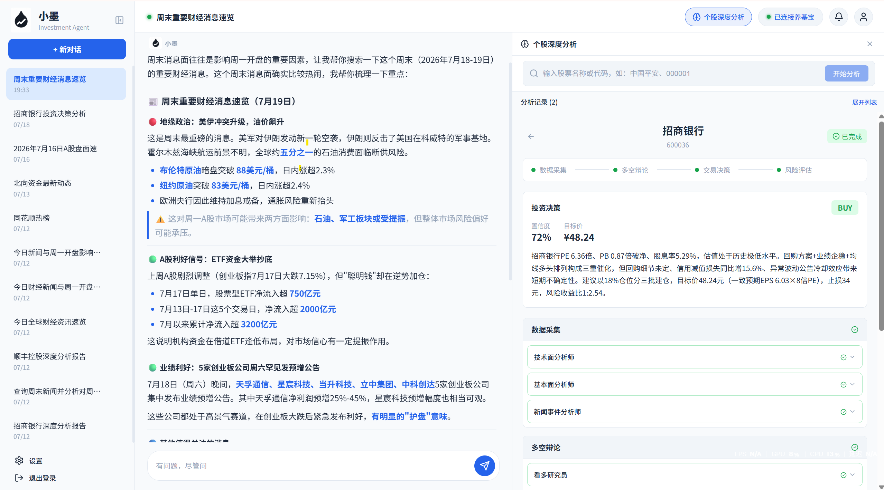

<div align="center">
  
  <h1 style="margin-top: 0.5em; margin-bottom: 0.3em;">小墨 Xiaomo</h1>
  <p style="margin-top: 0; margin-bottom: 0.5em;"><strong>面向多用户部署的金融领域 AI Agent 平台</strong></p>
  <p style="margin-top: 0; margin-bottom: 0.5em;">基于 Spring AI 构建，支持自然语言投研、资产分析与多用户管理</p>
  <p style="margin-top: 0; margin-bottom: 0.5em;">注册登录 · 管理后台 · Token 配额 · 一键 Docker 部署</p>
</div>

<div align="center">
  
  
  
  
  
</div>

<div align="center">
  
  
  
  
  
  
</div>

---

<div align="center">
  
</div>

## 项目介绍

小墨是一个基于 Spring AI 构建的金融领域 AI Agent 平台。用户通过自然语言描述投资研究需求，Agent 自动理解任务、调用金融数据工具，并生成分析结果。

平台同时提供用户认证、数据隔离、Token 配额和管理员运营能力，支持 Docker Compose 一键部署。

## 项目定位

小墨是个人学习实践项目，主要用于探索 AI Agent 在金融领域场景中的工程化应用。

项目重点不在替代专业投资系统，而是在 Agent 架构设计、工具编排、多用户应用设计和智能数据分析方向进行实践。

## 核心亮点

> 项目主要探索 AI Agent 从简单调用模型到实际应用落地过程中涉及的工程问题。

### 1. Agent 工具调用治理

不是简单地把工具丢给 LLM，而是在 Agent 执行链路中加入了治理层：

```
           User Query
               │
               ▼
        Intent Filter
        (基于规则的意图分类)
               │
               ▼
      Relevant Tools Only
       (白名单过滤)
               │
               ▼
        Agent Reasoning
               │
               ▼
     Tool Governance Layer
  (重复检测 / 轮次控制 / 信息增益)
               │
               ▼
           Response
```

治理机制包括：

- **重复调用检测**：基于加权相似度（Jaccard 词相似度 + 数字相似度 + 长度相似度）判断工具是否陷入重复调用
- **搜索轮次控制**：限制搜索类工具调用次数；抓取类工具结合信息增益判断，连续无新信息时自动停止
- **工具结果检查**：三维度加权相似度分析工具返回内容的信息增益，低增益结果触发分级升级信号
- **报告完整性检查**（深度分析模式下）：检查报告字数和章节结构是否达标

### 2. Router Tool 架构

将 40+ 个 API 按领域封装为 8 个 Router Tool，将工具选择空间从 40+ 个具体接口降维为 8 个领域级 Router，降低 LLM Tool Selection 复杂度：

```
AStockQuoteRouterTool     → 行情层（实时报价、K线）
AStockReportRouterTool    → 研报层（个股/行业研报、PDF下载）
AStockSignalRouterTool    → 信号层（热点、北向、龙虎榜）
AStockCapitalRouterTool   → 资金面（融资融券、大宗交易、股东）
AStockNewsRouterTool      → 新闻层（个股新闻、全球资讯）
AStockLimitUpRouterTool   → 打板层（涨停池、连板梯队）
AStockOptionRouterTool    → 期权层（ETF期权、希腊字母）
AStockSentimentRouterTool → 舆情层（热榜、人气榜）
```

Router 内部路由到具体 Operation，Agent 只需选择领域，不需要关心具体接口。

### 3. 深度分析 Workflow

基于 Reactor 响应式编程实现的 Workflow 编排模块，用于复杂个股分析场景。数据采集阶段三路并行（市场分析师、基本面分析师、新闻分析师），随后进入多角色辩论和风险评估流程。

支持运行中取消、节点超时控制、分级升级信号。工作流拓扑为预定义流程，运行时参数（辩论轮数、温度、token 上限等）可配置。

### 4. 多用户平台化设计

不是单用户本地 demo，而是具备完整用户体系和管理能力的应用平台：用户认证、数据隔离、Token 配额、管理员后台、通知推送。

### 5. SSE 流式交互

后端 Flux 累积全文 → 流式输出，前端 ReadableStream 解析 → 实时渲染。用户可实时看到 Agent 的任务执行状态和生成过程（如"正在查询行情..."、"正在分析财务数据..."）。

## 系统架构

```
                          User
                           │
                           ▼
               Conversation Layer
                (会话管理 / 记忆系统)
                           │
                           ▼
                 Intent Understanding
                (基于规则的意图分类 / 工具过滤)
                           │
                           ▼
                  Agent Orchestrator
                           │
                   ┌───────┴───────┐
                   ▼               ▼
                LLM Model      Workflow
             (Spring AI 1.0)   (多阶段编排)
                   │
                   ▼
              Tool Router
               (8个领域)
                   │
                   ▼
             数据源层
       腾讯/东财/同花顺/巨潮/新浪/iwencai
```

## 核心能力

### AI Agent 对话

- **基于规则的意图分类**：通过关键词匹配识别用户任务类型（9 种意图），过滤无关工具
- **Tool Calling**：根据任务类型自动调用对应工具
- **上下文管理**：维护对话历史，支持多轮追问
- **流式响应**：SSE 实时输出模型响应和任务执行状态

### 金融研究

- **行情查询**：实时报价、K 线数据
- **基本面分析**：财务指标、估值计算、盈利能力
- **技术面分析**：趋势判断、支撑压力位
- **市场情绪**：资金流向、北向资金、龙虎榜

### 用户持仓分析

通过集成养基宝 API，实现用户基金账户数据同步：

```
用户授权 → 养基宝 API → 持仓数据同步 → Redis 缓存 → AI Agent 分析 → 生成个人投资报告
```

核心能力：扫码授权登录养基宝、获取用户账户列表、同步基金持仓明细、获取基金估值和收益数据、基于实时持仓生成个性化分析。

### 深度分析工作流

针对复杂个股分析场景，基于预定义 Workflow 的多阶段分析流程：

```
数据采集 (三路并行) → 多角色辩论与交叉评估 → 风险评估 → 生成报告
```

## 使用场景

| 场景 | 示例输入 | Agent 能力 |
|------|---------|-----------|
| 个股研究 | "分析茅台近期基本面和估值情况" | 行情 + 财务 + 估值 |
| 持仓诊断 | "分析一下我的基金组合" | 持仓结构 + 收益分析 + 风险评估 |
| 基金分析 | "我的基金最近为什么跌" | 持仓变化 + 市场因素分析 |
| 行业对比 | "对比宁德和比亚迪" | 多标的横向对比 |
| 研报检索 | "最近新能源研报" | iwencai 语义搜索 |
| 市场情绪 | "今天涨停多少家" | 打板池 + 连板梯队 |
| 资金流向 | "北向资金今天流入还是流出" | 实时资金数据 |
| 金融计算 | "贷款 100 万月供多少" | 22 种计算工具 |

## 工程设计

### 平台架构

- **用户认证**：邮箱注册登录，客户端 SHA-256 哈希 → 服务端 BCrypt 存储，Redis Token 管理（72h TTL，单设备在线）
- **管理员系统**：独立密码登录，用户列表查看，公告通知创建与推送
- **通知系统**：管理员创建通知 → 精准推送给目标用户 → SSE 实时送达前端 → 已读/隐藏状态管理
- **Token 配额**：每个用户独立的免费 Token 配额，注册时自动分配，使用量实时统计
- **数据隔离**：会话、记忆、持仓数据按用户 ID 完全隔离，互不干扰

### 意图级工具过滤

基于规则的意图分类，通过关键词匹配识别用户任务类型，仅向 Agent 暴露相关工具集合，减少无关 Tool 干扰。覆盖 9 种意图类型，每种对应独立的工具子集，含三层 fallback 机制。

```
用户输入 → Intent Filter (关键词规则匹配) → 过滤后的工具集合 → Agent Tool Calling
```

### 会话记忆系统

- **用户画像管理**：AI 自动从对话中提取用户投资偏好（6 个维度），支持用户主动记忆，自动去重，每用户最多 50 条
- **对话摘要压缩**：未压缩消息超过 20 条时触发 AI 压缩（10:1），增量处理，保留最近 5 条在上下文中
- **记忆注入**：用户画像和对话摘要以 token 预算控制注入 system prompt

### 养基宝数据集成

通过 API 集成用户基金账户数据：扫码授权获取账户 Token → 查询基金账户列表 → 获取持仓明细和收益数据 → 数据事务写入 PostgreSQL → Redis 缓存提高查询效率。实现从通用金融分析到个人资产分析的能力扩展。

### SSE 流式架构

- **后端**：Flux 累积全文 → 流式输出
- **前端**：ReadableStream 解析 → 实时渲染
- **体验**：用户可实时看到 Agent 的任务执行状态和生成过程

## 技术架构

### Backend

- **Java 17** + **Spring Boot 3.5**
- **Spring AI 1.0** - LLM 接入、Tool Calling、Prompt 管理
- **Spring Data JPA** + **PostgreSQL** - 持久化
- **Spring Data Redis** - 缓存 / 会话 / 限流
- **MCP Protocol** - 外部 AI 服务集成（百度 AI 搜索）

### Frontend

- **Vue 3** + **TypeScript**
- **Vite 6** - 构建工具
- **Pinia** - 状态管理
- **SSE Streaming** - 实时对话

### Infrastructure

- **Docker** 多阶段构建（Node 20 + JDK 17 + JRE 17）
- **Redis** 多级缓存策略
- **PostgreSQL** 数据持久化

## 项目结构

```
src/main/java/com/xiaomo/agent/
├── agent/              # AI Agent 核心（意图识别、工具调用）
├── tool/               # Tool 工具系统
│   ├── Financial*      # 金融计算工具（22种）
│   └── astock/         # A股数据工具（8个Router）
├── conversation/       # 会话管理
├── auth/               # 用户认证（注册登录、Token管理）
├── notification/       # 通知系统（管理员推送、SSE实时送达）
├── memory/             # 用户画像 + 对话摘要
└── user/               # 用户管理

frontend/src/
├── api/chat.ts         # SSE 流式客户端
├── views/ChatView.vue  # 对话界面
├── stores/             # 状态管理
└── composables/        # Markdown 流式解析
```

详细结构请查看 [项目文档](docs/)。

## 快速开始

### 方式一：Docker Compose 部署（推荐）

```bash
# 1. 克隆项目
git clone https://github.com/liukai-code/xiaomo-investment-agent.git
cd xiaomo-investment-agent

# 2. 配置环境变量
cp .env.example .env
# 编辑 .env 填入 API Key、管理员密码等配置

# 3. 启动服务（自动拉起 PostgreSQL + Redis + 应用）
docker-compose up -d

# 4. 访问应用
open http://localhost:4545
```

部署完成后：
- 用户访问首页即可注册登录
- 管理员通过 `/api/admin/login` 登录管理后台（密码在 .env 中配置）
- 管理员可查看用户列表、推送公告通知

### 方式二：本地开发

**环境要求**：Java 17+, Node.js 18+, PostgreSQL 14+, Redis 6+

```bash
# 1. 克隆项目
git clone https://github.com/liukai-code/xiaomo-investment-agent.git
cd xiaomo-investment-agent

# 2. 配置环境变量
cp .env.example .env
# 编辑 .env 填入数据库、Redis、API Key 等配置

# 3. 启动后端
mvn clean package -DskipTests
mvn spring-boot:run    # 端口 4545

# 4. 启动前端
cd frontend
npm install
npm run dev           # 端口 5656，代理到 4545

# 5. 访问应用
open http://localhost:5656
```

## Roadmap

- [x] AI Agent 基础框架（Spring AI + Tool Calling）
- [x] A 股数据工具集（13 源 55 端点）
- [x] SSE 流式对话
- [x] 用户记忆系统
- [x] 深度分析 Workflow
- [x] Agent 工具调用治理
- [ ] RAG 投研知识库
- [ ] 投资组合管理
- [ ] 回测系统
- [ ] 多 Agent 协作

## 当前限制

- 当前深度分析采用预定义 Workflow，不支持完全自主任务规划
- 金融数据来自第三方接口，存在稳定性限制
- 分析结果仅作为研究辅助，不构成投资建议

## Disclaimer

小墨用于金融信息查询和投资研究辅助，不提供投资建议，不代表任何买卖推荐。股市有风险，投资需谨慎。

## License

[Apache License 2.0](LICENSE)

## 致谢

- [Spring AI](https://spring.io/projects/spring-ai) - AI Agent 框架
- [a-stock-data](https://github.com/simonlin1212/a-stock-data) - A 股数据工具参考
