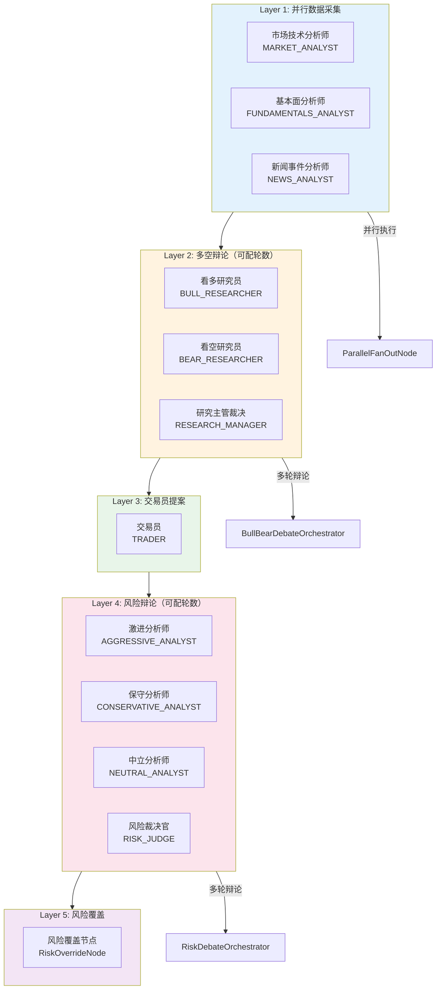
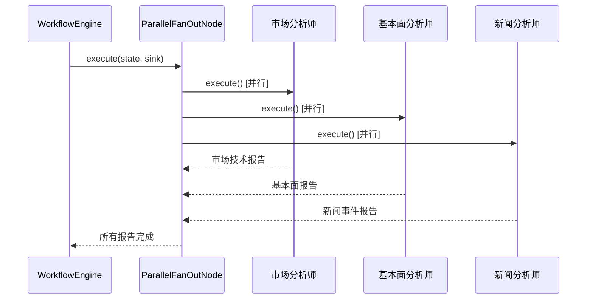
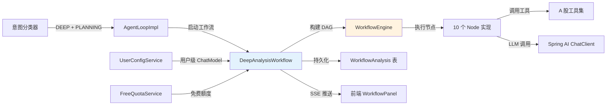

# 多智能体深度分析工作流 -- 5 层 DAG 的多 Agent 协作引擎

> 本文档是小墨项目技术亮点系列的第 1 篇，面向初次接触项目的开发者，从问题出发，逐步拆解多智能体深度分析工作流的设计思路与实现细节。

---

## 目录

- [一、核心内容](#一核心内容)
- [二、为什么需要这个设计](#二为什么需要这个设计)
- [三、整体架构](#三整体架构)
- [四、代码走读](#四代码走读)
- [五、配置与调参](#五配置与调参)
- [六、实战案例](#六实战案例)
- [七、与其他模块的关系](#七与其他模块的关系)
- [八、常见问题排查](#八常见问题排查)
- [九、源码索引](#九源码索引)
- [十、延伸阅读](#十延伸阅读)

---

## 一、核心内容

- 理解为什么单个 AI Agent 不足以完成复杂的投研分析，需要多 Agent 协作
- 掌握 5 层 DAG 工作流的每一层在做什么、为什么这样排列
- 理解基于 Reactor 的 DAG 执行引擎如何实现并行、超时、取消
- 了解 10 个 Agent 角色各自的职责和 System Prompt 设计
- 知道如何调整辩论轮数、超时时间等参数

---

## 二、为什么需要这个设计

### 2.1 问题场景

用户说"深度分析茅台"，这需要：
1. 查实时行情（股价、PE、PB、市值）
2. 查机构研报（评级、目标价、EPS 预测）
3. 查新闻事件（公告、舆情、龙虎榜）
4. 查资金面（融资融券、北向资金、大宗交易）
5. 综合以上数据，判断买入/持有/卖出
6. 评估风险，给出仓位建议

如果让单个 Agent 完成所有步骤，它会面临**上下文膨胀**（40+ 次工具调用的结果全部塞进上下文）、**决策偏差**（单一视角容易遗漏风险）、**执行不可控**（无法保证每步都执行到）等问题。

### 2.2 不这样做的后果

| 场景 | 单 Agent | 多 Agent 工作流 |
|------|---------|----------------|
| 分析视角 | 单一，容易遗漏 | 3 个分析师并行采集，覆盖技术面/基本面/新闻面 |
| 决策质量 | 一个结论，无交叉验证 | 多空辩论 + 风险评估，多角度交叉验证 |
| 执行保证 | 可能跳过某些数据源 | DAG 结构保证每层都执行 |
| 超时控制 | 无上限 | 600 秒总预算，每层有时间限制 |
| 取消机制 | 不支持 | 用户可随时取消，已获取的数据不丢失 |

### 2.3 设计目标

1. **并行采集**：3 个分析师同时工作，缩短数据采集时间
2. **对抗性决策**：多空辩论 + 风险评估，避免单一视角偏差
3. **DAG 编排**：5 层流水线，每层有明确的输入输出
4. **可取消**：用户随时取消，已获取的数据持久化不丢失
5. **时间预算**：600 秒总超时，每层动态分配剩余时间

---

## 三、整体架构

### 3.1 一句话描述

基于 Reactor 响应式编程构建 5 层 DAG 工作流：并行数据采集 → 多空辩论 → 交易员提案 → 风险辩论 → 风险裁决，每个阶段由独立的 AI Agent 角色执行。

### 3.2 架构图



### 3.3 核心组件表

| 组件 | 文件路径 | 职责 |
|------|---------|------|
| WorkflowEngine | `workflow/engine/WorkflowEngine.java` | DAG 执行引擎，管理节点执行顺序、超时、取消 |
| WorkflowGraph | `workflow/engine/WorkflowGraph.java` | DAG 图结构，存储节点和边 |
| WorkflowNode | `workflow/engine/WorkflowNode.java` | 节点接口，每个节点实现 `execute()` |
| DeepAnalysisWorkflow | `workflow/service/DeepAnalysisWorkflow.java` | 顶层编排器，构建 DAG、管理生命周期 |
| ParallelFanOutNode | `workflow/node/ParallelFanOutNode.java` | 并行扇出节点，同时执行多个分析师 |
| BullBearDebateOrchestrator | `workflow/node/BullBearDebateOrchestrator.java` | 多空辩论编排器 |
| DebateNode | `workflow/node/DebateNode.java` | 单个辩论参与者节点 |
| TraderNode | `workflow/node/TraderNode.java` | 交易员提案节点 |
| RiskDebateOrchestrator | `workflow/node/RiskDebateOrchestrator.java` | 风险辩论编排器 |
| RiskOverrideNode | `workflow/node/RiskOverrideNode.java` | 风险覆盖节点（最终裁决） |
| JudgeNode | `workflow/node/JudgeNode.java` | 裁决节点 |
| AgentRole | `workflow/agent/AgentRole.java` | 10 个 Agent 角色枚举（含 System Prompt 和工具白名单） |
| WorkflowAgentFactory | `workflow/agent/WorkflowAgentFactory.java` | Agent 实例工厂 |
| WorkflowState | `workflow/state/WorkflowState.java` | 运行时状态（报告、辩论记录、最终决策） |
| WorkflowEvent | `workflow/event/WorkflowEvent.java` | 事件模型（phaseStart/phaseComplete/error） |
| WorkflowAnalysis | `workflow/persist/WorkflowAnalysis.java` | JPA 持久化实体 |

---

## 四、代码走读

### 4.1 DAG 构建：DeepAnalysisWorkflow.buildGraph()

5 层 DAG 在 `buildGraph()` 方法中组装：

```java
// DeepAnalysisWorkflow.java — buildGraph() 精简版
private WorkflowGraph buildGraph(ChatModel userChatModel) {
    // Layer 1: 3 个并行分析师
    ParallelFanOutNode layer1 = new ParallelFanOutNode("Layer1_DataCollection",
            List.of(
                    agentFactory.createAnalyst(AgentRole.MARKET_ANALYST, userChatModel),
                    agentFactory.createAnalyst(AgentRole.FUNDAMENTALS_ANALYST, userChatModel),
                    agentFactory.createAnalyst(AgentRole.NEWS_ANALYST, userChatModel)
            ));

    // Layer 2: 多空辩论
    BullBearDebateOrchestrator layer2 = new BullBearDebateOrchestrator(
            agentFactory.createDebateNode(AgentRole.BULL_RESEARCHER, userChatModel),
            agentFactory.createDebateNode(AgentRole.BEAR_RESEARCHER, userChatModel),
            agentFactory.createJudgeNode(AgentRole.RESEARCH_MANAGER, userChatModel),
            properties.bullBearRounds());

    // Layer 3: 交易员
    TraderNode layer3 = agentFactory.createTraderNode(userChatModel);

    // Layer 4: 风险评估辩论
    RiskDebateOrchestrator layer4 = new RiskDebateOrchestrator(
            agentFactory.createDebateNode(AgentRole.AGGRESSIVE_ANALYST, userChatModel),
            agentFactory.createDebateNode(AgentRole.CONSERVATIVE_ANALYST, userChatModel),
            agentFactory.createDebateNode(AgentRole.NEUTRAL_ANALYST, userChatModel),
            agentFactory.createJudgeNode(AgentRole.RISK_JUDGE, userChatModel),
            properties.riskRounds());

    // Layer 5: 风险覆盖（可选）
    RiskOverrideNode layer5 = new RiskOverrideNode(riskOverrideProperties);

    // 组装 DAG
    WorkflowGraph graph = new WorkflowGraph();
    graph.addNode(layer1).addNode(layer2).addNode(layer3).addNode(layer4).addNode(layer5)
            .addEdge("Layer1_DataCollection", "BullBearDebate")
            .addEdge("BullBearDebate", "Trader")
            .addEdge("Trader", "RiskDebate")
            .addEdge("RiskDebate", "RiskOverride")
            .setStart("Layer1_DataCollection");

    return graph;
}
```

### 4.2 DAG 执行引擎：WorkflowEngine.execute()

引擎使用 Reactor 的 `concatMap` 按顺序执行每个节点，`ParallelFanOutNode` 内部使用 `Flux.merge()` 实现并行：

```java
// WorkflowEngine.java — execute() 精简版
public Flux<WorkflowEvent> execute(WorkflowGraph graph, WorkflowState state) {
    Instant pipelineStart = Instant.now();
    Duration totalBudget = Duration.ofSeconds(properties.timeoutSeconds());  // 默认 600s

    Flux<WorkflowEvent> pipeline = Flux.fromIterable(graph.resolveExecutionPath(state))
            .concatMap(node -> {
                // 检查取消
                if (state.isCancelled()) return Flux.empty();

                // 检查时间预算
                Duration remaining = totalBudget.minus(Duration.between(pipelineStart, Instant.now()));
                if (remaining.toSeconds() < stageMinSeconds) return Flux.empty();

                // 执行节点，带超时
                return node.execute(state, sink)
                        .timeout(remaining)
                        .onErrorResume(e -> { /* 超时处理 */ });
            });

    // 用取消信号中断
    Sinks.One<Void> cancelSink = state.getOrCreateCancelSink();
    return pipeline.takeUntilOther(cancelSink.asMono());
}
```

**三个关键机制**：
1. **时间预算**：总预算 600 秒，每个节点执行前检查剩余时间
2. **取消支持**：`takeUntilOther(cancelSink.asMono())` 在取消信号到达时立即终止
3. **错误恢复**：节点超时或异常时跳过该节点，继续执行后续节点

### 4.3 并行数据采集：ParallelFanOutNode

Layer 1 使用 `ParallelFanOutNode` 同时执行 3 个分析师：



每个分析师有严格的 5-8 步工具调用流程（在 `AgentRole` 的 System Prompt 中定义），完成后输出结构化报告（含 signal、confidence、reasoning 等 JSON 字段）。

### 4.4 多空辩论：BullBearDebateOrchestrator

Layer 2 实现多轮对抗性辩论：

```
轮次1: 看多研究员 → 看空研究员 → 研究主管裁决
轮次2: 看多研究员(反驳) → 看空研究员(反驳) → 研究主管裁决
...
轮次N: 最终裁决 → 输出投资计划
```

每轮辩论中：
- 看多/看空研究员引用分析师报告中的具体数据论证
- 研究主管评估双方论据的说服力，输出投资计划（BUY/SELL/HOLD + 目标价 + 仓位建议）

辩论轮数通过 `workflow.bull-bear-rounds` 配置（默认 2 轮）。

### 4.5 10 个 Agent 角色

| 角色 | 层级 | 工具白名单 | 职责 |
|------|------|-----------|------|
| MARKET_ANALYST | Layer 1 | a_stock_quote, a_stock_signal, a_stock_limit_up | 技术面分析 |
| FUNDAMENTALS_ANALYST | Layer 1 | a_stock_quote, a_stock_report, a_stock_news, a_stock_capital, financial_calculator | 基本面分析 |
| NEWS_ANALYST | Layer 1 | a_stock_news, a_stock_signal, bailian_web_search | 新闻事件分析 |
| BULL_RESEARCHER | Layer 2 | 无 | 看多论证 |
| BEAR_RESEARCHER | Layer 2 | 无 | 看空论证 |
| RESEARCH_MANAGER | Layer 2 | 无 | 多空裁决 |
| TRADER | Layer 3 | financial_calculator | 交易方案制定 |
| AGGRESSIVE_ANALYST | Layer 4 | 无 | 激进风险评估 |
| CONSERVATIVE_ANALYST | Layer 4 | 无 | 保守风险评估 |
| NEUTRAL_ANALYST | Layer 4 | 无 | 中立风险评估 |
| RISK_JUDGE | Layer 4 | 无 | 最终风险裁决 |

**设计原则**：
- Layer 1 的分析师有工具（需要调用 API 采集数据）
- Layer 2/4 的辩论者无工具（基于 Layer 1 的报告辩论，不需要新数据）
- Layer 3 的交易员只有计算器（需要计算仓位、止损等数值）
- 每个角色的 System Prompt 严格定义了工具调用步骤和输出格式

### 4.6 持久化与取消

分析结果持久化到 `WorkflowAnalysis` 表，包含：
- 3 份分析师报告（JSON）
- 多空辩论记录（JSON）
- 交易方案
- 风险辩论记录（JSON）
- 最终裁决（action, confidence, targetPrice, summary）

取消机制：
- 用户调用 `cancelAnalysis(analysisId)` → 标记已取消 + 触发 cancelSink + dispose Flux
- 引擎在每个节点执行前检查 `state.isCancelled()`，已取消则跳过
- 已获取的数据不丢失（已持久化的报告保留）

---

## 五、配置与调参

| 配置项 | 默认值 | 说明 |
|--------|--------|------|
| `workflow.timeoutSeconds` | `600` | 工作流总超时（秒） |
| `workflow.stageMinSeconds` | `30` | 每层最少保留时间（秒） |
| `workflow.bull-bear-rounds` | `2` | 多空辩论轮数 |
| `workflow.risk-rounds` | `2` | 风险辩论轮数 |
| `workflow.risk-override.enabled` | `true` | 是否启用风险覆盖节点 |
| `workflow.risk-override.maxPositionPct` | `30` | 风险覆盖最大仓位限制 |

---

## 六、实战案例

### 6.1 正常流程："深度分析茅台"

```
Layer 1: 并行数据采集（~120s）
  ├─ 市场分析师: 调用 5 个工具 → 技术面报告 (BULLISH, 0.7)
  ├─ 基本面分析师: 调用 8 个工具 → 基本面报告 (NEUTRAL, 0.6)
  └─ 新闻分析师: 调用 5 个工具 → 新闻事件报告 (BULLISH, 0.65)

Layer 2: 多空辩论（~90s）
  ├─ 轮次1: 多方(3论据) vs 空方(3论据) → 研究主管裁决
  └─ 轮次2: 多方(反驳) vs 空方(反驳) → 最终裁决: BUY, 目标价1800

Layer 3: 交易员提案（~30s）
  └─ 入场价1520-1550, 仓位20%, 止损1400, 止盈1800

Layer 4: 风险辩论（~60s）
  ├─ 激进: 建议仓位30%
  ├─ 保守: 建议仓位10%
  ├─ 中立: 建议仓位20%
  └─ 风险裁决: 仓位15%, BUY, 置信度0.65

Layer 5: 风险覆盖（~5s）
  └─ 最终确认: BUY, 仓位15%, 目标价1750

总耗时: ~305s
```

### 6.2 取消场景

```
Layer 1 进行中（市场分析师已完成，基本面分析师还在调工具）
  → 用户点击"取消"
  → cancelAnalysis(analysisId)
  → state.signalCancel()
  → 引擎检测到取消信号，跳过 Layer 2-5
  → 已获取的 3 份报告持久化到数据库
  → 状态: CANCELLED
```

---

## 七、与其他模块的关系



---

## 八、常见问题排查

| 现象 | 可能原因 | 排查方法 |
|------|---------|---------|
| 工作流超时（600s） | 某个分析师工具调用过慢 | 检查 `workflow.timeoutSeconds` 和网络状况 |
| 辩论轮数不够 | `bull-bear-rounds` 设置过低 | 增大配置值 |
| 分析师报告为空 | 工具调用全部失败 | 检查东财 API 是否被封禁 |
| 取消后状态仍为 RUNNING | 取消信号未传播到引擎 | 检查 `cancelledAnalyses` 集合 |
| 前端不显示进度 | SSE 事件未推送 | 检查 `analysisEventSinks` 是否创建 |
| 免费额度不足 | 未配置 API Key 且额度用完 | 提示用户配置 API Key |

---

## 九、源码索引

| 文件 | 路径 | 关键方法 |
|------|------|---------|
| DeepAnalysisWorkflow | `workflow/service/DeepAnalysisWorkflow.java` | `execute()`, `buildGraph()`, `cancelAnalysis()` |
| WorkflowEngine | `workflow/engine/WorkflowEngine.java` | `execute()` |
| WorkflowGraph | `workflow/engine/WorkflowGraph.java` | `addNode()`, `addEdge()`, `resolveExecutionPath()` |
| ParallelFanOutNode | `workflow/node/ParallelFanOutNode.java` | `execute()` — Flux.merge 并行 |
| BullBearDebateOrchestrator | `workflow/node/BullBearDebateOrchestrator.java` | `execute()` — 多轮辩论 |
| TraderNode | `workflow/node/TraderNode.java` | `execute()` |
| RiskDebateOrchestrator | `workflow/node/RiskDebateOrchestrator.java` | `execute()` |
| RiskOverrideNode | `workflow/node/RiskOverrideNode.java` | `execute()` |
| AgentRole | `workflow/agent/AgentRole.java` | 10 个角色的 System Prompt 和工具白名单 |
| WorkflowAgentFactory | `workflow/agent/WorkflowAgentFactory.java` | `createAnalyst()`, `createDebateNode()` |
| WorkflowState | `workflow/state/WorkflowState.java` | 运行时状态管理 |
| WorkflowEvent | `workflow/event/WorkflowEvent.java` | 事件模型 |
| WorkflowAnalysis | `workflow/persist/WorkflowAnalysis.java` | JPA 持久化实体 |
| 前端面板 | `frontend/src/components/workflow/WorkflowPanel.vue` | 实时进度可视化 |
| 设计文档 | `docs/superpowers/specs/2026-07-09-deep-analysis-module-design.md` | 详细设计 |
| 使用指南 | `docs/Guides/MultiAgentWorkflow.md` | 技术详解 |

---

## 十、延伸阅读

- [多智能体深度分析工作流技术详解](../Guides/MultiAgentWorkflow.md) — 更详细的技术说明
- [深度分析模块设计文档](../superpowers/specs/2026-07-09-deep-analysis-module-design.md) — 设计决策记录
- [分析师工具映射](../Guides/analyst-tools-mapping.md) — 3 位分析师各自使用哪些工具
- [意图分类 + 工具过滤](03-IntentClassificationAndToolFiltering.md) — DEEP + PLANNING 模式的触发条件
- [工具调用防护](02-ToolGuardSystem.md) — 工作流中每个分析师节点的防护机制
- [A 股数据工具集](04-AStockDataAndRouterTool.md) — 分析师调用的 8 个 Router Tool
