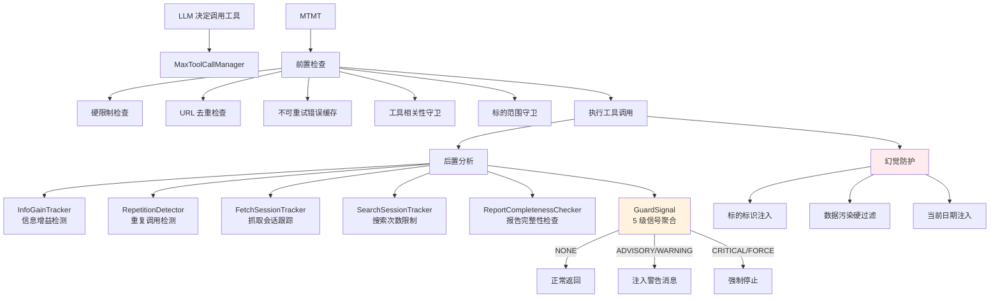
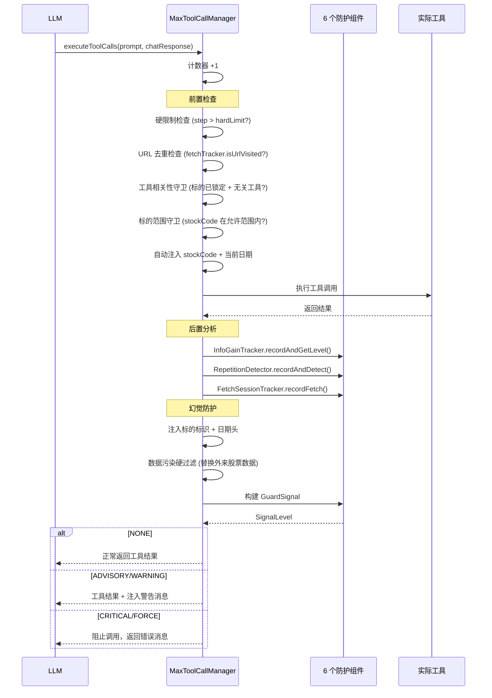
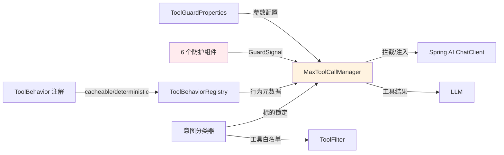

# 工具调用防护 + 幻觉防护 -- 如何防止 Agent 失控

> 本文档是小墨项目技术亮点系列的第 2 篇，面向初次接触项目的开发者，从问题出发，逐步拆解工具调用防护系统和幻觉防护机制的设计思路与实现细节。

---

## 目录

- [一、核心内容](#一核心内容)
- [二、为什么需要这个设计](#二为什么需要这个设计)
- [三、整体架构](#三整体架构)
- [四、代码走读](#四代码走读)
- [五、配置与调参](#五配置与调参)
- [六、实战案例](#六实战案例)
- [七、与其他模块的关系](#七与其他模块的关系)
- [八、常见问题排查](#八常见问题排查)
- [九、源码索引](#九源码索引)
- [十、延伸阅读](#十延伸阅读)

---

## 一、核心内容

- 理解 AI Agent 为什么会陷入"工具调用死循环"以及为什么会产生幻觉数据
- 掌握 6 个协作防护组件的工作原理和信号级别
- 理解 `MaxToolCallManager` 如何在工具执行前后拦截和注入防护信号
- 了解"数据污染硬过滤"和"标的锁定"等幻觉防护机制
- 知道如何调整防护参数以平衡安全性和灵活性

---

## 二、为什么需要这个设计

### 2.1 问题场景一：工具调用死循环

用户问"分析茅台"，Agent 开始调用工具。但 LLM 的行为不可预测：
- 反复调用同一个行情接口（相同参数），期望得到"更好"的结果
- 信息增益为零（连续几轮返回几乎相同的数据），但 Agent 不知道该停了
- 抓取网页时反复访问同一个 URL，或者连续抓取 10 个页面但没有新信息

### 2.2 问题场景二：AI 幻觉数据

用户问"分析茅台（600519）"，Agent 调用工具获取了茅台的数据。但在生成报告时：
- LLM 可能"串台"，把五粮液（000858）的数据混入茅台的分析中
- LLM 可能使用训练数据中的旧日期（2024 年数据），而不是今天的实时数据
- LLM 可能忘记标的，转而分析用户持仓中的其他股票

### 2.3 不这样做的后果

| 场景 | 无防护 | 有防护 |
|------|--------|--------|
| 反复调用同一工具 | 浪费 30+ 次工具调用，token 爆炸 | 检测到重复后注入警告，3 次后强制停止 |
| 信息增益为零 | Agent 永远在"收集数据"，不生成报告 | 检测到低信息增益后建议停止 |
| 数据串台 | 茅台分析中混入五粮液数据，结论错误 | 硬过滤替换外来数据 + 标的锁定 |
| 使用旧日期 | 分析基于去年的数据 | 自动注入当前日期 |

### 2.4 设计目标

1. **渐进式升级**：从建议（ADVISORY）到警告（WARNING）到强制（FORCE），给 Agent 自我纠正的机会
2. **多维度检测**：不只看调用次数，还看信息增益、重复度、URL 去重、报告完整性
3. **最小侵入**：尽量通过注入消息引导 Agent 自主停止，而不是粗暴拦截
4. **数据完整性**：确保工具返回的数据与分析标的一致，阻止幻觉数据混入

---

## 三、整体架构

### 3.1 一句话描述

6 个协作组件在每次工具调用前后检测异常行为（重复、低增益、超限），通过 5 级信号渐进式干预；同时对工具返回结果做标的锁定和数据污染过滤，防止 AI 幻觉。

### 3.2 架构图



### 3.3 核心组件表

| 组件 | 文件路径 | 职责 |
|------|---------|------|
| MaxToolCallManager | `agent/service/impl/MaxToolCallManager.java` | 总调度器，拦截工具调用、聚合信号、注入防护 |
| GuardSignal | `tool/guard/GuardSignal.java` | 5 级信号聚合（NONE/ADVISORY/WARNING/CRITICAL/FORCE） |
| RepetitionDetector | `tool/guard/RepetitionDetector.java` | 滑窗检测重复工具调用（完全相同 / 相似） |
| InfoGainTracker | `tool/guard/InfoGainTracker.java` | 衡量工具返回结果的信息增益 |
| SearchSessionTracker | `tool/guard/SearchSessionTracker.java` | 控制搜索轮次上限 |
| FetchSessionTracker | `tool/guard/FetchSessionTracker.java` | URL 去重 + 连续无新信息检测 |
| ReportCompletenessChecker | `tool/guard/ReportCompletenessChecker.java` | 检查报告字数和章节数 |
| SimilarityUtils | `tool/guard/SimilarityUtils.java` | 文本相似度计算工具 |
| ToolBehaviorRegistry | `tool/guard/ToolBehaviorRegistry.java` | 管理工具行为元数据（cacheable/deterministic） |
| ToolBehavior | `tool/annotation/ToolBehavior.java` | 工具行为注解 |
| ToolGuardProperties | `agent/config/ToolGuardProperties.java` | 防护参数配置 |

---

## 四、代码走读

### 4.1 信号级别：GuardSignal 的 5 级渐进式干预

`GuardSignal` 是整个防护系统的核心 — 它聚合所有检测组件的结果，输出一个 5 级信号：

```java
// GuardSignal.java — 信号级别判定
public SignalLevel getLevel() {
    if (currentStep >= hardLimit) return SignalLevel.FORCE;           // 硬上限
    if (overMaxFetches && isFetchTool) return SignalLevel.FORCE;     // 抓取硬上限
    if (currentStep >= escalationFinal) return SignalLevel.CRITICAL; // 最终警告
    if (currentStep >= escalationWarning                             // 升级警告
            || infoGain == InfoGainLevel.LOW                         // 低信息增益
            || repetition == RepetitionResult.STUCK_IDENTICAL)       // 完全重复
        return SignalLevel.WARNING;
    if (currentStep >= softLimit                                     // 软限制
            || repetition == RepetitionResult.STUCK_SIMILAR          // 相似调用
            || isDuplicateUrl || stuckNoNewInfo)                     // URL去重/无新信息
        return SignalLevel.ADVISORY;
    return SignalLevel.NONE;
}
```

| 级别 | 触发条件 | 行为 |
|------|---------|------|
| **NONE** | 一切正常 | 不干预 |
| **ADVISORY** | 达到软限制 / 相似调用 / 重复URL / 连续无新信息 | 注入建议消息，Agent 可以选择忽略 |
| **WARNING** | 达到升级警告 / 低信息增益 / 完全重复调用 | 注入强警告消息，建议停止 |
| **CRITICAL** | 达到最终警告 | 注入强制停止消息 |
| **FORCE** | 达到硬限制 / 超过抓取上限 | 阻止工具调用，返回错误消息 |

**渐进式升级的设计意图**：给 Agent 自我纠正的机会。如果 Agent 在 ADVISORY 阶段就调整了策略，就不需要升级到 WARNING。

### 4.2 重复检测：RepetitionDetector

使用**滑动窗口**检测工具调用的重复性：

```java
// RepetitionDetector.java — 核心逻辑
public RepetitionResult recordAndDetect(String toolName, String args) {
    LinkedList<String> history = callHistory.computeIfAbsent(toolName, k -> new LinkedList<>());
    history.addLast(normalize(args));
    if (history.size() > threshold) history.removeFirst();  // 滑窗

    // 完全相同：窗口内所有调用的参数一模一样
    boolean allIdentical = Arrays.stream(arr).allMatch(s -> arr[0].equals(s));
    if (allIdentical) return RepetitionResult.STUCK_IDENTICAL;

    // 相似调用：窗口内所有调用的平均相似度 > 0.8
    double avgSimilarity = computeAllPairSimilarity(arr);
    if (avgSimilarity > 0.8) return RepetitionResult.STUCK_SIMILAR;

    return RepetitionResult.NONE;
}
```

两种检测级别：
- **STUCK_IDENTICAL**：完全相同的调用（参数一模一样） → WARNING
- **STUCK_SIMILAR**：相似的调用（参数略有不同但语义相近） → ADVISORY

### 4.3 信息增益：InfoGainTracker

衡量每轮工具调用是否带来了新信息：

```java
// InfoGainTracker.java — 核心逻辑
public InfoGainLevel recordAndGetLevel(String toolResult) {
    String summary = truncate(toolResult);  // 截取前 500 字符
    recentSummaries.addLast(summary);
    if (recentSummaries.size() > windowSize) recentSummaries.removeFirst();

    // 窗口内所有结果的平均相似度 > 阈值 → 信息增益低
    double avgSimilarity = computeAllPairSimilarity(recentSummaries);
    return avgSimilarity > threshold ? InfoGainLevel.LOW : InfoGainLevel.HIGH;
}
```

**为什么用文本相似度而不是精确匹配？** 因为工具返回的数据可能格式略有不同（如浮点精度差异），但内容实质相同。相似度检测能捕捉到这种情况。

### 4.4 抓取会话跟踪：FetchSessionTracker

专门处理网页抓取类工具（`fetchWebpage`、`fetchArticleContent`）的防护：

```java
// FetchSessionTracker.java — 核心逻辑
public FetchResult recordFetch(String url, InfoGainLevel infoGain) {
    fetchCount++;
    boolean duplicate = !visitedUrls.add(normalizeUrl(url));  // URL 去重

    if (infoGain == InfoGainLevel.LOW) {
        consecutiveNoNewInfo++;    // 连续无新信息计数
    } else if (infoGain == InfoGainLevel.HIGH) {
        consecutiveNoNewInfo = 0;  // 有新信息，重置计数
    }

    return new FetchResult(fetchCount, duplicate, consecutiveNoNewInfo);
}
```

三个防护维度：
1. **URL 去重**：同一个 URL 只抓取一次，第二次直接跳过
2. **抓取次数上限**：超过 `maxFetches` 后阻止所有抓取工具
3. **连续无新信息**：连续 N 次抓取都没有新信息，建议停止

### 4.5 MaxToolCallManager：总调度器

`MaxToolCallManager` 实现了 Spring AI 的 `ToolCallingManager` 接口，在每次工具调用前后插入防护逻辑：



### 4.6 幻觉防护：三层防护机制

**第一层：标的标识注入**

每次 A 股工具返回结果时，在结果头部和尾部注入标的标识：

```
【数据归属：贵州茅台（600519） | 当前日期：2026年07月31日 | 禁止用于其他标的或日期的分析】
... (工具返回的原始数据) ...
⚠️ 以上数据属于 贵州茅台（600519），请基于此数据分析该标的，禁止分析其他标的。
```

这通过反复提醒 LLM "这些数据属于谁"，减少数据串台的概率。

**第二层：数据污染硬过滤**

即使注入了标识，LLM 仍可能忽略。硬过滤在结果返回前，直接替换掉非目标标的的数据：

```java
// MaxToolCallManager.java — 数据污染硬过滤
Set<String> foreignCodes = extractForeignStockCodes(resultText, allowedStockCodes);
if (!foreignCodes.isEmpty()) {
    // 将 "601869长飞光纤" 替换为 "[非目标标的]"
    result = filterToolResult(result, tc, resultText, allowedStockCodes, foreignCodes);
}
```

**第三层：标的范围守卫 + 自动注入**

当标的已锁定时：
- 如果 LLM 传了错误的股票代码 → 拦截，返回错误消息
- 如果 LLM 没传股票代码 → 自动注入目标代码，避免工具因缺参报错

```java
// MaxToolCallManager.java — 标的范围守卫
if (!requestedCodes.isEmpty() && !allowedStockCodes.containsAll(requestedCodes)) {
    // LLM 传了错误的代码 → 拦截
    return "股票代码 " + disallowed + " 不在分析范围内";
}
if (requestedCodes.isEmpty()) {
    // LLM 没传 stockCode → 自动注入
    tc = new ToolCall(tc.id(), tc.type(), tc.name(), injectStockCode(tc.arguments(), tc.name(), targetCode));
}
```

---

## 五、配置与调参

| 配置项 | 默认值 | 说明 |
|--------|--------|------|
| `agent.tool-guard.softLimit` | `8` | 软限制：达到后开始注入建议 |
| `agent.tool-guard.escalationWarning` | `12` | 升级警告：达到后注入强警告 |
| `agent.tool-guard.escalationFinal` | `15` | 最终警告：达到后注入强制停止 |
| `agent.tool-guard.maxIterations` | `20` | 硬限制：达到后阻止所有工具调用 |
| `agent.tool-guard.maxFetches` | `8` | 最大抓取次数 |
| `agent.tool-guard.maxSearchRounds` | `5` | 最大搜索轮次 |
| `agent.tool-guard.maxSameToolCalls` | `8` | 同一工具最大调用次数 |
| `agent.tool-guard.infoGainWindowSize` | `4` | 信息增益检测窗口大小 |
| `agent.tool-guard.infoGainThreshold` | `0.75` | 信息增益阈值（相似度 > 此值视为低增益） |
| `agent.tool-guard.repetitionThreshold` | `3` | 重复检测滑窗大小 |
| `agent.tool-guard.toolTimeoutSeconds` | `60` | 单次工具调用超时时间 |

---

## 六、实战案例

### 6.1 正常流程：5 步完成分析

```
步骤1: a_stock_quote(tencentQuote) → 正常返回     SignalLevel=NONE
步骤2: a_stock_report(stockReport) → 正常返回     SignalLevel=NONE
步骤3: a_stock_capital(marginTrading) → 正常返回  SignalLevel=NONE
步骤4: a_stock_news(stockNews) → 正常返回         SignalLevel=NONE
步骤5: LLM 生成分析报告                           无工具调用
```

### 6.2 重复调用场景

```
步骤1: a_stock_quote(tencentQuote, 600519) → 正常返回
步骤2: a_stock_quote(tencentQuote, 600519) → 正常返回  Repetition=STUCK_IDENTICAL
       → [GUARD: ADVISORY] "检测到重复调用，请换一种方式"
步骤3: a_stock_quote(tencentQuote, 600519) → 正常返回  Repetition=STUCK_IDENTICAL
       → [GUARD: WARNING] "检测到连续重复调用，请基于已有结果回答"
步骤4: LLM 调整策略，使用已有数据生成报告
```

### 6.3 幻觉防护场景

```
用户输入: "分析茅台"
标的锁定: allowedStockCodes={600519}

步骤1: a_stock_signal(conceptBlocks, stockCode=000858)
       → 标的范围守卫拦截: "股票代码 000858 不在分析范围内"

步骤2: a_stock_signal(conceptBlocks)  // LLM 没传 stockCode
       → 自动注入: stockCode=600519
       → 工具返回结果
       → 数据污染检测: 发现结果中包含 "601869长飞光纤"
       → 硬过滤: 替换为 "[非目标标的]"
       → 注入标识头: "【数据归属：贵州茅台（600519） | 当前日期：2026年07月31日】"
```

---

## 七、与其他模块的关系



修改防护系统时需要注意的联动点：
- 修改 `GuardSignal` 的信号判定逻辑 → 影响所有防护行为
- 修改 `@ToolBehavior` 注解 → 影响缓存和去重策略
- 新增防护组件 → 需要在 `MaxToolCallManager` 中集成并更新 `GuardSignal`
- 修改标的锁定逻辑 → 与意图分类器的 `ResolvedTarget` 联动

---

## 八、常见问题排查

| 现象 | 可能原因 | 排查方法 |
|------|---------|---------|
| Agent 分析不完整，只有 3 步就停了 | softLimit 设置过低 | 检查 `agent.tool-guard.softLimit` 配置 |
| 工具调用超时 | 单次调用超过 toolTimeoutSeconds | 检查网络状况，增大超时时间 |
| Agent 忽略 ADVISORY 信号继续调用 | 正常行为，ADVISORY 只是建议 | 观察是否会升级到 WARNING |
| 外来数据未被过滤 | 股票代码格式不匹配正则 | 检查 `extractForeignStockCodes()` 的正则 |
| 标的代码未自动注入 | 意图分类器未解析出标的 | 检查 `allowedStockCodes` 是否为 null |
| 报告完整性检查误判 | 字数阈值设置不当 | 检查 `ReportCompletenessChecker` 配置 |

---

## 九、源码索引

| 文件 | 路径 | 关键方法 |
|------|------|---------|
| MaxToolCallManager | `agent/service/impl/MaxToolCallManager.java` | `executeToolCalls()`, `injectStockCode()`, `filterToolResult()` |
| GuardSignal | `tool/guard/GuardSignal.java` | `getLevel()`, `format()`, `suggestAction()` |
| RepetitionDetector | `tool/guard/RepetitionDetector.java` | `recordAndDetect()` |
| InfoGainTracker | `tool/guard/InfoGainTracker.java` | `recordAndGetLevel()` |
| SearchSessionTracker | `tool/guard/SearchSessionTracker.java` | `recordSearch()` |
| FetchSessionTracker | `tool/guard/FetchSessionTracker.java` | `recordFetch()`, `isUrlVisited()` |
| ReportCompletenessChecker | `tool/guard/ReportCompletenessChecker.java` | `isReportSubstantial()` |
| SimilarityUtils | `tool/guard/SimilarityUtils.java` | `computeSimilarity()` |
| ToolBehaviorRegistry | `tool/guard/ToolBehaviorRegistry.java` | `getBehavior()` |
| ToolGuardProperties | `agent/config/ToolGuardProperties.java` | 配置参数 |
| 设计文档 | `docs/DevelopmentProcess/tool-call-guard-system.md` | 详细设计记录 |

---

## 十、延伸阅读

- [工具调用防护系统设计文档](../DevelopmentProcess/tool-call-guard-system.md) — 详细的设计决策和演进历史
- [股票数据幻觉防护](../Guides/stock-drift-prevention.md) — 幻觉问题的具体案例和防护策略
- [幻觉问题汇总](../Guides/drift-issues-summary.md) — 已发现的幻觉问题清单
- [意图分类 + 工具过滤](03-IntentClassificationAndToolFiltering.md) — 标的锁定的数据来源
- [A 股数据工具集](04-AStockDataAndRouterTool.md) — @ToolBehavior 注解的使用
