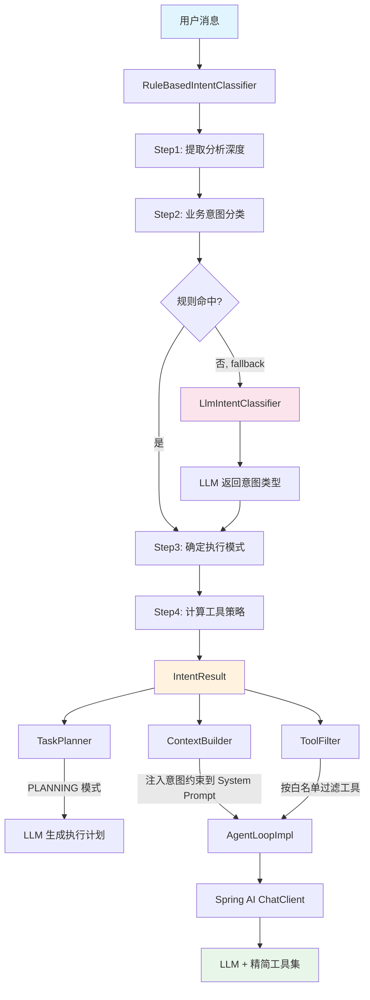
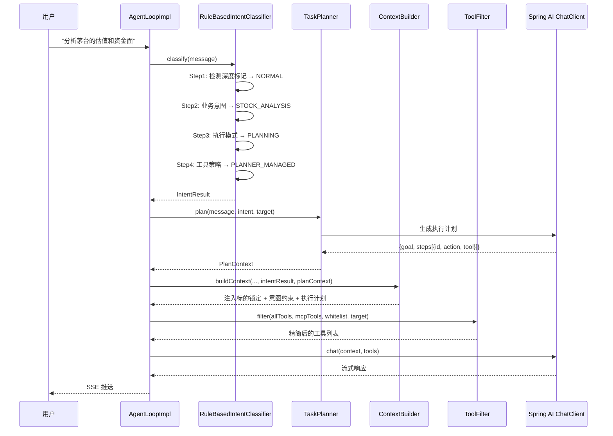
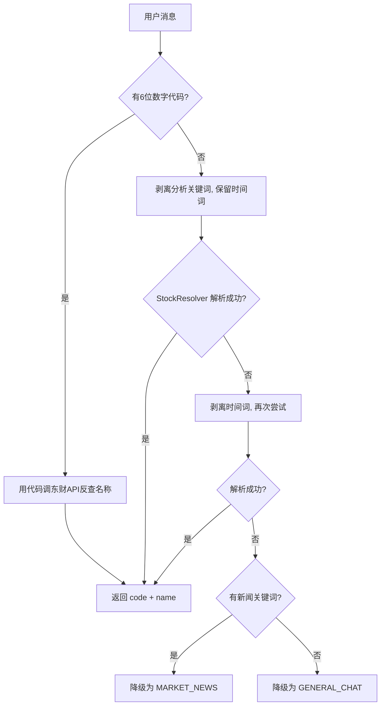
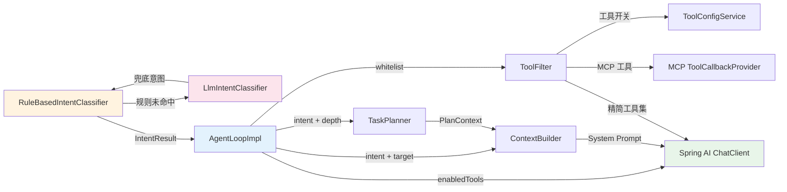

# 意图分类 + 工具过滤 -- 用户消息进入系统的第一道关卡

> 本文档是小墨项目技术亮点系列的第 3 篇，面向初次接触项目的开发者，从问题出发，逐步拆解意图分类与工具过滤的设计思路与实现细节。

---

## 目录

- [一、核心内容](#一核心内容)
- [二、为什么需要这个设计](#二为什么需要这个设计)
- [三、整体架构](#三整体架构)
- [四、代码走读](#四代码走读)
- [五、配置与调参](#五配置与调参)
- [六、实战案例](#六实战案例)
- [七、与其他模块的关系](#七与其他模块的关系)
- [八、常见问题排查](#八常见问题排查)
- [九、源码索引](#九源码索引)
- [十、延伸阅读](#十延伸阅读)

---

## 一、核心内容

- 理解为什么 AI Agent 不能把所有工具一股脑丢给 LLM，必须做意图预判
- 掌握 `RuleBasedIntentClassifier` 的 4 级优先匹配机制和 8 种意图类型
- 理解"业务意图"与"分析深度"分离的设计动机
- 掌握"规则优先 + LLM 兜底"的混合分类策略
- 看懂从用户消息到最终工具白名单的完整数据流
- 知道新增一种意图类型需要改哪些文件

---

## 二、为什么需要这个设计

### 2.1 问题场景

小墨接入了 19 个工具类、44 个 `@Tool` 方法。如果把它们全部塞给 LLM，会出现两个严重问题：

1. **工具选择困难**：LLM 面对 44 个工具定义，需要花大量 token 理解每个工具的用途。用户问"你好"，LLM 也可能尝试调用 `a_stock_quote`。
2. **无关工具干扰**：用户问"帮我算复利"，如果同时加载了涨停池、龙虎榜等工具，LLM 有可能"跑偏"去调用不相关的工具，浪费时间和 token。

### 2.2 不这样做的后果

| 场景 | 无意图分类 | 有意图分类 |
|------|-----------|-----------|
| "你好" | LLM 可能尝试调用行情工具 | 直接回答，不加载任何工具 |
| "帮我算 NPV" | 加载 44 个工具，LLM 可能先查行情再算 | 只加载 `financial_calculator` + `market_data` |
| "分析茅台" | 同上，且可能混淆持仓工具 | 加载 13 个 A 股工具，排除持仓工具 |

### 2.3 设计目标

1. **毫秒级分类**：高频场景纯规则匹配，延迟 < 5ms
2. **高特异性优先**：越具体的意图越先匹配，避免被宽泛意图"吞掉"
3. **规则 + LLM 混合兜底**：规则未命中时调用 LLM 分类，覆盖自然语言长尾
4. **业务意图与执行方式分离**："分析茅台"和"深度分析茅台"的业务意图相同（都是个股分析），但执行方式不同（单步 vs 多步规划）
5. **可扩展**：新增意图类型只需添加关键词和工具映射，不改主流程

---

## 三、整体架构

### 3.1 一句话描述

用户消息进入后，先用关键词规则快速判断"用户想做什么"（意图分类），规则未命中时调用 LLM 兜底分类，再根据意图从 44 个工具中筛选出相关的子集（工具过滤），只把这把"精简工具箱"交给 LLM。

### 3.2 架构图



### 3.3 核心组件表

| 组件 | 文件路径 | 职责 |
|------|---------|------|
| `RuleBasedIntentClassifier` | `agent/intent/RuleBasedIntentClassifier.java` | 4 级优先关键词匹配，规则未命中时调用 LLM 兜底 |
| `LlmIntentClassifier` | `agent/intent/LlmIntentClassifier.java` | LLM 兜底分类器，用轻量 prompt 从 8 种意图中选择 |
| `IntentType` | `agent/intent/IntentType.java` | 8 种业务意图枚举 |
| `AnalysisDepth` | `agent/intent/AnalysisDepth.java` | 分析深度枚举（NORMAL / DEEP） |
| `ExecutionMode` | `agent/intent/ExecutionMode.java` | 执行模式枚举（DIRECT / PARALLEL / PLANNING） |
| `IntentResult` | `agent/intent/IntentResult.java` | 分类结果 record（意图 + 深度 + 置信度 + 标的 + 策略 + 模式） |
| `IntentToolGroupMap` | `agent/intent/IntentToolGroupMap.java` | 意图 → 工具白名单映射 |
| `ToolPolicy` | `agent/intent/ToolPolicy.java` | 工具策略（白名单 / 全禁 / Planner 管理） |
| `ToolFilter` | `agent/service/impl/ToolFilter.java` | 根据策略 + 开关 + MCP 集合过滤工具列表 |
| `TaskPlanner` | `agent/service/impl/TaskPlanner.java` | 判断执行模式 + 生成 LLM 执行计划 |
| `RequestFeatures` | `agent/intent/RequestFeatures.java` | 从用户消息提取的结构化特征 |

---

## 四、代码走读

### 4.1 请求入口：AgentLoopImpl 中的调用链

每条用户消息进入 `AgentLoopImpl` 后，首先经过意图分类和工具过滤：



### 4.2 核心逻辑：RuleBasedIntentClassifier.classify()

分类器的 `classify()` 方法分 4 步执行：

```java
// RuleBasedIntentClassifier.java — classify() 精简版
public IntentResult classify(String message) {
    String trimmed = message.trim();

    // Step 1: 提取分析深度 — "深入分析"、"详细研究"等 → DEEP
    AnalysisDepth depth = AnalysisDepth.NORMAL;
    Matcher depthMatcher = DEPTH_PATTERN.matcher(trimmed);
    if (depthMatcher.find()) {
        depth = AnalysisDepth.DEEP;
    }

    // Step 2: 业务意图分类 — 4 级优先匹配
    IntentDraft draft = classifyBusinessIntent(trimmed, depth);

    // Step 3: 确定执行模式 — DIRECT / PARALLEL / PLANNING
    ExecutionMode mode = taskPlanner.determineExecutionMode(trimmed, draft.intent(), depth);

    // Step 4: 根据执行模式计算工具策略
    ToolPolicy policy = IntentToolGroupMap.getPolicy(draft.intent(), depth, mode);

    return new IntentResult(draft.intent(), depth, draft.confidence(),
            draft.target(), policy, mode);
}
```

**关键设计**：Step 2 只返回业务意图（`IntentDraft`），不包含策略和执行模式。Step 3 和 Step 4 统一计算，避免分类逻辑和策略逻辑耦合。

### 4.3 业务意图分类：4 级优先匹配 + LLM 兜底

`classifyBusinessIntent()` 按固定优先级顺序匹配，**命中即返回**；全部未命中时调用 LLM 分类器兜底：

```
用户消息
  │
  ├─ 第一优先级：高特异性意图（特征最明确，不会误匹配）
  │   ├─ isHoldingsQuery()    → HOLDINGS_QUERY     (confidence=0.95)
  │   └─ isGeneralChat()      → GENERAL_CHAT       (0.9)
  │
  ├─ 第二优先级：金融专业意图（领域关键词匹配）
  │   ├─ isSectorAnalysis()   → SECTOR_ANALYSIS    (0.9)
  │   ├─ isFinancialCalc()    → FINANCIAL_CALC     (0.9)
  │   ├─ isMarketNews()       → MARKET_NEWS        (0.85)
  │   ├─ isTradingSentiment() → TRADING_SENTIMENT   (0.9)
  │   └─ isDbQuery()          → DB_QUERY           (0.9)
  │
  ├─ 第三优先级：个股分析（需要调外部 API 解析标的，成本最高）
  │   └─ hasAnalysisIntent() + tryResolveStock()  → STOCK_ANALYSIS (0.85)
  │
  └─ 兜底：LlmIntentClassifier.classify()
       ├─ STOCK_ANALYSIS → tryResolveStock() 解析标的 (0.7)
       ├─ 其他意图 → 直接返回 (0.7)
       └─ GENERAL_CHAT → 保持兜底 (0.5)
```

**为什么这样排序？** 核心原则是**高特异性优先**：

- **持仓查询**放第一："我的基金"这类短语极其明确，不会与其他意图混淆
- **通用对话**放第二："什么是PE"如果排在后面，会被 `hasAnalysisIntent()` 中的"PE"关键词误匹配为个股分析
- **个股分析**放最后：需要调用东财 API 解析标的（200-500ms），成本最高，只有其他意图都没命中时才触发
- **LLM 兜底**：规则全部未命中时（如"昨天涨的最好的前十只股票"），调用 `LlmIntentClassifier` 用一次轻量 LLM 请求（maxTokens=20）判断意图，避免长尾查询全部降级为 GENERAL_CHAT

### 4.4 LLM 兜底分类器：LlmIntentClassifier

当规则分类器的所有关键词都未命中时，调用 `LlmIntentClassifier` 进行兜底分类：

```java
// LlmIntentClassifier.java — classify() 核心逻辑
public IntentType classify(String message) {
    AnthropicChatOptions options = AnthropicChatOptions.builder()
            .thinking(AnthropicApi.ThinkingType.DISABLED, null)
            .temperature(0.1)   // 低温度，追求确定性
            .maxTokens(20)      // 只需返回一个枚举值
            .build();

    String result = chatClient.prompt()
            .system(SYSTEM_PROMPT)  // 定义 8 种意图的分类规则
            .user(message)
            .options(options)
            .call()
            .content();

    // 精确匹配 → 模糊匹配 → 降级 GENERAL_CHAT
    return INTENT_MAP.getOrDefault(result.strip(), IntentType.GENERAL_CHAT);
}
```

**设计要点**：

| 参数 | 值 | 理由 |
|------|-----|------|
| `temperature` | 0.1 | 分类任务需要确定性，不需要创造性 |
| `maxTokens` | 20 | 只需返回一个枚举名（如 `TRADING_SENTIMENT`） |
| `ThinkingType` | DISABLED | 分类任务不需要深度思考 |
| 调用时机 | 规则 fallback 时 | 高频场景走规则（0ms），只有长尾走 LLM（~500ms） |

**Prompt 设计**：System Prompt 列出 8 种意图的定义和典型示例，特别强调排名类查询（如"涨的最好的股票"）应归类为 `TRADING_SENTIMENT`。

**容错机制**：
- LLM 返回无法解析 → 降级为 `GENERAL_CHAT`
- LLM 调用异常（网络超时等） → 降级为 `GENERAL_CHAT`
- LLM 返回 `STOCK_ANALYSIS` → 仍需走 `tryResolveStock()` 解析标的

### 4.5 业务意图 vs 分析深度 vs 执行模式

这是整个系统最精妙的设计 — 三个维度正交组合：

| 维度 | 枚举 | 说明 |
|------|------|------|
| **业务意图** | `IntentType`（8 种） | 用户想分析**什么**（个股、板块、新闻...） |
| **分析深度** | `AnalysisDepth`（2 种） | 分析**多深**（普通 / 深度） |
| **执行模式** | `ExecutionMode`（3 种） | Agent **怎么做**（直接 / 并行 / 规划） |

示例：

| 用户输入 | 业务意图 | 分析深度 | 执行模式 |
|---------|---------|---------|---------|
| "你好" | GENERAL_CHAT | NORMAL | DIRECT |
| "茅台多少钱" | STOCK_ANALYSIS | NORMAL | DIRECT |
| "分析茅台的估值和资金面" | STOCK_ANALYSIS | NORMAL | PARALLEL |
| "深度分析茅台" | STOCK_ANALYSIS | DEEP | PLANNING |
| "先查板块再找龙头" | SECTOR_ANALYSIS | NORMAL | PLANNING |

**为什么要分离？** 因为"深度分析"不是一种业务意图，而是一种执行强度。"深度分析茅台"和"分析茅台"的分析对象相同（都是茅台），但执行方式不同（多步规划 vs 单步查询）。如果把"深度分析"做成独立意图，就需要为每种业务意图 × 深度的组合定义一个枚举值，组合爆炸。

### 4.6 执行模式判断：TaskPlanner.determineExecutionMode()

执行模式由 `TaskPlanner` 基于规则判断（不走 LLM），核心逻辑：

```java
// TaskPlanner.java — determineExecutionMode() 精简版
public ExecutionMode determineExecutionMode(String message, IntentType intent, AnalysisDepth depth) {
    // 深度分析始终触发 LLM 规划
    if (depth == AnalysisDepth.DEEP) return ExecutionMode.PLANNING;

    RequestFeatures features = extractFeatures(message);

    // 存在前后依赖 → PLANNING（"先...再..."）
    if (features.hasDependentSteps()) return ExecutionMode.PLANNING;

    // 多标的 × 多维度 → PLANNING（"茅台和五粮液的估值和资金面"）
    if (features.targetCount() >= 2 && features.dimensionCount() >= 2) return ExecutionMode.PLANNING;

    // 多维度 + 综合决策需求 → PLANNING（"从估值和资金面判断是否值得买"）
    if (features.dimensionCount() >= 2 && features.hasSynthesisRequirement()) return ExecutionMode.PLANNING;

    // 3 个以上子目标 → PLANNING
    if (features.subGoalCount() >= 3) return ExecutionMode.PLANNING;

    // 预估 2 次以上工具调用 → PARALLEL
    if (features.estimatedToolCalls() >= 2) return ExecutionMode.PARALLEL;

    return ExecutionMode.DIRECT;
}
```

`RequestFeatures` 是从用户消息中提取的结构化特征：

| 特征 | 提取方式 | 示例 |
|------|---------|------|
| `targetCount` | 正则匹配"X和Y"模式 | "茅台和五粮液" → 2 |
| `dimensionCount` | 关键词计数（估值/基本面/资金面等） | "估值和资金面" → 2 |
| `hasDependentSteps` | "先...再/然后/之后"模式 | "先查板块再找龙头" → true |
| `hasSynthesisRequirement` | "是否值得"/"给出建议"等 | "是否值得买" → true |
| `estimatedToolCalls` | 基于维度数和标的数估算 | 维度2 × 标的1 → 2 |

### 4.7 工具策略映射：IntentToolGroupMap

`IntentToolGroupMap` 将每种意图映射到一组工具名白名单：

| 意图 | 工具白名单 | 工具数 |
|------|-----------|--------|
| STOCK_ANALYSIS | 全量 A 股工具 + 行情 + 计算器 + 抓取 | 13 |
| MARKET_NEWS | 新闻 + 信号 + 涨停 + 行情 + 抓取 | 6 |
| SECTOR_ANALYSIS | 信号 + 研报 + 新闻 + 涨停 + 情绪 + 行情 + 抓取 | 8 |
| TRADING_SENTIMENT | 涨停 + 信号 + 情绪 + 新闻 + 行情 | 5 |
| HOLDINGS_QUERY | 持仓 + 账户汇总 + 行情 + 报价 | 4 |
| FINANCIAL_CALC | 计算器 + 行情 | 2 |
| DB_QUERY | 数据库 Schema + 执行查询 | 2 |
| GENERAL_CHAT | 无工具（DENY_ALL） | 0 |
| 任意 + DEEP | PLANNER_MANAGED（不过滤） | 全部 |

**关键规则**：
- `PLANNING` / `PARALLEL` 模式 → 返回 `PLANNER_MANAGED`，跳过静态白名单
- `DIRECT` 模式 → 使用上面的静态白名单
- MCP 搜索工具（如百度 AI 搜索）由 `AgentLoopImpl` 特殊处理，始终保留

### 4.8 工具过滤：ToolFilter.filter()

`ToolFilter` 是最终的工具过滤器，综合 3 个条件：

```java
// ToolFilter.java — filter() 精简版
public List<ToolCallback> filter(List<ToolCallback> allTools, Set<String> mcpTools,
                                  Set<String> intentWhitelist, ResolvedTarget target) {
    // 条件1: 工具开关（用户可在设置中禁用某些工具）
    Set<String> enabledNames = toolConfigService.listAll().entrySet().stream()
            .filter(Map.Entry::getValue).map(Map.Entry::getKey).collect(Collectors.toSet());

    List<ToolCallback> result = allTools.stream()
            .filter(cb -> {
                String name = cb.getToolDefinition().name();
                if (!enabledNames.contains(name)) return false;    // 条件1: 工具开关
                if (mcpTools.contains(name)) return true;          // 条件2: MCP 工具始终保留
                if (intentWhitelist != null && !intentWhitelist.contains(name)) return false; // 条件3: 意图白名单
                return true;
            })
            .map(cb -> new ToolCallbackContextWrapper(cb))  // 包装：注入上下文
            .toList();

    // 条件4: 标的锁定时移除持仓工具，防止任务漂移
    if (target != null) {
        result = result.stream()
                .filter(cb -> !HOLDINGS_TOOL_NAMES.contains(cb.getToolDefinition().name()))
                .toList();
    }
    return result;
}
```

**4 层过滤**：
1. **工具开关**：用户可在设置中禁用某些工具（如禁用 SQL 工具）
2. **MCP 工具**：外部 MCP 服务（如百度 AI 搜索）不受意图白名单限制，始终保留
3. **意图白名单**：根据 `IntentToolGroupMap` 的映射过滤
4. **标的锁定**：当解析出股票标的时，移除持仓查询工具（`getMyHoldings` 等），防止 Agent 在分析个股时"跑偏"去查用户持仓

### 4.9 标的解析：tryResolveStock()

当业务意图判断为 `STOCK_ANALYSIS` 时，需要解析出具体的股票标的。这是整个分类流程中最复杂的部分：



**关键设计：时间词保护**

"今天国际"（股票代码 300532）的名称包含时间词"今天"。如果一上来就剥离时间词，会把"今天国际"变成"国际"，解析失败。

解决方案：**两次尝试** — 先用保留时间词的版本解析，失败后再剥离时间词重试。

| 输入 | 首次剥离(保留时间词) | 二次剥离(含时间词) | 结果 |
|------|---------------------|-------------------|------|
| "分析茅台" | "茅台" | — | STOCK_ANALYSIS(code=600519) |
| "今天国际怎么样" | "国际怎么样" | — | STOCK_ANALYSIS(首次成功) |
| "今天行情怎么样" | "行情怎么样"(失败) | ""(空) | GENERAL_CHAT(降级) |

---

## 五、配置与调参

| 配置项 | 位置 | 默认值 | 说明 |
|--------|------|--------|------|
| `agent.intent.enabled` | application.yml | `true` | 意图分类器总开关，关闭后所有请求走 PLANNER_MANAGED |
| `agent.planning.enabled` | application.yml | `true` | 任务规划器开关，关闭后所有请求走 DIRECT 模式 |
| `agent.planning.maxSteps` | application.yml | `5` | LLM 生成执行计划的最大步骤数 |
| `agent.planning.planMaxTokens` | application.yml | `512` | LLM 生成计划的 max_tokens |

---

## 六、实战案例

### 6.1 正常流程："帮我算一下 10 万元年化 5% 复利 10 年的收益"

```
[IntentClassifier] 检测到深度标记: 无
[IntentClassifier] FINANCIAL_CALC: 帮我算一下 10 万元年化 5% 复利 10 年的收益
[IntentClassifier] intent=FINANCIAL_CALC, depth=NORMAL, mode=DIRECT, confidence=0.9

→ 工具白名单: {financial_calculator, market_data}
→ 只加载 2 个工具，LLM 直接调用 financial_calculator.compoundInterest()
```

### 6.2 歧义处理："茅台PE是多少"

这条消息同时包含：
- "茅台" → 可能触发个股分析
- "PE" → 原来在 CONCEPT_KEYWORDS 中会被通用对话吞掉（Bug#1）

**修复后**：PE/PB/ROE 等指标词已从 `CONCEPT_KEYWORDS` 移至 `ANALYSIS_KEYWORDS`。`isGeneralChat()` 中增加了排除逻辑 — 如果消息同时包含分析意图关键词，不判定为通用对话。

```
[IntentClassifier] hasAnalysisIntent=true (命中"PE")
[IntentClassifier] isGeneralChat=false (排除: 包含分析意图)
[IntentClassifier] tryResolveStock("茅台PE是多少") → 解析成功: 600519
[IntentClassifier] intent=STOCK_ANALYSIS, depth=NORMAL, mode=DIRECT, confidence=0.85

→ 工具白名单: 13 个 A 股全量工具
```

### 6.3 LLM 兜底："昨天涨的最好的前十只A股股票"

这条消息不命中任何规则关键词（"涨的最好"、"前十"不在关键词列表中），走 LLM 兜底：

```
[IntentClassifier] 规则未命中, 尝试 LLM 分类: 昨天涨的最好的前十只A股股票
[LlmIntentClassifier] LLM 返回: 'TRADING_SENTIMENT', 输入: 昨天涨的最好的前十只A股股票
[IntentClassifier] LLM 分类结果: TRADING_SENTIMENT
[IntentClassifier] intent=TRADING_SENTIMENT, depth=NORMAL, mode=DIRECT, confidence=0.7

→ 工具白名单: {a_stock_limit_up, a_stock_signal, a_stock_sentiment, a_stock_news, market_data}
→ LLM 调用耗时 ~500ms（仅在规则未命中时触发）
```

### 6.4 异常场景：标的解析失败

```
用户输入: "分析一下今天的行情"
→ hasAnalysisIntent=true (命中"行情")
→ tryResolveStock("分析一下今天的行情")
  → stripAnalysisKeywords(保留时间词): "行情" → StockResolver 失败
  → stripAnalysisKeywords(剥离时间词): "" → 空字符串
→ 降级: isMarketNews=true (命中"行情") → MARKET_NEWS
```

---

## 七、与其他模块的关系



修改意图分类器时需要注意的联动点：
- 新增 `IntentType` → 同步更新 `IntentToolGroupMap` 的工具映射
- 修改关键词列表 → 同步更新 `RuleBasedIntentClassifierTest` 的测试用例
- 修改执行模式判断逻辑 → 同步更新 `TaskPlannerTest`

---

## 八、常见问题排查

| 现象 | 可能原因 | 排查方法 |
|------|---------|---------|
| 用户说"分析XX"但被识别为 GENERAL_CHAT | 标的解析失败，降级为通用对话 | 查日志 `[IntentClassifier] 标的解析失败` |
| 工具加载过多（44个全加载） | 意图分类器被禁用或走 PLANNER_MANAGED | 检查 `agent.intent.enabled` 配置 |
| 工具加载过少（只加载2个） | 用户输入被误判为 FINANCIAL_CALC 或 DB_QUERY | 查日志 `[IntentClassifier] intent=` |
| "什么是PE"被识别为个股分析 | Bug#1 未修复，PE 在 CONCEPT_KEYWORDS 中 | 确认代码版本，检查 `isGeneralChat()` 排除逻辑 |
| "今天国际"被解析失败 | 时间词被提前剥离 | 检查 `tryResolveStock()` 的两次尝试逻辑 |
| LLM 兜底延迟过高 | LLM 调用超时或网络问题 | 查日志 `[LlmIntentClassifier] LLM 调用异常`，检查 API 连通性 |
| LLM 兜底分类不准 | Prompt 未覆盖该场景 | 查日志 `[LlmIntentClassifier] LLM 返回`，考虑在 Prompt 中补充示例 |

---

## 九、源码索引

| 文件 | 路径 | 关键方法 |
|------|------|---------|
| RuleBasedIntentClassifier | `src/main/java/com/xiaomo/agent/agent/intent/RuleBasedIntentClassifier.java` | `classify()`, `classifyBusinessIntent()`, `fallbackToLlm()`, `tryResolveStock()` |
| LlmIntentClassifier | `src/main/java/com/xiaomo/agent/agent/intent/LlmIntentClassifier.java` | `classify()` — 轻量 LLM 分类，maxTokens=20 |
| IntentType | `src/main/java/com/xiaomo/agent/agent/intent/IntentType.java` | 8 种业务意图枚举 |
| AnalysisDepth | `src/main/java/com/xiaomo/agent/agent/intent/AnalysisDepth.java` | NORMAL / DEEP |
| ExecutionMode | `src/main/java/com/xiaomo/agent/agent/intent/ExecutionMode.java` | DIRECT / PARALLEL / PLANNING |
| IntentResult | `src/main/java/com/xiaomo/agent/agent/intent/IntentResult.java` | 分类结果 record |
| IntentToolGroupMap | `src/main/java/com/xiaomo/agent/agent/intent/IntentToolGroupMap.java` | `getPolicy()` |
| ToolPolicy | `src/main/java/com/xiaomo/agent/agent/intent/ToolPolicy.java` | `allowList()`, `denyAll()`, `plannerManaged()` |
| ToolFilter | `src/main/java/com/xiaomo/agent/agent/service/impl/ToolFilter.java` | `filter()` |
| TaskPlanner | `src/main/java/com/xiaomo/agent/agent/service/impl/TaskPlanner.java` | `determineExecutionMode()`, `plan()` |
| RequestFeatures | `src/main/java/com/xiaomo/agent/agent/intent/RequestFeatures.java` | 特征 record |
| AgentLoopImpl | `src/main/java/com/xiaomo/agent/agent/service/impl/AgentLoopImpl.java` | 中央编排（调用上述所有组件） |
| 测试 | `src/test/java/com/xiaomo/agent/agent/intent/RuleBasedIntentClassifierTest.java` | 13 个测试组，覆盖所有意图类型 + LLM 兜底 |

---

## 十、延伸阅读

- [意图分类系统设计文档](../DevelopmentProcess/意图分类系统设计文档.md) — 详细的设计决策记录
- [工具开关管理机制](../Guides/工具开关管理机制.md) — ToolConfigService 的配置说明
- [A 股数据工具集 + Router 架构](04-AStockDataAndRouterTool.md) — 工具白名单中的 A 股工具详解
- [工具调用防护 + 幻觉防护](02-ToolGuardSystem.md) — 工具调用后的安全防护机制
- [多智能体深度分析工作流](01-MultiAgentWorkflow.md) — DEEP + PLANNING 模式的完整执行流程
