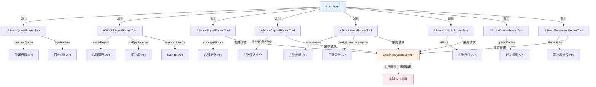
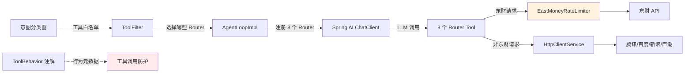

# A 股数据工具集 + Router 架构 -- 44 个工具如何被驯服

> 本文档是小墨项目技术亮点系列的第 4 篇，面向初次接触项目的开发者，从问题出发，逐步拆解 A 股数据工具集的设计思路与 Router 架构的实现细节。

---

## 目录

- [一、核心内容](#一核心内容)
- [二、为什么需要这个设计](#二为什么需要这个设计)
- [三、整体架构](#三整体架构)
- [四、代码走读](#四代码走读)
- [五、配置与调参](#五配置与调参)
- [六、实战案例](#六实战案例)
- [七、与其他模块的关系](#七与其他模块的关系)
- [八、常见问题排查](#八常见问题排查)
- [九、源码索引](#九源码索引)
- [十、延伸阅读](#十延伸阅读)

---

## 一、核心内容

- 理解为什么 40+ 个金融数据 API 不能直接暴露给 LLM，必须用 Router 模式封装
- 掌握 Router Tool 的 `operation` + `params` 双参数设计模式
- 理解东财限流器（`EastMoneyRateLimiter`）的串行限流 + 随机抖动策略
- 知道新增一个 A 股数据工具的完整步骤
- 了解 8 个 Router Tool 各自覆盖的数据领域和数据源

---

## 二、为什么需要这个设计

### 2.1 问题场景

小墨需要对接 7+ 个数据源（腾讯、东财、同花顺、巨潮、新浪、百度、iwencai），覆盖行情、研报、资金、新闻、打板、期权、情绪等 8 大领域，总计 59 个 API 端点。

如果每个 API 端点都定义为一个独立的 `@Tool` 方法：
- LLM 面对 59 个工具定义，选择困难
- 工具描述占用大量 token（每个工具描述约 100-200 token，59 个就是 6000-12000 token）
- 同领域的工具分散，LLM 难以理解它们之间的关系

### 2.2 不这样做的后果

| 场景 | 59 个独立工具 | 8 个 Router Tool |
|------|-------------|-----------------|
| 工具定义 token | ~8000 token | ~1200 token |
| LLM 选择准确率 | 低（容易选错工具） | 高（先选领域再选操作） |
| 新增 API | 改 AgentLoopImpl 注册 | 只改对应 Router 类 |
| 东财限流 | 每个工具单独处理 | 统一走 RateLimiter |

### 2.3 设计目标

1. **领域内聚**：同一数据源、同一领域的 API 封装在一个 Router 中
2. **双层路由**：LLM 先选 Router（领域），再选 operation（具体 API）
3. **统一限流**：东财 API 统一走 `EastMoneyRateLimiter`，避免触发封禁
4. **可扩展**：新增 API 只需在对应 Router 中添加一个 `case`，不改架构

---

## 三、整体架构

### 3.1 一句话描述

将 59 个金融数据 API 按领域封装为 8 个 Router Tool，每个 Router 通过 `operation` 参数路由到具体操作，东财 API 统一走串行限流器。

### 3.2 架构图



### 3.3 核心组件表

| 组件 | 文件路径 | 职责 |
|------|---------|------|
| AStockQuoteRouterTool | `tool/astock/AStockQuoteRouterTool.java` | 实时行情、K线（腾讯/百度） |
| AStockReportRouterTool | `tool/astock/AStockReportRouterTool.java` | 研报、EPS预测、语义搜索（东财/同花顺/iwencai） |
| AStockSignalRouterTool | `tool/astock/AStockSignalRouterTool.java` | 热点板块、龙虎榜、解禁（东财） |
| AStockCapitalRouterTool | `tool/astock/AStockCapitalRouterTool.java` | 融资融券、大宗交易、股东（东财） |
| AStockNewsRouterTool | `tool/astock/AStockNewsRouterTool.java` | 新闻、公告、互动问答（东财/巨潮/新浪） |
| AStockLimitUpRouterTool | `tool/astock/AStockLimitUpRouterTool.java` | 涨停池、连板梯队、跌停（东财/同花顺） |
| AStockOptionRouterTool | `tool/astock/AStockOptionRouterTool.java` | ETF期权T型报价、希腊字母（新浪） |
| AStockSentimentRouterTool | `tool/astock/AStockSentimentRouterTool.java` | 热榜、人气榜、概念命中（同花顺/东财） |
| EastMoneyRateLimiter | `tool/astock/EastMoneyRateLimiter.java` | 东财API串行限流（≥1s + 随机抖动） |
| AStockUtils | `tool/astock/AStockUtils.java` | 代码标准化、市场前缀、金额格式化 |
| ToolBehavior | `tool/annotation/ToolBehavior.java` | 工具行为注解（deterministic/cacheable） |

---

## 四、代码走读

### 4.1 Router 模式：operation + params 双参数

每个 Router Tool 只有一个 `@Tool` 方法，通过 `operation` 参数路由到具体操作：

```java
// AStockQuoteRouterTool.java — 核心结构
@Tool(description = "A股行情深度查询。operation 可选值：tencentQuote, baiduKline。params 为 JSON 字符串。")
public String a_stock_quote(
        @ToolParam(description = "操作类型") String operation,
        @ToolParam(description = "JSON格式参数") String params) {
    JsonNode p = parseParams(params);
    return switch (operation.trim()) {
        case "tencentQuote" -> tencentQuote(getStr(p, "stockCodes"));
        case "baiduKline" -> baiduKline(getStr(p, "stockCode"), getOptStr(p, "startTime", ""));
        default -> "未知操作: " + operation;
    };
}
```

**LLM 调用示例**：

```json
{
  "operation": "tencentQuote",
  "params": "{\"stockCodes\":\"600519,000858\"}"
}
```

**为什么用 JSON 字符串而不是多个参数？**

Spring AI 的 `@Tool` 方法参数会被序列化为工具调用的 input schema。如果每个操作的参数都作为独立方法参数，schema 会非常复杂（59 个操作各有不同参数）。用 `params` JSON 字符串统一传参，schema 只需要两个字段（`operation` + `params`），LLM 更容易理解。

### 4.2 统一的参数解析工具

每个 Router 都有一组私有的参数解析方法，处理 JSON 参数的提取和默认值：

```java
// 每个 Router 内部的工具方法
private JsonNode parseParams(String params) {
    if (params == null || params.isBlank()) return null;
    return objectMapper.readTree(params);
}

private String getStr(JsonNode p, String key) {
    if (p == null || !p.has(key) || p.get(key).isNull())
        throw new IllegalArgumentException("缺少参数: " + key);
    return p.get(key).asText();
}

private String getOptStr(JsonNode p, String key, String defaultVal) {
    if (p == null || !p.has(key) || p.get(key).isNull()) return defaultVal;
    return p.get(key).asText();
}
```

### 4.3 东财限流器：EastMoneyRateLimiter

东财 API 有严格的反爬策略，频繁请求会触发 403 封禁。`EastMoneyRateLimiter` 是所有东财请求的统一网关：

```java
// EastMoneyRateLimiter.java — 核心限流逻辑
public synchronized String get(String url, Map<String, String> headers) throws Exception {
    waitForInterval();  // 限流等待
    Request request = new Request.Builder().url(url).get()
            .header("User-Agent", EM_UA).build();
    return executeWithRetry(request, true);
}

private void waitForInterval() throws InterruptedException {
    long now = System.currentTimeMillis();
    long elapsed = now - lastCallTime;
    long waitNeeded = minIntervalMs - elapsed;  // 默认 1000ms
    if (waitNeeded > 0) {
        long jitter = (long) (random.nextDouble() * jitterMaxMs);  // 默认 0-500ms
        Thread.sleep(waitNeeded + jitter);
    }
}
```

**三个关键设计**：

1. **串行限流**：`synchronized` 保证同一时刻只有一个东财请求在执行
2. **最小间隔**：两次请求之间至少间隔 `minIntervalMs`（默认 1000ms）
3. **随机抖动**：在最小间隔基础上加 0-500ms 随机延迟，避免固定频率被识别为爬虫

**重试策略**：遇到 429（限流）或 5xx（服务端错误）时，指数退避重试最多 3 次（600ms → 1200ms → 2400ms）。遇到 403（风控封禁）立即放弃，不浪费重试次数。

### 4.4 代码标准化：AStockUtils

不同数据源对股票代码的格式要求不同：

| 数据源 | 沪市格式 | 深市格式 | 示例 |
|--------|---------|---------|------|
| 腾讯 | `sh600519` | `sz000858` | `toMarketPrefix()` |
| 东财 | `1.600519` | `0.000858` | `toEastmoneySecId()` |
| 百度 | `600519` | `000858` | 直接用 |

`AStockUtils.normalizeCode()` 统一处理各种输入格式：

```java
// 支持输入：600519, sh600519, 600519.SH, SH600519
public static String normalizeCode(String input) {
    String code = input.trim().toLowerCase();
    code = code.replaceAll("\\.(sh|sz|bj)$", "");  // 去后缀
    code = code.replaceAll("^(sh|sz|bj)", "");      // 去前缀
    if (!code.matches("^\\d{6}$"))
        throw new IllegalArgumentException("无效的股票代码: " + input);
    return code;
}
```

### 4.5 8 个 Router Tool 全景

| Router | operation 列表 | 数据源 | 是否走东财限流器 |
|--------|---------------|--------|----------------|
| **AStockQuoteRouterTool** | tencentQuote, baiduKline | 腾讯、百度 | 否 |
| **AStockReportRouterTool** | stockReport, industryReport, downloadReportPdf, thsEpsForecast, iwencaiSearch, iwencaiQuery | 东财、同花顺、iwencai | 部分（stockReport/industryReport） |
| **AStockSignalRouterTool** | conceptBlocks, fundFlowMinute, dragonTigerBoard, dailyDragonTiger, lockupExpiry, industryRanking | 东财 | 是 |
| **AStockCapitalRouterTool** | marginTrading, blockTrade, holderNumChange, dividendHistory, fundFlow120d, northboundFlow | 东财 | 是 |
| **AStockNewsRouterTool** | stockNews, globalNews, cninfoAnnouncements, irmQA, sinaFinancialReport | 东财、巨潮、新浪 | 部分（stockNews/globalNews） |
| **AStockLimitUpRouterTool** | ztPool, zbPool, dtPool, yztPool, thsLimitUpPool, sentimentOverview | 东财、同花顺 | 是（东财部分） |
| **AStockOptionRouterTool** | optionCodes, optionTQuote, optionGreeks | 新浪 | 否 |
| **AStockSentimentRouterTool** | thsHotList, emHotRank, emConceptHit | 同花顺、东财 | 部分（emHotRank/emConceptHit） |

**总计**：8 个 Router，59 个路由操作，覆盖 7+ 数据源。

### 4.6 @ToolBehavior 注解

每个 Router 方法都标注了 `@ToolBehavior`，声明工具的行为特征：

```java
@ToolBehavior(deterministic = false, cacheable = false)
@Tool(description = "...")
public String a_stock_quote(...) { ... }
```

| 属性 | 含义 | A 股工具默认值 |
|------|------|---------------|
| `deterministic` | 相同输入是否总返回相同结果 | `false`（行情数据实时变化） |
| `cacheable` | 结果是否可缓存 | `false`（同上） |

这些注解供 [工具调用防护系统](02-ToolGuardSystem.md) 使用，判断是否可以对工具结果做去重和缓存。

---

## 五、配置与调参

| 配置项 | 默认值 | 说明 |
|--------|--------|------|
| `astock.eastmoney.min-interval-ms` | `1000` | 东财请求最小间隔（ms），建议 ≥ 1000 |
| `astock.eastmoney.jitter-max-ms` | `500` | 随机抖动上限（ms），实际抖动为 0 到此值 |
| `astock.eastmoney.connect-timeout-seconds` | `10` | 东财 HTTP 连接超时 |
| `astock.eastmoney.read-timeout-seconds` | `15` | 东财 HTTP 读取超时 |
| `astock.iwencai.api-key` | 空 | iwencai 语义搜索 API Key（可选） |

---

## 六、实战案例

### 6.1 正常流程：查询茅台实时行情

LLM 决策：用户要查行情 → 选 `a_stock_quote` Router → 选 `tencentQuote` 操作

```
[AStockQuoteRouterTool] operation=tencentQuote, params={"stockCodes":"600519"}
→ 腾讯行情 API: https://qt.gtimg.cn/q=sh600519
→ 解析返回数据

=== A股实时行情 ===

贵州茅台(600519): 1520.00元  涨跌: +1.25%
  PE(TTM): 28.50  PB: 8.32  市值: 19100.00亿  流通市值: 19100.00亿
  换手率: 0.35%  量比: 1.02  成交额: 125000.00万
  涨停价: 1672.00  跌停价: 1368.00
```

### 6.2 东财限流场景

连续调用两个东财 API（如先查研报再查资金面）：

```
[AStockReportRouterTool] operation=stockReport, params={"stockCode":"600519"}
→ [EastMoneyRateLimiter] 限流等待 0ms（首次调用）
→ 东财报表 API 返回

[AStockCapitalRouterTool] operation=marginTrading, params={"stockCode":"600519"}
→ [EastMoneyRateLimiter] 限流等待 1234ms + 抖动 187ms
→ Thread.sleep(1421ms)
→ 东财数据中心返回
```

### 6.3 异常场景：东财 403 封禁

```
[AStockSignalRouterTool] operation=conceptBlocks, params={"stockCode":"600519"}
→ [EastMoneyRateLimiter] 限流等待 1100ms
→ 东财返回 HTTP 403
→ 抛出异常: "东财 403 风控触发，请降低请求频率"
→ Router 返回错误字符串: "操作失败: 东财 403 风控触发..."
```

---

## 七、与其他模块的关系



修改 Router Tool 时需要注意的联动点：
- 新增 Router → 同步更新 `IntentToolGroupMap` 的工具白名单
- 新增东财 API → 确保走 `EastMoneyRateLimiter`，不要直接用 `HttpClientService`
- 修改工具名 → 同步更新意图分类器的白名单映射和测试用例
- 修改 `@ToolBehavior` → 影响工具调用防护的去重和缓存策略

---

## 八、常见问题排查

| 现象 | 可能原因 | 排查方法 |
|------|---------|---------|
| 东财 API 返回 403 | 请求频率过高，触发风控 | 检查 `EastMoneyRateLimiter` 日志，增大 `min-interval-ms` |
| 东财 API 返回空数据 | 股票代码格式错误 | 检查 `AStockUtils.normalizeCode()` 输出 |
| LLM 不知道用哪个 operation | 工具描述中 operation 列表不清晰 | 检查 `@Tool` 注解的 description |
| iwencai 搜索返回 401 | API Key 未配置或过期 | 检查 `astock.iwencai.api-key` 配置 |
| 腾讯行情返回乱码 | GBK 编码未正确处理 | 检查 `httpClientService.get()` 的编码处理 |
| 百度K线数据为空 | startTime 参数格式错误 | 检查日期格式是否为 `yyyy-MM-dd` |

---

## 九、源码索引

| 文件 | 路径 | 关键方法 |
|------|------|---------|
| AStockQuoteRouterTool | `tool/astock/AStockQuoteRouterTool.java` | `a_stock_quote()`, `tencentQuote()`, `baiduKline()` |
| AStockReportRouterTool | `tool/astock/AStockReportRouterTool.java` | `a_stock_report()`, `stockReport()`, `iwencaiSearch()` |
| AStockSignalRouterTool | `tool/astock/AStockSignalRouterTool.java` | `a_stock_signal()`, `conceptBlocks()`, `dragonTigerBoard()` |
| AStockCapitalRouterTool | `tool/astock/AStockCapitalRouterTool.java` | `a_stock_capital()`, `marginTrading()`, `northboundFlow()` |
| AStockNewsRouterTool | `tool/astock/AStockNewsRouterTool.java` | `a_stock_news()`, `stockNews()`, `cninfoAnnouncements()` |
| AStockLimitUpRouterTool | `tool/astock/AStockLimitUpRouterTool.java` | `a_stock_limit_up()`, `ztPool()`, `sentimentOverview()` |
| AStockOptionRouterTool | `tool/astock/AStockOptionRouterTool.java` | `a_stock_option()`, `optionTQuote()`, `optionGreeks()` |
| AStockSentimentRouterTool | `tool/astock/AStockSentimentRouterTool.java` | `a_stock_sentiment()`, `thsHotList()`, `emHotRank()` |
| EastMoneyRateLimiter | `tool/astock/EastMoneyRateLimiter.java` | `get()`, `post()`, `waitForInterval()`, `retryWithBackoff()` |
| AStockUtils | `tool/astock/AStockUtils.java` | `normalizeCode()`, `toEastmoneySecId()`, `toMarketPrefix()` |
| ToolBehavior | `tool/annotation/ToolBehavior.java` | 注解定义 |
| 工具参考手册 | `docs/Guides/tool-reference.md` | 全量工具列表 |

---

## 十、延伸阅读

- [工具参考手册](../Guides/tool-reference.md) — 19 个工具类、44 个方法、59 个操作的完整列表
- [市场工具汇总](../Guides/market-tools-summary.md) — 各数据源的 API 特点和限制
- [分析师工具映射](../Guides/analyst-tools-mapping.md) — 深度分析工作流中 3 位分析师各自使用哪些工具
- [意图分类 + 工具过滤](03-IntentClassificationAndToolFiltering.md) — 如何从 8 个 Router 中选择相关的子集
- [工具调用防护 + 幻觉防护](02-ToolGuardSystem.md) — 工具调用后的安全防护机制
