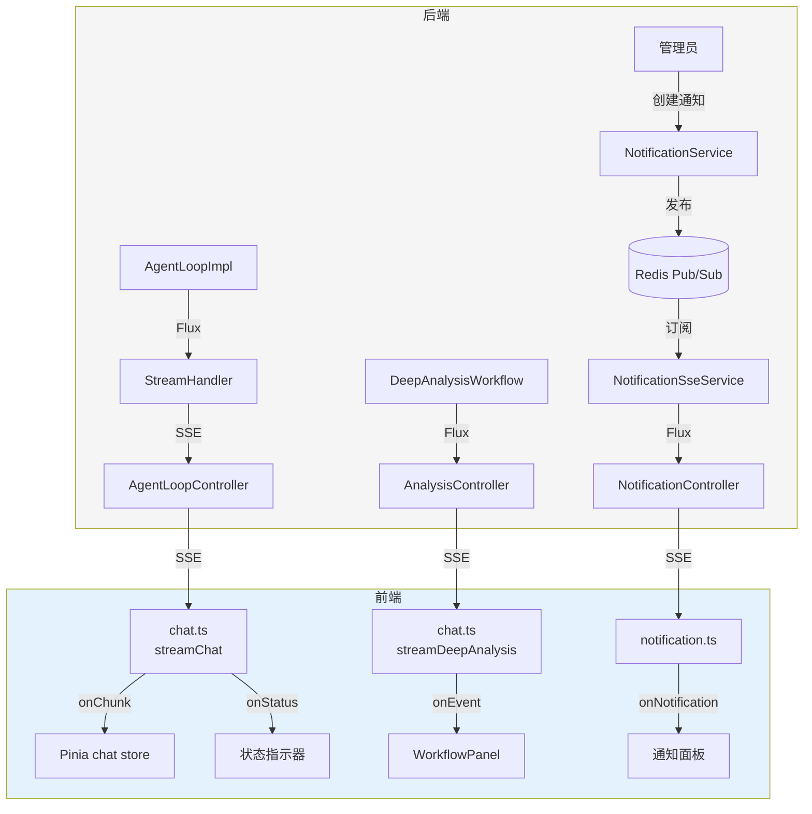
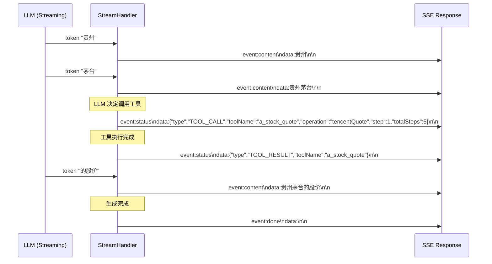
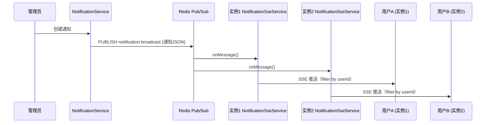
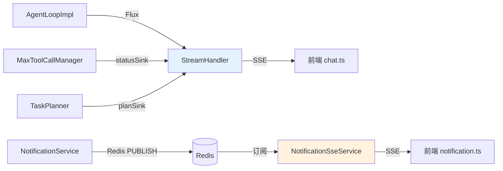

# SSE 流式架构 + 通知系统 -- 实时推送的技术实现

> 本文档是小墨项目技术亮点系列的第 6 篇，面向初次接触项目的开发者，从问题出发，逐步拆解 SSE 流式对话和实时通知系统的设计思路与实现细节。

---

## 目录

- [一、核心内容](#一核心内容)
- [二、为什么需要这个设计](#二为什么需要这个设计)
- [三、整体架构](#三整体架构)
- [四、代码走读](#四代码走读)
- [五、配置与调参](#五配置与调参)
- [六、实战案例](#六实战案例)
- [七、与其他模块的关系](#七与其他模块的关系)
- [八、常见问题排查](#八常见问题排查)
- [九、源码索引](#九源码索引)
- [十、延伸阅读](#十延伸阅读)

---

## 一、核心内容

- 理解为什么 AI 对话必须用 SSE 流式输出而不是一次性返回
- 掌握后端 Flux → SSE → 前端 ReadableStream 的完整数据流
- 了解 5 种 SSE 事件类型（THINKING / TOOL_CALL / TOOL_RESULT / CONTENT / PLAN）
- 理解通知系统如何通过 Redis Pub/Sub 实现跨实例的实时推送
- 知道前端如何解析 SSE 流并处理 buffer 拆分问题

---

## 二、为什么需要这个设计

### 2.1 问题场景一：AI 对话的等待焦虑

LLM 生成一个完整的分析报告需要 10-30 秒。如果用同步接口，用户需要盯着空白页面等 30 秒，体验极差。SSE 流式输出让用户看到文字逐字出现，像"打字"一样，大幅降低感知等待时间。

### 2.2 问题场景二：工具调用过程不透明

Agent 在后台调用了 5 个工具，用户完全不知道发生了什么。SSE 的 status 事件可以实时告知用户"正在查询行情..."、"正在分析研报..."，让过程透明化。

### 2.3 问题场景三：通知推送

管理员发布公告后，需要实时推送给所有在线用户。传统的轮询方案浪费资源，SSE 可以实现服务端主动推送。

### 2.4 设计目标

1. **逐字输出**：LLM 生成的每个 token 都立即推送到前端
2. **状态透明**：工具调用的开始/结束、执行计划都实时可见
3. **跨实例推送**：多实例部署时，通知能推送到所有实例上的用户
4. **断线恢复**：前端可以取消请求、重新连接

---

## 三、整体架构

### 3.1 一句话描述

后端通过 Reactor Flux 驱动 SSE 流，前端通过 fetch + ReadableStream 消费事件；通知系统通过 Redis Pub/Sub 实现跨实例广播，每个实例维护本地 Sink 推送给连接的用户。

### 3.2 架构图



### 3.3 核心组件表

| 组件 | 文件路径 | 职责 |
|------|---------|------|
| StreamHandler | `agent/service/impl/StreamHandler.java` | 后端 SSE 流组装，处理 LLM 流式输出和工具调用事件 |
| ChatStreamEvent | `agent/service/ChatStreamEvent.java` | SSE 事件模型（5 种类型） |
| AgentLoopController | `agent/controller/AgentLoopController.java` | 聊天 SSE 端点 |
| AnalysisController | `analysis/controller/AnalysisController.java` | 深度分析 SSE 端点 |
| NotificationSseService | `notification/service/NotificationSseService.java` | 通知 SSE 服务（Redis Pub/Sub） |
| NotificationController | `notification/controller/NotificationController.java` | 通知 SSE 端点 |
| chat.ts | `frontend/src/api/chat.ts` | 前端 SSE 客户端（streamChat + streamDeepAnalysis） |
| notification.ts | `frontend/src/api/notification.ts` | 前端通知 SSE 客户端 |
| chat store | `frontend/src/stores/chat.ts` | Pinia 状态管理（消息追加） |

---

## 四、代码走读

### 4.1 SSE 事件类型

后端定义了 5 种事件类型：

```java
// ChatStreamEvent.java
public enum ChatStreamEventType {
    THINKING,    // LLM 正在思考
    TOOL_CALL,   // 开始调用工具（含工具名、操作名、步骤数）
    TOOL_RESULT, // 工具调用完成
    CONTENT,     // LLM 生成的文本增量
    PLAN         // 执行计划（含目标和步骤列表）
}
```

每种事件携带不同的数据：

| 事件 | 携带字段 | 前端处理 |
|------|---------|---------|
| THINKING | 无 | 显示"思考中..."动画 |
| TOOL_CALL | toolName, operation, step, totalSteps | 显示"正在调用 a_stock_quote(tencentQuote) [1/5]" |
| TOOL_RESULT | toolName | 隐藏工具调用指示器 |
| CONTENT | content（文本增量） | 追加到消息内容 |
| PLAN | planGoal, planSteps | 显示执行计划面板 |

### 4.2 后端 SSE 流组装

`StreamHandler` 负责将 LLM 的流式输出和工具调用事件组装为 SSE 流：



### 4.3 前端 SSE 解析

前端通过 `fetch` + `ReadableStream` 消费 SSE 流：

```typescript
// chat.ts — streamChat() 核心逻辑
export function streamChat(conversationId, message, token, callbacks): AbortController {
  const controller = new AbortController()

  fetch(url, { headers: { Authorization: `Bearer ${token}` }, signal: controller.signal })
    .then(async (res) => {
      const reader = res.body.getReader()
      const decoder = new TextDecoder()
      let buffer = ''

      while (true) {
        const { done, value } = await reader.read()
        if (done) break

        buffer += decoder.decode(value, { stream: true })
        const result = processChatEvents(buffer)  // 解析 SSE 事件
        buffer = result.incomplete                  // 保留不完整的事件

        for (const event of result.events) {
          if (event.event === 'content') {
            callbacks.onChunk(event.data)           // 追加文本
          } else if (event.event === 'status') {
            callbacks.onStatus(JSON.parse(event.data))  // 状态更新
          }
        }
      }
      callbacks.onDone(lastText)
    })

  return controller  // 用于取消请求
}
```

**关键设计：buffer 处理**

SSE 事件以 `\n\n` 分隔。但 TCP 包可能在任意位置拆分，一个事件可能跨两个 `read()` 调用。`processChatEvents()` 用 `split(/\n\n/)` 分割，最后一段（不完整的）保留在 buffer 中，等下次 `read()` 补全。

### 4.4 通知系统：Redis Pub/Sub

通知系统使用 Redis Pub/Sub 实现跨实例推送：



`NotificationSseService` 实现了 `MessageListener` 接口，订阅 Redis Channel：

```java
// NotificationSseService.java — 核心逻辑
public class NotificationSseService implements MessageListener {

    private final Sinks.Many<String> sink = Sinks.many().multicast().onBackpressureBuffer();

    @PostConstruct
    public void init() {
        // 订阅 Redis Channel
        redisMessageListenerContainer.addMessageListener(
                new MessageListenerAdapter(this, "onMessage"),
                new ChannelTopic("notification:broadcast"));
    }

    @Override
    public void onMessage(Message message, byte[] pattern) {
        sink.tryEmitNext(new String(message.getBody()));  // 发布到本地 Sink
    }

    public Flux<String> getNotificationStream(Long userId) {
        return sink.asFlux().filter(body -> {
            // 广播通知推送给所有人，定向通知只推送给目标用户
            JsonNode node = objectMapper.readTree(body);
            boolean broadcast = node.get("broadcast").asBoolean(true);
            if (broadcast) return true;
            // 检查 userId 是否在 targetUserIds 中
            ...
        });
    }
}
```

**跨实例原理**：
- 管理员创建通知 → `NotificationService` 发布到 Redis Channel
- 所有实例的 `NotificationSseService` 都收到消息（Redis Pub/Sub 广播）
- 每个实例的 `getNotificationStream(userId)` 按 userId 过滤，只推送给目标用户

---

## 五、配置与调参

| 配置项 | 默认值 | 说明 |
|--------|--------|------|
| SSE 超时 | 120s | 流式对话的超时时间 |
| Redis Channel | `notification:broadcast` | 通知广播的 Redis Channel |
| `spring.mvc.async.request-timeout` | -1 | Spring MVC 异步请求超时（-1=不超时） |

---

## 六、实战案例

### 6.1 正常流式对话

```
客户端请求: GET /agent/chat/stream?conversationId=1&message=茅台多少钱

SSE 响应流:
event:status
data:{"type":"THINKING"}

event:status
data:{"type":"TOOL_CALL","toolName":"a_stock_quote","operation":"tencentQuote","step":1,"totalSteps":1}

event:status
data:{"type":"TOOL_RESULT","toolName":"a_stock_quote"}

event:content
data:贵州茅台

event:content
data:贵州茅台(600519)

event:content
data:贵州茅台(600519) 当前价格 1520.00 元

event:done
data:
```

前端处理：
```
→ 显示"思考中..."
→ 显示"正在调用 a_stock_quote(tencentQuote) [1/1]"
→ 隐藏工具调用指示器
→ 逐字显示"贵州茅台(600519) 当前价格 1520.00 元"
→ 流结束
```

### 6.2 取消请求

```
用户在流式输出过程中点击"停止"
→ 调用 controller.abort()
→ fetch 请求被取消
→ 后端检测到连接断开，停止 LLM 生成
```

---

## 七、与其他模块的关系



---

## 八、常见问题排查

| 现象 | 可能原因 | 排查方法 |
|------|---------|---------|
| 前端收到乱码 | 编码不一致 | 检查 Content-Type 是否为 `text/event-stream;charset=UTF-8` |
| 流式输出中途断开 | 超时或代理断连 | 检查 SSE 超时配置和 Nginx 代理设置 |
| 通知不推送 | Redis 连接失败 | 检查 Redis 配置和 `notification:broadcast` Channel |
| 工具调用状态不显示 | statusSink 未注入 | 检查 `MaxToolCallManager` 中的 statusSink 注入 |
| buffer 拆分导致事件丢失 | processChatEvents 处理不当 | 检查 `incomplete` buffer 的处理逻辑 |

---

## 九、源码索引

| 文件 | 路径 | 关键方法 |
|------|------|---------|
| StreamHandler | `agent/service/impl/StreamHandler.java` | SSE 流组装 |
| ChatStreamEvent | `agent/service/ChatStreamEvent.java` | 5 种事件类型 |
| AgentLoopController | `agent/controller/AgentLoopController.java` | `/agent/chat/stream` 端点 |
| AnalysisController | `analysis/controller/AnalysisController.java` | `/api/analysis/{id}/stream` 端点 |
| NotificationSseService | `notification/service/NotificationSseService.java` | `onMessage()`, `getNotificationStream()` |
| NotificationController | `notification/controller/NotificationController.java` | `/api/notifications/stream` 端点 |
| chat.ts | `frontend/src/api/chat.ts` | `streamChat()`, `streamDeepAnalysis()`, `processWorkflowEvents()` |
| notification.ts | `frontend/src/api/notification.ts` | 通知 SSE 客户端 |
| chat store | `frontend/src/stores/chat.ts` | 消息追加和状态管理 |

---

## 十、延伸阅读

- [多智能体深度分析工作流](01-MultiAgentWorkflow.md) — 深度分析的 SSE 事件流
- [工具调用防护](02-ToolGuardSystem.md) — 工具调用状态事件的发射
- [用户配置系统](07-UserConfigSystem.md) — 用户级 ChatModel 对流式输出的影响
