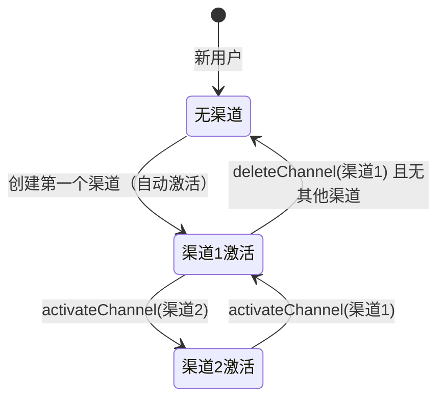

# 用户配置系统 -- 让每个用户拥有自己的 AI 服务

> 本文档是小墨项目技术亮点系列的第 7 篇，面向初次接触项目的开发者，从问题出发，逐步拆解用户配置系统的设计思路与实现细节。

---

## 目录

- [一、核心内容](#一核心内容)
- [二、为什么需要这个设计](#二为什么需要这个设计)
- [三、整体架构](#三整体架构)
- [四、代码走读](#四代码走读)
- [五、配置与调参](#五配置与调参)
- [六、实战案例](#六实战案例)
- [七、与其他模块的关系](#七与其他模块的关系)
- [八、常见问题排查](#八常见问题排查)
- [九、源码索引](#九源码索引)
- [十、延伸阅读](#十延伸阅读)

---

## 一、核心内容

- 理解为什么需要 Per-User API Key 路由，而不是所有用户共享一个 API Key
- 掌握用户级 ChatModel 的创建和回退机制
- 了解多渠道管理（Channel）的设计 — 一个用户可以配置多个 API 渠道并切换
- 理解 API Key 加密存储和脱敏显示的安全设计
- 知道连接测试功能如何验证用户配置的可用性

---

## 二、为什么需要这个设计

### 2.1 问题场景

小墨默认使用全局 API Key 调用 LLM。但：
- 免费额度有限，用户用完后无法继续使用
- 不同用户可能使用不同的 API 提供商（官方 Anthropic、第三方代理）
- 不同用户可能偏好不同的模型（Claude Opus、Claude Sonnet）
- 一个 API Key 被所有用户共享，限流时互相影响

### 2.2 不这样做的后果

| 场景 | 无用户配置 | 有用户配置 |
|------|-----------|-----------|
| 免费额度用完 | 用户无法使用 | 用户配置自己的 API Key 继续使用 |
| API 限流 | 所有用户受影响 | 每个用户用自己的 Key，互不影响 |
| 想用不同模型 | 只能用全局默认模型 | 用户可选模型 |
| 想用代理 API | 不支持 | 用户可自定义 Base URL |

### 2.3 设计目标

1. **Per-User API Key**：每个用户可以配置自己的 API Key，系统自动路由
2. **多渠道管理**：一个用户可以配置多个 API 渠道（如官方 + 代理），随时切换
3. **安全存储**：API Key 加密存储，前端脱敏显示
4. **平滑回退**：用户无自定义配置时，自动回退到全局默认
5. **连接测试**：保存前可测试 API Key 是否有效

---

## 三、整体架构

### 3.1 一句话描述

每个用户可以配置多个 API 渠道（Channel），每个渠道包含 API Key、Base URL、模型名；系统根据激活渠道创建用户级 ChatModel，无配置时回退到全局默认。

### 3.2 架构图

```mermaid
flowchart TD
    subgraph UserSettings["用户设置"]
        CH1[渠道1: Anthropic 官方<br/>API Key + claude-sonnet-4]
        CH2[渠道2: 代理服务<br/>API Key + 自定义 URL]
        CH3[渠道3: ...]
    end

    subgraph Backend["后端"]
        UCS[UserConfigService]
        UCS -->|查找激活渠道| DB[(user_config 表)]
        UCS -->|加密/解密| ENC[EncryptionService]
        UCS -->|缓存| Redis[(Redis)]

        UCS -->|getUserChatModel()| CM[用户级 ChatModel]
        CM -->|有配置| UC[AnthropicChatModel<br/>用户 API Key]
        CM -->|无配置| GC[全局默认 ChatModel]
    end

    subgraph Integration["集成点"]
        Agent[AgentLoopImpl] -->|调用| UCS
        DAW[DeepAnalysisWorkflow] -->|调用| UCS
        Agent -->|使用 ChatModel| CM
    end

    style UserSettings fill:#e3f2fd
    style UCS fill:#fff3e0
```

### 3.3 核心组件表

| 组件 | 文件路径 | 职责 |
|------|---------|------|
| UserConfigService | `user/config/UserConfigService.java` | 配置管理（CRUD + 多渠道 + ChatModel 创建） |
| UserConfig | `user/config/UserConfig.java` | JPA 实体（API Key 加密存储） |
| UserConfigDTO | `user/config/UserConfigDTO.java` | API 传输对象（API Key 脱敏） |
| ApiChannelDTO | `user/config/ApiChannelDTO.java` | 渠道传输对象 |
| ConfigController | `user/config/ConfigController.java` | REST API（配置 + 渠道管理） |
| UserConfigRepository | `user/config/UserConfigRepository.java` | 数据库访问 |
| EncryptionService | `common/util/EncryptionService.java` | API Key 加密/解密 |
| SettingsDialog | `frontend/src/components/SettingsDialog.vue` | 前端设置界面 |

---

## 四、代码走读

### 4.1 Per-User ChatModel 创建

`UserConfigService.getUserChatModel()` 是核心方法 — 根据用户配置创建独立的 ChatModel：

```java
// UserConfigService.java — getUserChatModel()
public ChatModel getUserChatModel(Long userId) {
    UserConfig config = findEffectiveConfig(userId);  // 查找激活渠道
    if (config == null || config.getApiKeyEncrypted() == null) {
        return null;  // 无配置，调用方使用全局默认
    }

    String apiKey = encryptionService.decrypt(config.getApiKeyEncrypted());
    String baseUrl = config.getBaseUrl() != null ? config.getBaseUrl() : "https://api.anthropic.com";
    String modelName = config.getModelName() != null ? config.getModelName() : "claude-sonnet-4-20250514";

    AnthropicApi anthropicApi = AnthropicApi.builder()
            .baseUrl(baseUrl).apiKey(apiKey).build();
    return AnthropicChatModel.builder()
            .anthropicApi(anthropicApi)
            .defaultOptions(AnthropicChatOptions.builder()
                    .model(modelName).maxTokens(4096).temperature(0.7).build())
            .build();
}
```

**调用方回退逻辑**（以 `DeepAnalysisWorkflow` 为例）：

```java
// DeepAnalysisWorkflow.java — 回退逻辑
ChatModel userChatModel = userConfigService.getUserChatModel(userId);
if (userChatModel != null) {
    log.info("使用用户自定义配置, userId={}", userId);
} else {
    log.info("使用全局默认配置, userId={}", userId);
}
// 后续使用 userChatModel（可能为 null，由各 Agent 工厂处理回退）
```

### 4.2 多渠道管理

一个用户可以有多个 API 渠道，但同一时刻只有一个激活：



**激活切换**：`activateChannel()` 先取消所有渠道的激活状态，再激活目标渠道：

```java
// UserConfigService.java — activateChannel()
public void activateChannel(Long userId, Long channelId) {
    userConfigRepository.deactivateAllByUserId(userId);  // 取消所有
    UserConfig config = userConfigRepository.findByIdAndUserId(channelId, userId).orElseThrow();
    config.setIsActive(true);
    userConfigRepository.save(config);
    clearCache(userId);
}
```

**删除激活渠道**：自动切换到下一个可用渠道：

```java
// UserConfigService.java — deleteChannel()
if (wasActive) {
    List<UserConfig> remaining = userConfigRepository.findByUserIdOrderByCreatedAtAsc(userId);
    if (!remaining.isEmpty()) {
        remaining.get(0).setIsActive(true);  // 自动激活下一个
    }
}
```

### 4.3 API Key 安全设计

**存储安全**：
- API Key 使用 `EncryptionService` 加密后存储到数据库
- 数据库字段 `api_key_encrypted` 最大 512 字符

**显示安全**：
- 前端展示时脱敏：`sk-ant-***xyz`
- `maskApiKey()` 方法：保留前 3 位和后 3 位，中间用 `***` 替代

```java
// UserConfigService.java — maskApiKey()
private String maskApiKey(String apiKey) {
    if (apiKey == null || apiKey.length() < 6) return "***";
    return apiKey.substring(0, 3) + "***" + apiKey.substring(apiKey.length() - 3);
}
```

**传输安全**：
- 前端提交的 API Key 通过 HTTPS 传输
- 保存时加密，读取时脱敏，只有创建 ChatModel 时才解密

### 4.4 连接测试

用户保存配置前可以测试 API Key 是否有效：

```java
// UserConfigService.java — testConnection()
public Result<Map<String, Object>> testConnection(UserConfigDTO dto) {
    String url = baseUrl + "/v1/messages";
    String requestBody = objectMapper.writeValueAsString(Map.of(
            "model", modelName, "max_tokens", 1,
            "messages", List.of(Map.of("role", "user", "content", "hi"))));

    Request request = new Request.Builder().url(url)
            .addHeader("x-api-key", apiKey)
            .addHeader("anthropic-version", "2023-06-01")
            .post(RequestBody.create(requestBody, MediaType.parse("application/json")))
            .build();

    long startTime = System.currentTimeMillis();
    String responseBody = httpClientService.execute(request);
    long latency = System.currentTimeMillis() - startTime;

    return Result.success(Map.of("success", true, "latencyMs", latency, "model", responseMap.get("model")));
}
```

测试发送一个 `max_tokens=1` 的最小请求，验证：
- API Key 是否有效（401 → 无效）
- Base URL 是否可达（ConnectException → 不可达）
- 模型名是否正确（404 → 模型不存在）

### 4.5 Redis 缓存

用户配置缓存到 Redis，避免每次请求都查数据库：

```java
private static final String REDIS_KEY_PREFIX = "user:config:";
private static final long CACHE_TTL_HOURS = 24;

// 读取：先缓存后数据库
public UserConfigDTO getConfig(Long userId) {
    UserConfigDTO cached = getCachedConfig(REDIS_KEY_PREFIX + userId);
    if (cached != null) return cached;
    UserConfig config = findEffectiveConfig(userId);
    UserConfigDTO dto = convertToDTO(config);
    cacheConfig(REDIS_KEY_PREFIX + userId, dto);
    return dto;
}

// 写入：清除缓存
public void saveConfig(Long userId, UserConfigDTO dto) {
    // ... 保存到数据库 ...
    clearCache(userId);  // 下次读取时重新加载
}
```

---

## 五、配置与调参

| 配置项 | 默认值 | 说明 |
|--------|--------|------|
| `CACHE_TTL_HOURS` | `24` | Redis 缓存过期时间（小时） |
| 默认 Base URL | `https://api.anthropic.com` | 用户未配置时的默认 API 地址 |
| 默认模型 | `claude-sonnet-4-20250514` | 用户未配置时的默认模型 |
| 默认 maxTokens | `4096` | 用户级 ChatModel 的最大输出 token |
| 默认 temperature | `0.7` | 用户级 ChatModel 的温度 |

---

## 六、实战案例

### 6.1 用户配置自己的 API Key

```
1. 用户打开设置页面
2. 输入 API Key: sk-ant-abc123xyz789
3. 选择模型: claude-sonnet-4-20250514
4. 点击"测试连接" → 返回 {success: true, latencyMs: 230, model: "claude-sonnet-4-20250514"}
5. 点击"保存" → 加密存储到 user_config 表
6. 后续对话自动使用用户自己的 API Key
```

### 6.2 多渠道切换

```
用户已有渠道1（Anthropic 官方），想添加渠道2（代理服务）：

1. 创建渠道2: {channelName: "代理", apiKey: "sk-proxy-xxx", baseUrl: "https://proxy.example.com"}
2. 渠道2 创建成功，默认未激活
3. 激活渠道2 → deactivateAllByUserId() → activate 渠道2
4. 后续对话使用代理服务的 API

切换回渠道1:
5. activateChannel(渠道1) → deactivateAll → activate 渠道1
```

### 6.3 无配置回退

```
新用户注册后未配置 API Key:
→ getUserChatModel(userId) 返回 null
→ DeepAnalysisWorkflow 使用全局默认 ChatModel
→ 免费额度扣减逻辑生效
```

---

## 七、与其他模块的关系

```mermaid
flowchart LR
    UCS[UserConfigService] -->|getUserChatModel()| Agent[AgentLoopImpl]
    UCS -->|getUserChatModel()| DAW[DeepAnalysisWorkflow]
    Agent -->|Per-User ChatModel| SCC[Spring AI ChatClient]
    DAW -->|Per-User ChatModel| SCC

    UCS -->|加密| ENC[EncryptionService]
    UCS -->|缓存| Redis[(Redis)]
    UCS -->|持久化| DB[(user_config)]

    CC[ConfigController] -->|REST API| UCS
    FE[SettingsDialog.vue] -->|HTTP| CC

    FQS[FreeQuotaService] -->|额度检查| DAW

    style UCS fill:#fff3e0
    style FE fill:#e3f2fd
```

修改用户配置系统时需要注意的联动点：
- 修改 `UserConfig` 实体 → 同步更新数据库 migration
- 修改 ChatModel 创建逻辑 → 影响所有使用用户配置的模块（Agent、工作流）
- 修改加密方式 → 需要处理已有数据的迁移

---

## 八、常见问题排查

| 现象 | 可能原因 | 排查方法 |
|------|---------|---------|
| 用户配置未生效 | 缓存未清除 | 检查 Redis 缓存，手动清除 `user:config:{userId}` |
| API Key 保存后显示为空 | 加密/解密失败 | 检查 `EncryptionService` 是否正常工作 |
| 连接测试超时 | 网络问题或 API 不可达 | 检查 Base URL 和网络连接 |
| 切换渠道后仍用旧配置 | 缓存未更新 | 调用 `clearCache(userId)` |
| 删除激活渠道后无响应 | 自动切换逻辑异常 | 检查 `deleteChannel()` 的自动激活逻辑 |
| 脱敏显示异常 | API Key 长度不足 | 检查 `maskApiKey()` 对短 Key 的处理 |

---

## 九、源码索引

| 文件 | 路径 | 关键方法 |
|------|------|---------|
| UserConfigService | `user/config/UserConfigService.java` | `getConfig()`, `saveConfig()`, `getUserChatModel()`, `activateChannel()`, `testConnection()` |
| UserConfig | `user/config/UserConfig.java` | JPA 实体 |
| UserConfigDTO | `user/config/UserConfigDTO.java` | API 传输对象 |
| ApiChannelDTO | `user/config/ApiChannelDTO.java` | 渠道传输对象 |
| ApiChannelListDTO | `user/config/ApiChannelListDTO.java` | 渠道列表传输对象 |
| ConfigController | `user/config/ConfigController.java` | REST API 端点 |
| UserConfigRepository | `user/config/UserConfigRepository.java` | 数据库访问 |
| EncryptionService | `common/util/EncryptionService.java` | 加密/解密 |
| SettingsDialog | `frontend/src/components/SettingsDialog.vue` | 前端设置界面 |
| 工具开关管理 | `docs/Guides/工具开关管理机制.md` | 工具开关配置说明 |

---

## 十、延伸阅读

- [工具开关管理机制](../Guides/工具开关管理机制.md) — 用户级工具开关配置
- [意图分类 + 工具过滤](03-IntentClassificationAndToolFiltering.md) — 工具开关如何影响意图过滤
- [多智能体深度分析工作流](01-MultiAgentWorkflow.md) — 工作流中的 Per-User ChatModel 路由
- [SSE 流式架构](06-SSEStreamingAndNotification.md) — 用户配置对流式输出的影响
