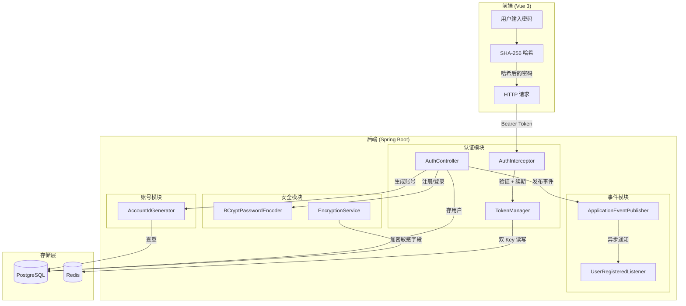
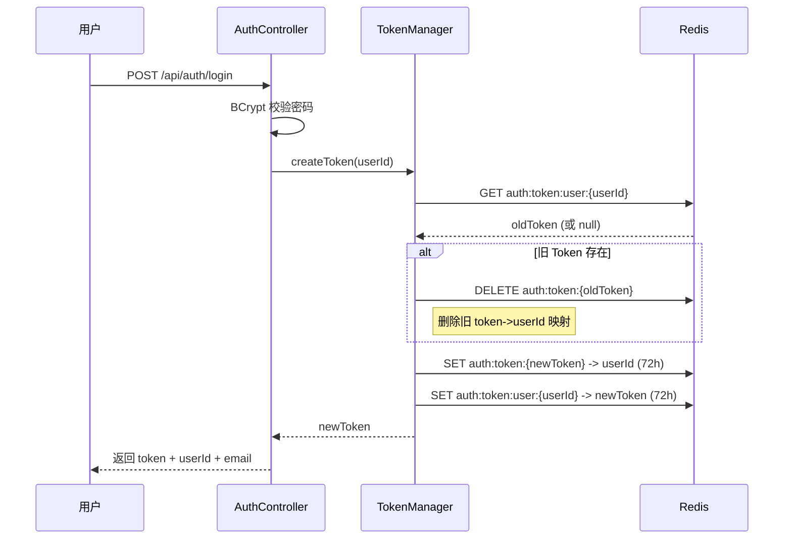
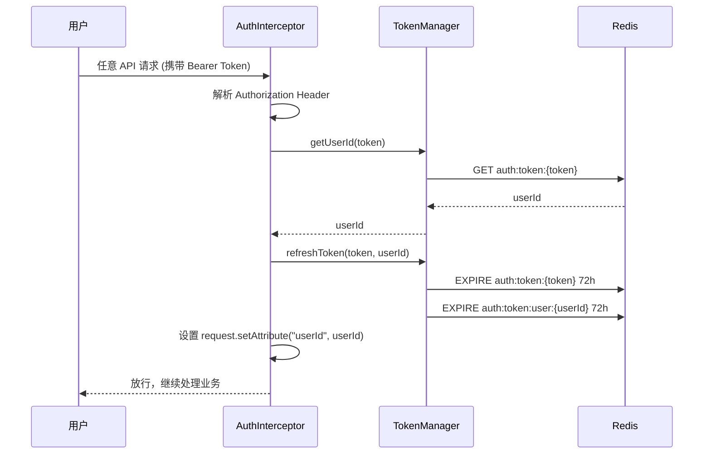
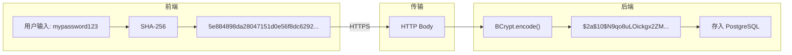
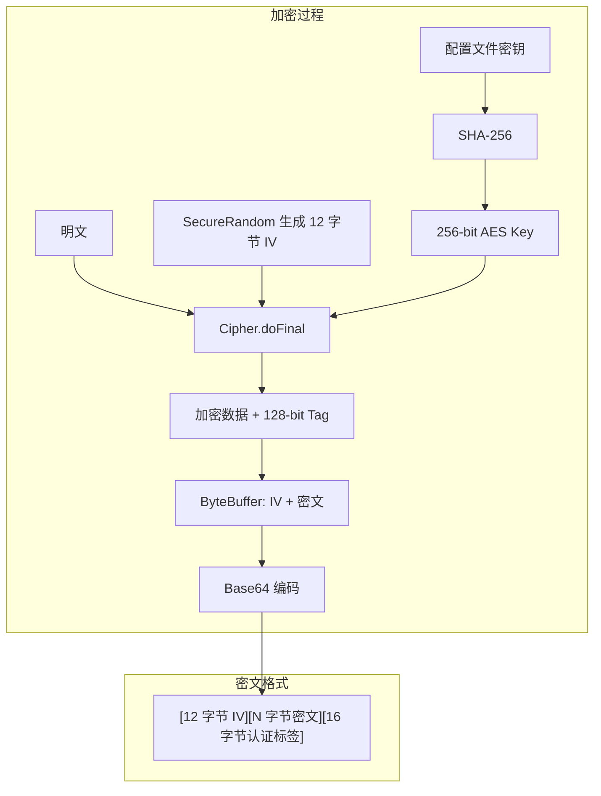
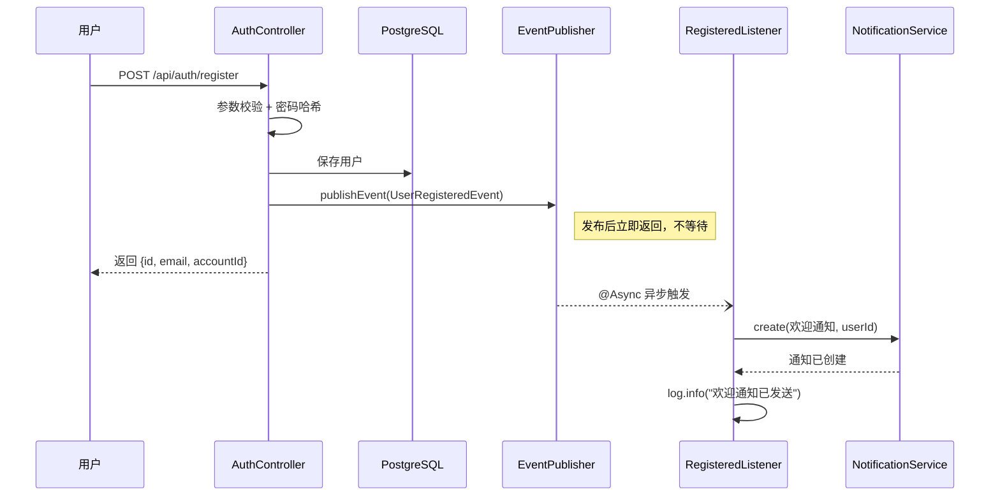
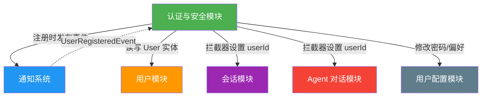

# 认证与安全架构 -- 单设备登录与数据加密

> 本文档是小墨项目技术亮点系列的第 9 篇，面向初次接触项目的开发者，从问题出发，逐步拆解 Redis 双 Key 单设备登录、滑动过期、密码哈希、AES-GCM 加密和注册事件的设计思路与实现细节。

---

## 目录

- [一、核心内容](#一核心内容)
- [二、为什么需要这个设计](#二为什么需要这个设计)
- [三、整体架构](#三整体架构)
- [四、代码走读](#四代码走读)
- [五、配置与调参](#五配置与调参)
- [六、实战案例](#六实战案例)
- [七、与其他模块的关系](#七与其他模块的关系)
- [八、常见问题排查](#八常见问题排查)
- [九、源码索引](#九源码索引)
- [十、延伸阅读](#十延伸阅读)

---

## 一、核心内容

- 理解 Redis 双 Key（token->userId + user:{id}->token）如何实现"同一账号只允许一台设备在线"
- 掌握滑动 72 小时 TTL 的实现原理——每次请求自动续期，长时间不操作才过期
- 了解客户端 SHA-256 + 服务端 BCrypt 的双层密码哈希策略，以及为什么不能只做一层
- 理解 AES-GCM 加密模式中 128-bit Tag、12 字节 IV、SHA-256 密钥派生的安全意义
- 掌握 Spring Event + @Async 实现注册欢迎通知的解耦模式
- 了解六位数字账号 ID（如 user_482716）的生成策略与冲突处理

---

## 二、为什么需要这个设计

### 2.1 问题场景一：多设备同时登录

用户在手机上登录了小墨，回家后又在电脑上登录。如果系统不做限制，两个设备同时持有有效 token，会话状态可能冲突——手机上刚问了茅台估值，电脑端的上下文却不知道这件事。对于金融场景，这种不确定性可能影响分析结果。

### 2.2 问题场景二：Token 永不过期

如果 token 创建后永久有效，用户换设备时旧 token 不失效，存在安全隐患。更现实的问题是：Redis 中的 token 数据无限堆积，内存持续增长。

### 2.3 问题场景三：密码明文传输

用户在前端输入密码，如果直接传给后端存储，中间人攻击可以轻松获取明文密码。即使做了 HTTPS，数据库被拖库时明文密码也会全部泄露。

### 2.4 问题场景四：敏感数据明文存储

用户的 API Key 等敏感配置如果以明文存入数据库，一旦数据库泄露，所有用户的第三方密钥都会暴露。金融场景下这可能导致资金风险。

### 2.5 不这样做的后果

| 场景 | 无安全设计 | 有安全设计 |
|------|-----------|-----------|
| 多设备登录 | 两个设备同时在线，会话状态冲突 | 新设备登录自动踢掉旧设备 |
| Token 过期 | 永久有效，Redis 内存无限增长 | 滑动 72h TTL，不活跃自动过期 |
| 密码传输 | 明文传输，中间人可截获 | 前端 SHA-256 + 后端 BCrypt，双重保护 |
| 敏感存储 | 明文存数据库，拖库即泄露 | AES-GCM 加密，即使拖库也无法解密 |
| 注册体验 | 注册后什么都没发生，用户不知道怎么开始 | 自动推送欢迎通知，告知免费额度 |

### 2.6 设计目标

1. **单设备登录**：同一账号同一时间只允许一台设备在线，新登录自动踢旧设备
2. **滑动过期**：每次请求自动续期 72 小时，不活跃才过期，活跃永不过期
3. **双层密码哈希**：前端 SHA-256 保护传输，后端 BCrypt 保护存储
4. **AES-GCM 加密**：对敏感字段使用认证加密，防篡改 + 防泄露
5. **事件解耦**：注册主流程只做核心逻辑，欢迎通知通过 Spring Event 异步发送

---

## 三、整体架构

### 3.1 一句话描述

认证模块基于 Redis 双 Key 实现单设备登录与滑动过期，密码经过客户端 SHA-256 和服务端 BCrypt 双重哈希，敏感数据使用 AES-GCM 加密存储，注册流程通过 Spring Event 异步发送欢迎通知。

### 3.2 架构图



### 3.3 核心组件表

| 组件 | 文件 | 职责 |
|------|------|------|
| AuthController | auth/controller/AuthController.java | 注册、登录、登出、修改密码、获取/更新偏好 |
| AuthInterceptor | auth/interceptor/AuthInterceptor.java | 拦截请求，验证 Token，自动续期 |
| TokenManager | auth/service/impl/TokenManagerImpl.java | Redis 双 Key 管理：创建、查询、续期、删除 |
| EncryptionService | common/util/EncryptionService.java | AES-GCM 加密/解密，SHA-256 密钥派生 |
| AccountIdGenerator | user/service/AccountIdGenerator.java | 生成六位数字账号 ID（如 user_482716） |
| UserRegisteredEvent | auth/event/UserRegisteredEvent.java | 注册事件载体 |
| UserRegisteredListener | auth/listener/UserRegisteredListener.java | 异步发送欢迎通知 |

---

## 四、代码走读

### 4.1 Redis 双 Key 单设备登录

这是整个认证体系的核心设计。Redis 中维护了两个 Key，形成双向映射：

- `auth:token:{token}` -> userId：通过 token 找到用户
- `auth:token:user:{userId}` -> token：通过用户找到 token

当用户登录时，先检查该用户是否已有旧 token，有则删除旧 token 的两个 Key，再创建新的。



关键代码片段：

```java
@Override
public String createToken(Long userId) {
    // 1. 查找并删除旧 token
    String oldToken = stringRedisTemplate.opsForValue()
            .get(TOKEN_PREFIX + "user:" + userId);
    if (oldToken != null) {
        stringRedisTemplate.delete(TOKEN_PREFIX + oldToken);
    }

    // 2. 创建新 token，双向写入
    String token = UUID.randomUUID().toString();
    stringRedisTemplate.opsForValue().set(
            TOKEN_PREFIX + token, String.valueOf(userId),
            TOKEN_EXPIRE_HOURS, TimeUnit.HOURS);
    stringRedisTemplate.opsForValue().set(
            TOKEN_PREFIX + "user:" + userId, token,
            TOKEN_EXPIRE_HOURS, TimeUnit.HOURS);
    return token;
}
```

为什么用双 Key 而不是只用一个？

- 只有 `token->userId`：登录时无法知道用户是否已有 token，无法踢掉旧设备
- 只有 `user->{token}`：验证请求时需要遍历所有用户才能找到 token 对应的用户
- 双 Key：两个方向都能 O(1) 查找，登录时能踢旧设备，验证时能快速定位用户

### 4.2 滑动 72 小时 TTL

Token 不是固定 72 小时后过期，而是每次请求都续期。这意味着只要用户持续活跃，token 永不过期；只有连续 72 小时不操作，token 才会失效。



关键代码片段：

```java
@Override
public boolean preHandle(HttpServletRequest request,
                         HttpServletResponse response,
                         Object handler) throws Exception {
    String authHeader = request.getHeader("Authorization");
    if (authHeader == null || !authHeader.startsWith("Bearer ")) {
        writeError(response, "未登录，请先登录");
        return false;
    }

    String token = authHeader.substring(7);
    Long userId = tokenManager.getUserId(token);
    if (userId == null) {
        writeError(response, "登录已过期，请重新登录");
        return false;
    }

    // 每次请求都续期两个 Key
    tokenManager.refreshToken(token, userId);
    request.setAttribute("userId", userId);
    request.setAttribute("token", token);
    return true;
}
```

滑动 TTL 的优势：

- 固定 TTL：用户登录后 72 小时必须重新登录，即使一直在用
- 滑动 TTL：只要用户持续活跃就不过期，72 小时不活跃才过期
- 实际效果：大多数用户永远不会遇到 token 过期，除非换设备或长时间不用

### 4.3 客户端 SHA-256 + 服务端 BCrypt

密码处理采用两层哈希策略，每一层解决不同的安全问题。



为什么要两层？

| 层级 | 解决的问题 | 如果去掉 |
|------|-----------|---------|
| 前端 SHA-256 | 保护传输过程 | 明文密码在网络中传输，中间人可截获 |
| 后端 BCrypt | 保护数据库存储 | 数据库被拖库，SHA-256 可被彩虹表破解 |

BCrypt 的特点：

- 自带盐值（salt），每次加密结果不同，彩虹表攻击无效
- 计算慢（work factor 可调），暴力破解成本极高
- Spring Security 内置支持，开箱即用

注册时的密码处理：

```java
// AuthController.register()
User user = new User();
user.setEmail(email.trim());
user.setAccountId(accountIdGenerator.generate());
// password 参数已经是前端 SHA-256 的结果
// 服务端再做一次 BCrypt
user.setPassword(passwordEncoder.encode(password));
userRepository.save(user);
```

登录时的密码校验：

```java
// AuthController.login()
User user = userRepository.findByEmail(email.trim()).orElse(null);
// password 是前端 SHA-256 的结果
// user.getPassword() 是 BCrypt 加密后的哈希
// matches() 内部会用同样的盐值重新计算 BCrypt 再比较
if (user == null || !passwordEncoder.matches(password, user.getPassword())) {
    return Result.error("邮箱或密码错误");
}
```

### 4.4 AES-GCM 认证加密

EncryptionService 使用 AES/GCM/NoPadding 模式，这是目前最推荐的对称加密方案。GCM 模式同时提供机密性（加密）和完整性（认证标签），任何对密文的篡改都会导致解密失败。



关键参数说明：

| 参数 | 值 | 说明 |
|------|-----|------|
| 算法 | AES/GCM/NoPadding | 认证加密模式，防篡改 + 防泄露 |
| Tag 长度 | 128 bit | 认证标签，用于验证密文完整性 |
| IV 长度 | 12 字节 | 每次加密随机生成，确保相同明文产生不同密文 |
| 密钥 | 256 bit | 由配置文件中的密钥经 SHA-256 派生 |

为什么用 SHA-256 派生密钥？

配置文件中的密钥可以是任意长度的字符串，但 AES-256 要求恰好 32 字节。SHA-256 的输出正好是 32 字节，且是单向函数，即使配置文件泄露，攻击者也无法反推出原始密钥。

加密流程代码：

```java
public String encrypt(String plaintext) {
    // 1. 随机生成 12 字节 IV
    byte[] iv = new byte[IV_LENGTH_BYTE];
    new SecureRandom().nextBytes(iv);

    // 2. 初始化加密器
    Cipher cipher = Cipher.getInstance(ALGORITHM);
    GCMParameterSpec parameterSpec = new GCMParameterSpec(TAG_LENGTH_BIT, iv);
    cipher.init(Cipher.ENCRYPT_MODE, secretKey, parameterSpec);

    // 3. 加密（输出包含密文 + 16 字节认证标签）
    byte[] encryptedData = cipher.doFinal(plaintext.getBytes(StandardCharsets.UTF_8));

    // 4. 拼接 IV 和密文，Base64 编码
    ByteBuffer byteBuffer = ByteBuffer.allocate(iv.length + encryptedData.length);
    byteBuffer.put(iv);
    byteBuffer.put(encryptedData);
    return Base64.getEncoder().encodeToString(byteBuffer.array());
}
```

为什么每次都要生成新的 IV？

如果两次加密使用相同的 IV 和 Key，攻击者可以通过异或两个密文得到两个明文的异或，从而破解内容。SecureRandom 每次生成不同的 IV，确保即使加密相同的明文，输出的密文也完全不同。

### 4.5 Spring Event + @Async 注册欢迎通知

注册流程需要做两件事：创建用户 + 发送欢迎通知。如果把通知逻辑写在注册方法里，会导致：

- 注册接口变慢（通知发送需要时间）
- 耦合度高（通知逻辑和注册逻辑混在一起）
- 异常传播（通知失败会导致注册失败）

Spring Event 机制解决了这个问题：注册方法只发布一个事件，监听器在另一个线程中异步处理通知。



关键代码片段：

事件定义（纯数据载体）：

```java
@Getter
public class UserRegisteredEvent {
    private final Long userId;
    public UserRegisteredEvent(Long userId) {
        this.userId = userId;
    }
}
```

事件监听器（异步处理）：

```java
@Async
@EventListener
public void onUserRegistered(UserRegisteredEvent event) {
    try {
        notificationService.create(
                "欢迎加入小墨！",
                "您已获得 100,000 免费体验 Token...",
                List.of(event.getUserId()));
    } catch (Exception e) {
        log.warn("发送注册欢迎通知失败, userId={}: {}",
                event.getUserId(), e.getMessage());
    }
}
```

注意 @Async 和 @EventListener 的组合：

- @EventListener：让方法监听 Spring 事件
- @Async：让方法在独立线程池中执行，不阻塞发布者
- 两者组合：事件发布后立即返回，监听器异步执行
- 异常处理：通知失败只记日志，不影响注册结果

### 4.6 六位数字账号 ID 生成

用户注册时除了邮箱，还会生成一个人类可读的六位数字账号（如 user_482716），方便用户记忆和分享。

```java
public String generate() {
    for (int i = 0; i < MAX_RETRIES; i++) {
        // 生成 100000~999999 之间的随机数
        int number = 100000 + random.nextInt(900000);
        String accountId = PREFIX + number;
        // 检查是否已存在
        if (!userRepository.existsByAccountId(accountId)) {
            return accountId;
        }
    }
    throw new RuntimeException("无法生成唯一账号ID，请重试");
}
```

设计考量：

- 为什么是 6 位？90 万个可能值（100000-999999），对于一个 AI 助手产品足够用
- 为什么带前缀 `user_`？方便识别用途，避免纯数字歧义
- 为什么最多重试 10 次？理论上 6 位数字足够容纳大量用户，10 次重试覆盖极端情况
- 为什么用 Random 而不是 SecureRandom？账号 ID 不是安全敏感信息，不需要密码学安全的随机数

---

## 五、配置与调参

### 5.1 Token 配置

| 配置项 | 默认值 | 说明 |
|--------|--------|------|
| TOKEN_PREFIX | `auth:token:` | Redis Key 前缀 |
| TOKEN_EXPIRE_HOURS | 72 | 滑动过期时间（小时） |

修改建议：

- 如果需要更严格的会话管理，可以将 TOKEN_EXPIRE_HOURS 改为 24（1 天）
- 如果用户反馈频繁掉线，可以改为 168（7 天）
- 不建议超过 720（30 天），过长的过期时间增加安全风险

### 5.2 加密配置

| 配置项 | 位置 | 说明 |
|--------|------|------|
| config.encryption.key | application.yml | AES 加密密钥（任意长度字符串，内部 SHA-256 派生） |

修改建议：

- 密钥必须在 application-local.yml 中配置，不要提交到 Git
- 建议使用 32 字节以上的随机字符串
- 修改密钥后，已加密的数据将无法解密，需要重新加密

### 5.3 账号 ID 配置

| 配置项 | 默认值 | 说明 |
|--------|--------|------|
| MAX_RETRIES | 10 | 生成唯一 ID 的最大重试次数 |
| PREFIX | `user_` | 账号 ID 前缀 |
| 数字范围 | 100000-999999 | 六位数字 |

### 5.4 拦截器配置

| 配置项 | 说明 |
|--------|------|
| 排除路径 `/api/auth/**` | 登录/注册接口不需要认证 |
| 排除路径 `/api/admin/**` | 管理后台使用独立的 AdminAuthInterceptor |
| 排除路径 `/assets/**` | 静态资源不需要认证 |
| 排除路径 `/{path}` | Vue Router History 模式 fallback |

---

## 六、实战案例

### 6.1 正常流程：用户注册

```
用户输入: email=test@example.com, password=mypassword123
前端处理: SHA-256("mypassword123") -> "5e884898da..."
后端处理:
  1. 校验邮箱格式 -> 通过
  2. 检查邮箱是否已注册 -> 未注册
  3. 生成账号 ID -> user_482716
  4. BCrypt.encode("5e884898da...") -> "$2a$10$N9qo8u..."
  5. 保存用户到 PostgreSQL
  6. 发布 UserRegisteredEvent
  7. 返回 {id: 1, email: "test@example.com", accountId: "user_482716"}
异步处理:
  8. UserRegisteredListener 发送欢迎通知
```

### 6.2 正常流程：用户登录

```
用户输入: email=test@example.com, password=mypassword123
前端处理: SHA-256("mypassword123") -> "5e884898da..."
后端处理:
  1. 查找用户 -> 找到
  2. BCrypt.matches("5e884898da...", "$2a$10$N9qo8u...") -> true
  3. createToken(userId):
     a. GET auth:token:user:1 -> null (首次登录)
     b. SET auth:token:{uuid1} -> 1 (72h)
     c. SET auth:token:user:1 -> {uuid1} (72h)
  4. 返回 {token: "uuid1", userId: 1, email: "test@example.com"}
```

### 6.3 正常流程：新设备登录踢掉旧设备

```
场景: 用户已在手机登录 (token=uuid1)，现在在电脑登录
后端处理:
  1. BCrypt 校验密码 -> 通过
  2. createToken(userId=1):
     a. GET auth:token:user:1 -> "uuid1" (旧 token 存在)
     b. DELETE auth:token:{uuid1} (删除旧 token->userId)
     c. SET auth:token:{uuid2} -> 1 (72h)
     d. SET auth:token:user:1 -> {uuid2} (72h)
  3. 返回 {token: "uuid2", ...}
结果: 手机端下次请求时，GET auth:token:{uuid1} -> null，提示"登录已过期"
```

### 6.4 边界情况：Token 过期

```
场景: 用户 72 小时未操作，token 过期
Redis 状态: auth:token:{uuid1} 已自动删除（TTL 到期）
用户操作: 发起任意 API 请求
后端处理:
  1. AuthInterceptor 解析 Authorization: Bearer uuid1
  2. tokenManager.getUserId("uuid1") -> null (已过期)
  3. 返回 401: {"code": 0, "msg": "登录已过期，请重新登录"}
```

### 6.5 边界情况：并发注册同一邮箱

```
场景: 两个请求同时注册同一个邮箱
后端处理:
  请求 A: userRepository.existsByEmail("test@x.com") -> false
  请求 B: userRepository.existsByEmail("test@x.com") -> false
  请求 A: userRepository.save(userA) -> 成功
  请求 B: userRepository.save(userB) -> 唯一约束冲突，抛异常
结果: GlobalExceptionHandler 捕获异常，返回错误提示
```

---

## 七、与其他模块的关系



依赖关系说明：

| 依赖方向 | 说明 |
|----------|------|
| Auth -> User | AuthController 读写 UserRepository，查询/保存用户数据 |
| Auth -> Notification | 注册时通过 Spring Event 触发欢迎通知 |
| Auth -> Redis | TokenManager 使用 Redis 存储 token 映射 |
| 会话/Agent <- Auth | AuthInterceptor 拦截所有请求，设置 userId 到 request attribute |
| 用户配置 <- Auth | 修改偏好时需要先验证 token 获取 userId |

---

## 八、常见问题排查

| 问题 | 可能原因 | 解决方案 |
|------|---------|---------|
| 登录后立即提示"登录已过期" | Redis 未启动或连接失败 | 检查 Redis 服务状态和 application.yml 中的 Redis 配置 |
| 注册时提示"邮箱已被注册"但用户说没注册过 | 用户之前注册过但忘记了 | 让用户尝试"忘记密码"流程（当前版本未实现） |
| 加密报错"Failed to encrypt data" | config.encryption.key 未配置 | 在 application-local.yml 中配置 config.encryption.key |
| 注册成功但没收到欢迎通知 | @Async 未生效，缺少 @EnableAsync | 检查启动类是否有 @EnableAsync 注解 |
| 多设备登录不生效 | TokenManager 未正确删除旧 token | 检查 Redis 中 auth:token:user:{userId} 的值是否为最新 token |
| BCrypt 校验总是失败 | 前端未做 SHA-256 或做了两次 | 检查前端代码，确保密码只做一次 SHA-256 |
| 账号 ID 生成失败"无法生成唯一账号ID" | 6 位数字空间接近饱和 | 增加数字位数或改用更长的随机字符串 |
| 拦截器排除路径不生效 | WebMvcConfig 中路径模式写错 | 检查 addPathPatterns 和 excludePathPatterns 的路径格式 |
| 滑动 TTL 不续期 | 请求未经过 AuthInterceptor | 检查请求路径是否被排除，或拦截器是否注册成功 |
| AES 解密报错 | 修改了 config.encryption.key | 已加密的数据必须用原密钥解密，修改密钥后需要重新加密 |

---

## 九、源码索引

| 文件路径 | 说明 |
|----------|------|
| `src/main/java/com/xiaomo/agent/auth/controller/AuthController.java` | 认证控制器：注册、登录、登出、修改密码、偏好管理 |
| `src/main/java/com/xiaomo/agent/auth/interceptor/AuthInterceptor.java` | 认证拦截器：验证 Token、自动续期、设置 userId |
| `src/main/java/com/xiaomo/agent/auth/service/impl/TokenManagerImpl.java` | Token 管理器：Redis 双 Key 创建、查询、续期、删除 |
| `src/main/java/com/xiaomo/agent/auth/event/UserRegisteredEvent.java` | 注册事件：纯数据载体，只包含 userId |
| `src/main/java/com/xiaomo/agent/auth/listener/UserRegisteredListener.java` | 事件监听器：异步发送欢迎通知 |
| `src/main/java/com/xiaomo/agent/common/util/EncryptionService.java` | 加密服务：AES-GCM 加密/解密，SHA-256 密钥派生 |
| `src/main/java/com/xiaomo/agent/user/service/AccountIdGenerator.java` | 账号 ID 生成器：六位数字 + user_ 前缀 |
| `src/main/java/com/xiaomo/agent/common/config/WebMvcConfig.java` | MVC 配置：注册 AuthInterceptor，配置排除路径 |

---

## 十、延伸阅读

- [05-两层记忆系统](05-MemorySystem.md) — 记忆系统依赖 AuthInterceptor 设置的 userId 来区分不同用户
- [06-SSE 流式输出与通知系统](06-SSEStreamingAndNotification.md) — 欢迎通知通过 NotificationService 发送，通知系统使用 SSE 实时推送
- [07-用户配置系统](07-UserConfigSystem.md) — 用户偏好管理（temperature、maxTokens 等）依赖认证模块的 userId
- [02-工具防护体系](02-ToolGuardSystem.md) — 工具调用权限控制与认证体系的协作

---

> 本文档基于小墨项目源码编写，最后更新时间：2026 年 7 月。
