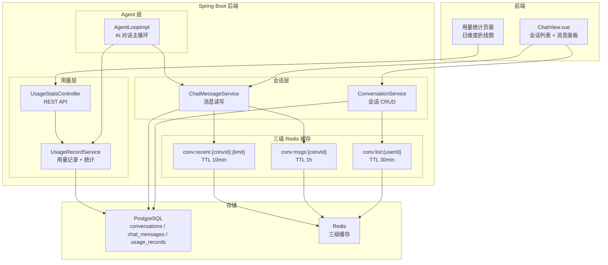
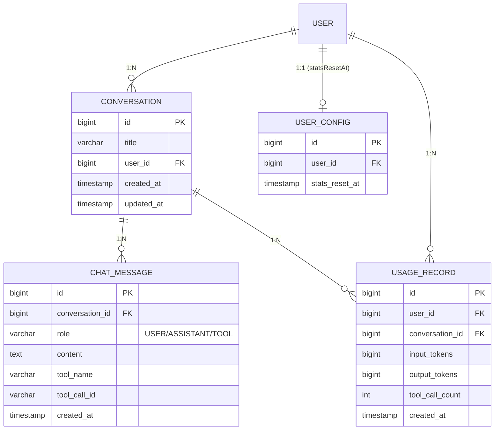
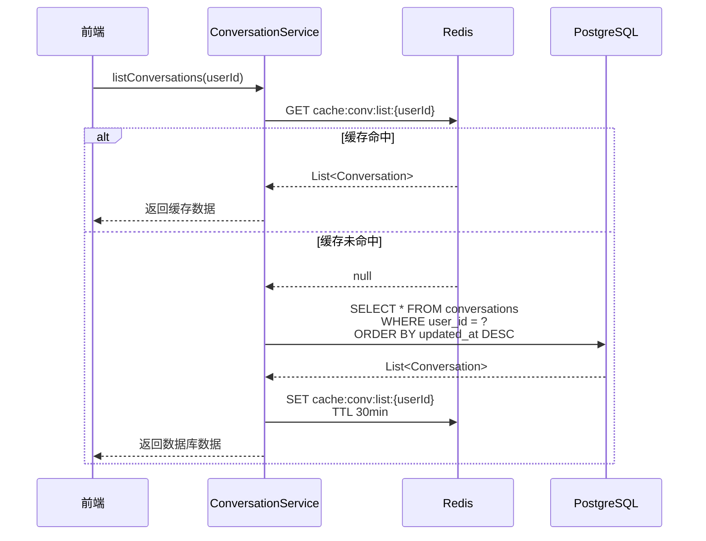
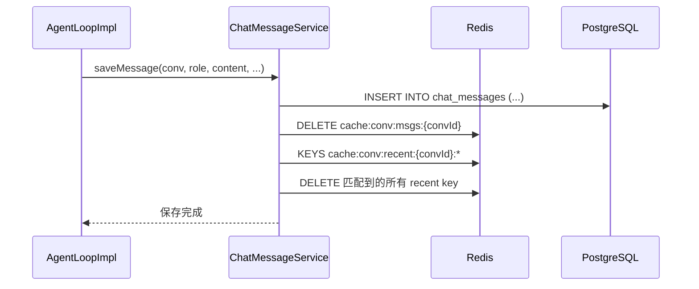
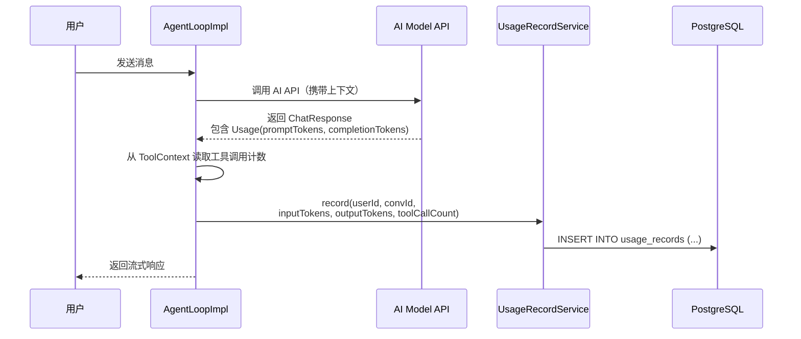
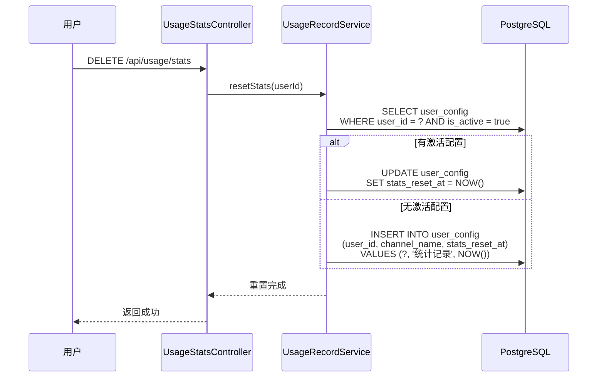
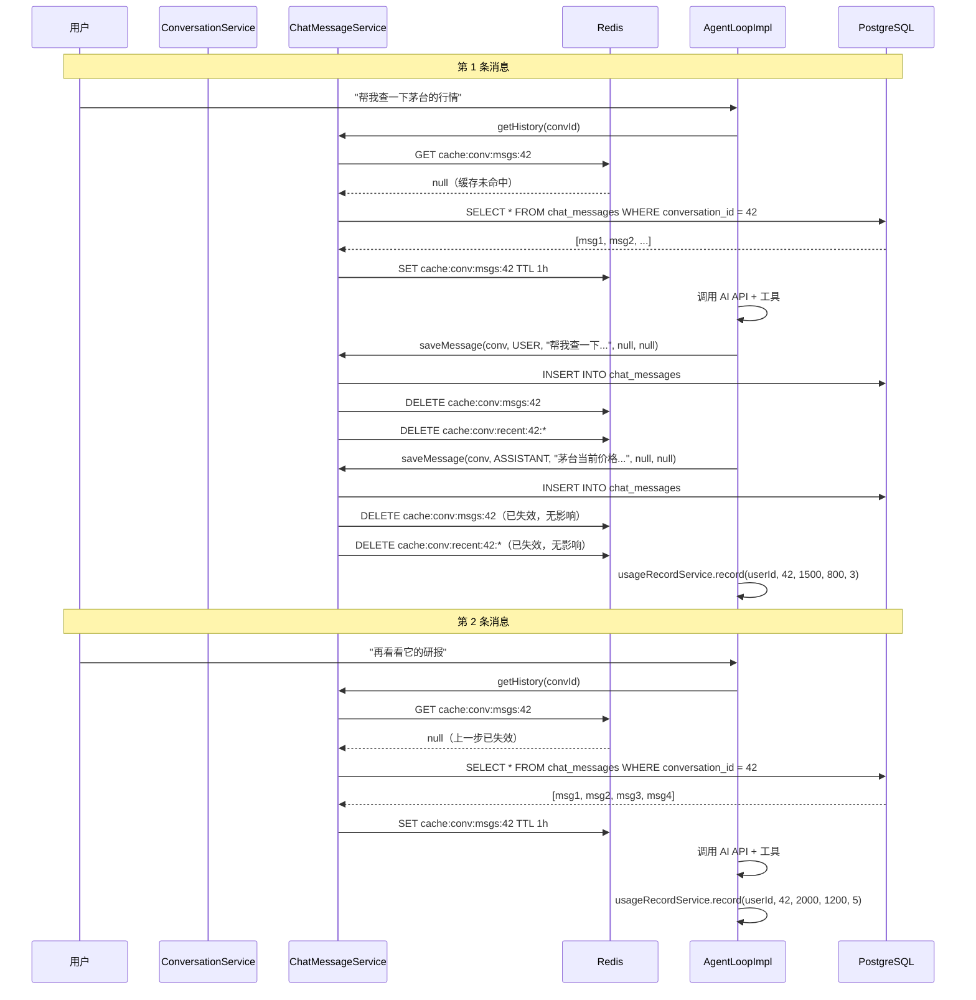
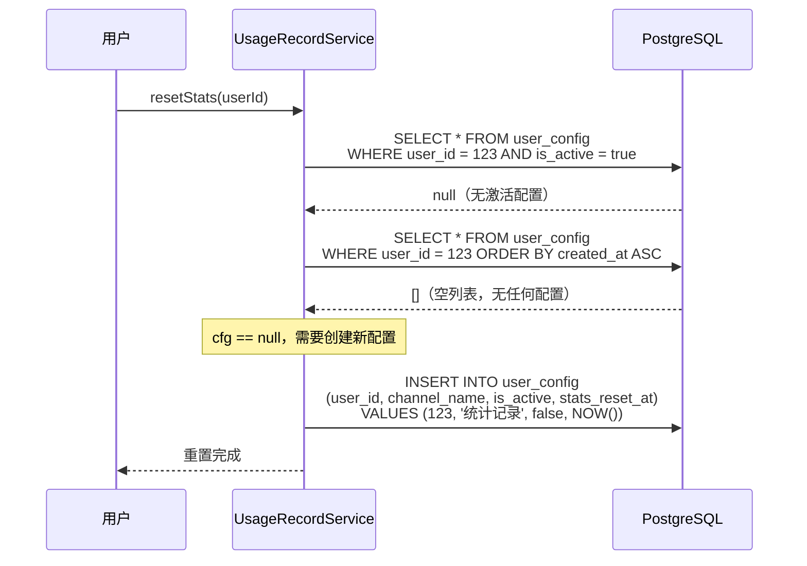
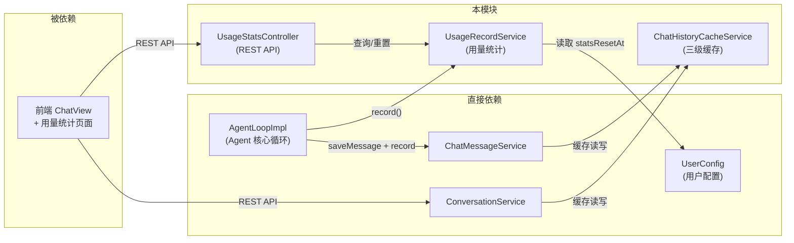

# 会话数据架构与用量统计 -- 三级缓存与精细化计量

> 本文档是小墨项目技术亮点系列的第 10 篇，面向初次接触项目的开发者，从问题出发，逐步拆解会话数据的存储、缓存、读写链路，以及每次 AI 请求的用量追踪与聚合统计机制。

---

## 目录

- [一、核心内容](#一核心内容)
- [二、为什么需要这个设计](#二为什么需要这个设计)
- [三、整体架构](#三整体架构)
- [四、代码走读](#四代码走读)
- [五、配置与调参](#五配置与调参)
- [六、实战案例](#六实战案例)
- [七、与其他模块的关系](#七与其他模块的关系)
- [八、常见问题排查](#八常见问题排查)
- [九、源码索引](#九源码索引)
- [十、延伸阅读](#十延伸阅读)

---

## 一、核心内容

- 理解会话（Conversation）、消息（ChatMessage）、用量记录（UsageRecord）三张核心表的实体关系与字段设计
- 掌握三级 Redis 缓存层次结构（conv:list / conv:msgs / conv:recent）的分层策略与 TTL 选择依据
- 学会缓存失效的 `evictMessageCache` 如何通过 `keys()` 模式匹配清除所有关联 key
- 理解用量追踪如何在每次 AI 请求结束后记录 inputTokens / outputTokens / toolCallCount
- 掌握"软重置"设计：通过 `statsResetAt` 时间戳实现统计归零但保留历史审计数据
- 了解日聚合统计如何用原生 SQL `Object[]` 投影避免 DTO 映射开销

---

## 二、为什么需要这个设计

### 2.1 问题场景

用户打开小墨，首页需要展示会话列表。点击某个会话，需要加载全部历史消息。在对话过程中，每发一条消息，Agent 可能调用多个工具（查行情、查研报、算估值），最终返回一段流式文本。

这里有三个核心痛点：

**痛点一：会话列表加载慢。** 每次打开首页都要查库，当用户有几十个会话时，每次都执行 `SELECT * FROM conversations WHERE user_id = ? ORDER BY updated_at DESC`，响应时间随数据量线性增长。

**痛点二：消息列表重复读取。** 用户在同一个会话里连续发消息，每次都从数据库加载全部历史消息送给 LLM 作为上下文。一次对话可能有 50 条消息，每轮都全量查询，浪费严重。

**痛点三：用量不可见。** 用户不知道自己消耗了多少 token、调用了多少次工具。运营侧也无法知道哪些用户是重度用户、哪些会话消耗了最多资源。没有计量数据，就无法做额度管理和成本控制。

### 2.2 不这样做的后果

| 场景 | 无缓存 + 无计量 | 有缓存 + 有计量 |
|------|-----------------|-----------------|
| 首页加载 | 每次查库，200-500ms | 缓存命中 <10ms |
| 连续对话 | 每轮全量查消息表 | 最近消息 10min 缓存命中 |
| Token 消耗 | 完全不可见，无法做额度控制 | 精确到每次请求，支持日维度聚合 |
| 统计重置 | 删除历史数据（不可恢复） | 软重置，数据还在，只是统计起点变了 |

### 2.3 设计目标

1. **三级缓存分层**：会话列表、全量消息、最近消息分别设置不同 TTL，匹配各自的访问频率
2. **写入即失效**：任何写操作（新增消息、删除会话）立即清除相关缓存，保证一致性
3. **逐请求计量**：每次 AI 请求结束后，从 API 响应中提取 usage 信息，原子写入用量记录表
4. **软重置**：统计归零不删数据，只记录一个时间戳，查询时按时间戳过滤
5. **日维度聚合**：用原生 SQL GROUP BY 聚合，前端可直接画折线图

---

## 三、整体架构

### 3.1 一句话描述

会话数据通过 JPA 持久化到 PostgreSQL，同时用三级 Redis 缓存加速读取；每次 AI 请求结束后，从 API 响应中提取 token 用量和工具调用次数，写入用量记录表；统计查询时，优先检查用户的 `statsResetAt` 时间戳，只聚合该时间点之后的数据。

### 3.2 架构图



### 3.3 核心组件表

| 组件 | 职责 | 缓存 key 模式 | TTL |
|------|------|---------------|-----|
| `ConversationServiceImpl` | 会话 CRUD，创建/删除时清除会话列表缓存 | `cache:conv:list:{userId}` | 30 分钟 |
| `ChatMessageServiceImpl` | 消息读写，写入时清除消息缓存 | `cache:conv:msgs:{convId}` | 1 小时 |
| `ChatHistoryCacheServiceImpl` | 三级缓存的统一管理，读/写/失效 | `cache:conv:recent:{convId}:{limit}` | 10 分钟 |
| `UsageRecordServiceImpl` | 用量记录写入、统计查询、软重置 | -- | -- |
| `UsageStatsController` | 对外暴露 `/api/usage/*` REST 接口 | -- | -- |
| `AgentLoopImpl` | AI 对话主循环，请求结束后调用 `usageRecordService.record()` | -- | -- |

### 3.4 数据实体关系



---

## 四、代码走读

### 4.1 三级缓存的读写流程

以"用户打开首页加载会话列表"为例，走一遍完整的缓存读取链路。



对应的代码在 `ConversationServiceImpl.listConversations()` 中：

```java
@Override
public List<Conversation> listConversations(Long userId) {
    // 第一步：尝试从 Redis 缓存读取
    List<Conversation> cached = cacheService.getCachedConversations(userId);
    if (cached != null) {
        return cached;
    }
    // 第二步：缓存未命中，查数据库
    List<Conversation> conversations =
        conversationRepository.findByUserIdOrderByUpdatedAtDesc(userId);
    // 第三步：回写缓存，设置 30 分钟 TTL
    cacheService.cacheConversations(userId, conversations);
    return conversations;
}
```

这里的关键设计是**先查缓存再查库**的 Cache-Aside 模式。`ChatHistoryCacheServiceImpl` 负责所有缓存操作，上层 Service 只管调用，不关心 Redis 细节。

### 4.2 消息缓存的分层设计

消息缓存分为两层，分别对应不同的使用场景：

| 层级 | key 模式 | 存储内容 | TTL | 使用场景 |
|------|----------|----------|-----|----------|
| 全量消息 | `cache:conv:msgs:{convId}` | 该会话的全部消息 | 1 小时 | 加载完整历史、导出对话 |
| 最近消息 | `cache:conv:recent:{convId}:{limit}` | 最近 N 条消息 | 10 分钟 | Agent 上下文窗口、快速预览 |

为什么要分两层？因为 Agent 对话时只需要最近 50 条消息作为上下文（`limit=50`），但用户查看历史时可能需要全部消息。全量消息 TTL 设为 1 小时，因为全量数据更大、变更频率更低；最近消息 TTL 设为 10 分钟，因为每发一条消息都会使它失效，太长的 TTL 反而浪费内存。

读取最近消息的代码：

```java
@Override
public List<ChatMessage> getCachedRecentMessages(Long convId, int limit) {
    // key 包含 limit 参数，不同 limit 值对应不同缓存
    String key = RECENT_PREFIX + convId + ":" + limit;
    Object cached = redisTemplate.opsForValue().get(key);
    if (cached instanceof List<?> list && !list.isEmpty()
            && list.get(0) instanceof ChatMessage) {
        @SuppressWarnings("unchecked")
        List<ChatMessage> result = (List<ChatMessage>) (List<?>) list;
        return result;
    }
    return null;
}
```

注意 key 设计中包含了 `limit` 参数：`cache:conv:recent:42:50` 和 `cache:conv:recent:42:10` 是两个独立的缓存项。这是因为不同场景需要不同数量的最近消息（Agent 用 50 条，前端预览可能用 10 条），各自独立缓存避免互相污染。

### 4.3 缓存失效策略

缓存最复杂的部分不是读写，而是失效。小墨采用**写入即失效**策略：任何导致数据变更的操作，立即清除相关缓存。

**场景一：新增消息**



这里的关键在 `evictMessageCache` 方法：

```java
@Override
public void evictMessageCache(Long convId) {
    // 第一步：删除全量消息缓存
    redisTemplate.delete(MSGS_PREFIX + convId);

    // 第二步：用 keys() 模式匹配删除所有 recent 缓存
    Set<String> recentKeys =
        redisTemplate.keys(RECENT_PREFIX + convId + ":*");
    if (recentKeys != null && !recentKeys.isEmpty()) {
        redisTemplate.delete(recentKeys);
    }
}
```

为什么需要 `keys()` 模式匹配？因为 `recent` 缓存的 key 包含 `limit` 参数（如 `cache:conv:recent:42:10`、`cache:conv:recent:42:50`），写入新消息时不知道之前缓存了哪些 limit 值，所以用 `*` 通配符一次性清除。

**关于 `keys()` 命令的性能说明：** `keys()` 在 Redis 中是 O(N) 操作，生产环境大量 key 时可能阻塞。小墨项目当前规模（单用户级别）可以接受；如果未来用户量增长，应替换为 `SCAN` 命令或引入 Redisson 的 `RKeys` 接口。

**场景二：删除会话**

```java
@Override
@Transactional
public void deleteConversation(Long userId, Long conversationId) {
    getConversationForUser(conversationId, userId);  // 校验所有权
    conversationRepository.deleteById(conversationId);
    // 同时清除两类缓存
    cacheService.evictConversationList(userId);      // 会话列表缓存
    cacheService.evictMessageCache(conversationId);   // 消息缓存
}
```

删除会话时需要同时清除两个维度的缓存：会话列表（因为列表变了）和该会话的消息（因为会话都没了，消息缓存也没意义了）。

**场景三：创建会话**

```java
@Override
@Transactional
public Conversation createConversation(Long userId, String title) {
    // 去重：同名会话直接返回已有会话
    Conversation existing = conversationRepository
        .findFirstByUserIdAndTitleOrderByUpdatedAtDesc(userId, effectiveTitle);
    if (existing != null) {
        return existing;
    }
    Conversation saved = conversationRepository.save(conversation);
    cacheService.evictConversationList(userId);  // 新增会话，列表缓存失效
    return saved;
}
```

### 4.4 用量追踪：逐请求计量

每次 AI 请求结束后，`AgentLoopImpl` 会从 API 响应中提取用量信息并记录。



核心代码在 `AgentLoopImpl` 中：

```java
// 从 API 响应中提取 usage 信息
Usage usage = chatResponse.getMetadata() != null
    ? chatResponse.getMetadata().getUsage() : null;
AtomicInteger toolCounter = (AtomicInteger) toolCtx
    .get(MaxToolCallManager.TOOL_CALL_COUNTER_KEY);
int toolCalls = toolCounter != null ? toolCounter.get() : 0;

// 优先使用 API 返回的精确 token 数，回退到估算值
Long inputTokens = usage != null && usage.getPromptTokens() != null
    ? usage.getPromptTokens().longValue()
    : UsageRecordService.estimateInputTokens(context);
Long outputTokens = usage != null && usage.getCompletionTokens() != null
    ? usage.getCompletionTokens().longValue() : null;

// 写入用量记录
usageRecordService.record(userId, conversation.getId(),
    inputTokens, outputTokens, toolCalls);
```

这段代码有两个设计要点：

1. **双保险的 token 估算**：优先使用 AI API 返回的精确 token 数（`usage.getPromptTokens()`），如果 API 没返回（某些模型可能不返回），则回退到基于文本长度的估算值（`estimateInputTokens`）。这保证了即使 API 不支持 usage 字段，也能有近似的计量数据。

2. **工具调用计数**：通过 `MaxToolCallManager` 维护的 `AtomicInteger` 计数器，在 Agent 循环中每次工具调用时自增，请求结束后读取最终值。这比从响应中解析 tool_call 更可靠。

### 4.5 用量记录实体设计

`UsageRecord` 实体设计得很精简，每次 AI 请求一条记录：

```java
@Entity
@Table(name = "usage_records")
public class UsageRecord {
    @Id @GeneratedValue(strategy = GenerationType.IDENTITY)
    private Long id;

    @Column(name = "user_id", nullable = false)
    private Long userId;              // 关联用户

    @Column(name = "conversation_id")
    private Long conversationId;      // 关联会话（可为空，兼容非会话场景）

    @Column(name = "input_tokens")
    private Long inputTokens;         // 输入 token 数

    @Column(name = "output_tokens")
    private Long outputTokens;        // 输出 token 数

    @Column(name = "tool_call_count")
    private Integer toolCallCount;    // 本次请求的工具调用次数

    @Column(name = "created_at")
    private LocalDateTime createdAt;  // 记录时间，@PrePersist 自动填充
}
```

为什么不把用量信息存在 `ChatMessage` 或 `Conversation` 表上？因为用量是**每次请求**的粒度，而一条消息可能对应多次工具调用和一次最终回复。独立的 `UsageRecord` 表可以精确追踪每次 API 调用的消耗，不受消息结构的约束。

### 4.6 软重置：统计归零但不删数据

用户点击"重置统计"时，系统不会删除 `usage_records` 表中的数据，而是在 `UserConfig` 表中记录一个 `statsResetAt` 时间戳。后续所有统计查询都只聚合该时间点之后的数据。



`resetStats` 的代码：

```java
@Override
@Transactional
public void resetStats(Long userId) {
    UserConfig cfg = findConfigForUpdate(userId);
    if (cfg == null) {
        // 用户没有任何配置（如纯免费额度用户）
        // 创建一条专用配置记录重置时间
        cfg = new UserConfig();
        cfg.setUserId(userId);
        cfg.setChannelName("统计记录");
        cfg.setIsActive(false);
    }
    cfg.setStatsResetAt(LocalDateTime.now());
    userConfigRepository.save(cfg);
}
```

这个设计的好处：

1. **审计可追溯**：历史用量数据始终保留在 `usage_records` 表中，任何时候都可以回溯
2. **多次重置**：用户可以多次重置，每次重置只是更新时间戳，不影响数据完整性
3. **零数据丢失**：与 `DELETE FROM usage_records WHERE user_id = ?` 相比，软重置完全不丢数据

### 4.7 统计查询：按时间戳过滤 + 日聚合

查询统计时，`getStats` 方法先找到用户的 `statsResetAt`，再决定查询条件：

```java
@Override
@Transactional(readOnly = true)
public UsageStatsDTO getStats(Long userId) {
    LocalDateTime since = findStatsResetAt(userId);

    UsageStatsDTO dto = new UsageStatsDTO();
    if (since != null) {
        // 有重置记录，只统计重置之后的数据
        dto.setTotalRequests(
            usageRecordRepository.countByUserIdSince(userId, since));
        dto.setTotalInputTokens(
            usageRecordRepository.sumInputTokensByUserIdSince(userId, since));
        dto.setTotalOutputTokens(
            usageRecordRepository.sumOutputTokensByUserIdSince(userId, since));
        dto.setTotalToolCalls(
            usageRecordRepository.sumToolCallCountByUserIdSince(userId, since));
        dto.setTotalConversations(
            conversationRepository.countByUserIdSince(userId, since));
        dto.setTotalMessages(
            chatMessageRepository.countByUserIdSince(userId, since));
    } else {
        // 无重置记录，统计全部数据
        dto.setTotalRequests(
            usageRecordRepository.countByUserId(userId));
        // ... 其他字段类似
    }
    return dto;
}
```

注意这里有一个细节：统计不仅查 `usage_records` 表，还跨表查了 `conversations` 和 `chat_messages` 的计数。这是因为 `UsageStatsDTO` 需要展示总请求数、总 token 数、总会话数、总消息数等多维度指标，这些数据分布在三张表中。

### 4.8 日聚合统计：原生 SQL Object[] 投影

`getDailyStats` 方法返回按天聚合的用量数据，用于前端画折线图：

```java
@Override
@Transactional(readOnly = true)
public List<DailyUsageDTO> getDailyStats(Long userId) {
    LocalDateTime since = findStatsResetAt(userId);

    List<Object[]> rows;
    if (since != null) {
        rows = usageRecordRepository.dailyStatsByUserIdSince(userId, since);
    } else {
        rows = usageRecordRepository.dailyStatsByUserId(userId);
    }

    // 手动将 Object[] 映射为 DTO
    List<DailyUsageDTO> result = new ArrayList<>();
    for (Object[] row : rows) {
        DailyUsageDTO dto = new DailyUsageDTO();
        dto.setDate(((LocalDate) row[0]).toString());           // 日期
        dto.setInputTokens(((Number) row[1]).longValue());      // 输入 token
        dto.setOutputTokens(((Number) row[2]).longValue());     // 输出 token
        dto.setToolCalls(((Number) row[3]).longValue());        // 工具调用次数
        dto.setRequestCount(((Number) row[4]).longValue());     // 请求数
        result.add(dto);
    }
    return result;
}
```

对应的 Repository 查询使用了原生 JPQL 的 GROUP BY 聚合：

```java
@Query("""
  SELECT CAST(u.createdAt AS LocalDate),
         COALESCE(SUM(u.inputTokens), 0),
         COALESCE(SUM(u.outputTokens), 0),
         COALESCE(SUM(u.toolCallCount), 0),
         COUNT(u)
  FROM UsageRecord u
  WHERE u.userId = :userId
  GROUP BY CAST(u.createdAt AS LocalDate)
  ORDER BY CAST(u.createdAt AS LocalDate) ASC
  """)
List<Object[]> dailyStatsByUserId(@Param("userId") Long userId);
```

为什么用 `Object[]` 而不是直接映射为 DTO？因为 JPA 的 GROUP BY 聚合查询返回的是多列投影，直接映射为 DTO 需要定义构造函数表达式（`SELECT new com.xiaomo...DailyUsageDTO(...)`），而 `Object[]` 方式更灵活，代码也更简洁。代价是手动类型转换，但这里的列数固定为 5，可维护性可以接受。

`COALESCE(SUM(...), 0)` 的作用是：如果某天没有用量记录，SUM 返回 NULL，COALESCE 将其转为 0，避免前端收到 null 值。

---

## 五、配置与调参

### 5.1 缓存 TTL 配置

| 配置项 | 当前值 | 位置 | 说明 |
|--------|--------|------|------|
| `CONV_LIST_TTL_MINUTES` | 30 | `ChatHistoryCacheServiceImpl` | 会话列表缓存，用户会话不频繁变更，30 分钟足够 |
| `MSGS_TTL_HOURS` | 1 | `ChatHistoryCacheServiceImpl` | 全量消息缓存，数据量大但变更频率低，1 小时合适 |
| `RECENT_TTL_MINUTES` | 10 | `ChatHistoryCacheServiceImpl` | 最近消息缓存，每发一条消息就失效，10 分钟是兜底 |

### 5.2 调参建议

| 场景 | 调整方向 | 风险 |
|------|----------|------|
| 用户量增长，Redis 内存紧张 | 缩短 `CONV_LIST_TTL_MINUTES` 到 15 分钟 | 会话列表缓存命中率下降 |
| 消息量大，全量缓存占用过多 | 改为只缓存最近消息，去掉全量缓存 | 查看历史时每次都要查库 |
| 用户频繁发消息，recent 缓存频繁失效 | 将 `RECENT_TTL_MINUTES` 缩短到 5 分钟 | 缓存命中率下降，但减少脏数据 |
| 需要更细粒度的统计 | 在 `UsageRecord` 中增加 `model` 字段 | 需要数据库迁移 |

### 5.3 API 端点

| 端点 | 方法 | 说明 | 响应体 |
|------|------|------|--------|
| `/api/usage/stats` | GET | 获取用户用量统计 | `UsageStatsDTO` |
| `/api/usage/daily` | GET | 获取日维度聚合数据 | `List<DailyUsageDTO>` |
| `/api/usage/stats` | DELETE | 软重置统计数据 | `Result<Void>` |

### 5.4 UsageStatsDTO 字段说明

| 字段 | 类型 | 说明 |
|------|------|------|
| `totalRequests` | Long | 总请求次数（每次 AI 调用计 1 次） |
| `totalInputTokens` | Long | 总输入 token 数 |
| `totalOutputTokens` | Long | 总输出 token 数 |
| `totalToolCalls` | Long | 总工具调用次数 |
| `totalConversations` | Long | 总会话数 |
| `totalMessages` | Long | 总消息数 |

### 5.5 DailyUsageDTO 字段说明

| 字段 | 类型 | 说明 |
|------|------|------|
| `date` | String | 日期，格式 `yyyy-MM-dd` |
| `inputTokens` | Long | 当日输入 token 总和 |
| `outputTokens` | Long | 当日输出 token 总和 |
| `toolCalls` | Long | 当日工具调用总次数 |
| `requestCount` | Long | 当日请求总次数 |

---

## 六、实战案例

### 6.1 正常流程：用户连续对话

**场景：** 用户在一个会话中连续发了 3 条消息。



观察要点：
- 第 1 条消息时缓存未命中，查库后回写缓存
- 每次 saveMessage 都会清除消息缓存（写入即失效）
- 第 2 条消息时缓存再次未命中（因为第 1 条消息的 saveMessage 已清除缓存）
- 每次请求结束后都会记录用量

### 6.2 边界案例：用户没有激活配置时重置统计

**场景：** 用户注册后一直使用免费额度，没有配置过 API Key，此时点击"重置统计"。



这个设计覆盖了一个容易被忽略的边界：纯免费用户可能从未配置过 API Key，`user_config` 表中没有他的记录。此时 `resetStats` 会创建一条 `isActive=false` 的专用配置，仅用于记录重置时间戳。这条配置不会影响用户的正常功能（因为 `isActive=false`）。

### 6.3 边界案例：缓存类型不匹配

**场景：** Redis 中某个 key 的值因为序列化问题变成了非预期类型。

```java
// getCachedConversations 中的类型检查
Object cached = redisTemplate.opsForValue().get(key);
if (cached instanceof List<?> list && !list.isEmpty()
        && list.get(0) instanceof Conversation) {
    // 类型匹配，返回缓存数据
    return (List<Conversation>) (List<?>) list;
}
// 类型不匹配，返回 null，回退到查库
return null;
```

代码中的 `instanceof` 双重检查（先检查是 List，再检查第一个元素是 Conversation）是一个防御性设计。如果 Redis 中的值因为序列化配置变更（比如从 JDK 序列化切换到 JSON 序列化）导致类型不匹配，不会抛异常，而是静默回退到查库。这保证了序列化方案切换时的平滑过渡。

---

## 七、与其他模块的关系

### 7.1 依赖关系图



### 7.2 模块交互说明

| 上游调用方 | 调用本模块的方式 | 说明 |
|-----------|-----------------|------|
| `AgentLoopImpl` | `ChatMessageService.saveMessage()` | 每次 AI 回复后保存消息，触发缓存失效 |
| `AgentLoopImpl` | `UsageRecordService.record()` | 每次 AI 请求结束后记录用量 |
| `StreamHandler` | `UsageRecordService.record()` | SSE 流式场景下的用量记录 |
| 工作流节点（AnalystNode 等） | `UsageRecordService.record()` | 多智能体工作流中每个节点的用量记录 |
| 前端 | `GET /api/usage/stats` | 展示用量统计面板 |
| 前端 | `GET /api/usage/daily` | 展示日维度折线图 |
| 前端 | `DELETE /api/usage/stats` | 用户手动重置统计 |

### 7.3 与用户配置系统的关系

`statsResetAt` 字段存储在 `UserConfig` 实体中，而不是独立建表。这是因为：

1. 重置操作是用户级别的，与用户配置天然关联
2. 避免为一个字段单独建表，减少表数量
3. `UserConfig` 已有按用户查询的 Repository 方法，复用现有基础设施

`findStatsResetAt` 方法的回退逻辑值得注意：先查激活配置（`isActive=true`），如果没有激活配置，则遍历该用户的所有配置，找到第一个有 `statsResetAt` 的。这保证了即使用户的激活配置被删除或切换，重置时间也不会丢失。

---

## 八、常见问题排查

| 问题 | 可能原因 | 排查方法 |
|------|----------|----------|
| 会话列表不更新 | 30 分钟 TTL 内缓存未失效 | 检查 Redis 中 `cache:conv:list:{userId}` 的 TTL；确认 create/delete 操作是否正确调用了 `evictConversationList` |
| 消息列表显示旧数据 | `evictMessageCache` 未被调用 | 检查 `saveMessage` 是否调用了 `cacheService.evictMessageCache(convId)`；检查 Redis 中是否残留 `cache:conv:msgs:{convId}` |
| 用量统计数字不增长 | `record()` 未被调用 | 检查 `AgentLoopImpl` 中的 `usageRecordService.record()` 是否正常执行；检查 `usage_records` 表是否有新记录 |
| 重置统计后数字没变 | `statsResetAt` 未正确写入 | 检查 `user_config` 表中该用户的 `stats_reset_at` 字段是否为预期时间；检查 `findStatsResetAt` 的回退逻辑 |
| 日聚合数据缺失某天 | 该天没有用量记录 | 正常行为，`GROUP BY` 只返回有数据的日期；如需显示空日期，需在前端补充 |
| `keys()` 命令导致 Redis 阻塞 | 大量 key 匹配 | 用 `redis-cli --latency` 检查延迟；考虑替换为 `SCAN` 命令 |
| 缓存类型转换异常 | 序列化方案不一致 | 检查 `RedisTemplate` 的序列化器配置；`instanceof` 检查会静默回退到查库，不会抛异常 |
| `estimateInputTokens` 不准确 | API 未返回精确 token 数 | 检查 AI 模型是否支持 usage 字段；估算值基于字符数，与实际 token 有偏差 |

---

## 九、源码索引

### 9.1 实体层

| 文件 | 说明 |
|------|------|
| `src/main/java/com/xiaomo/agent/conversation/entity/Conversation.java` | 会话实体，包含 title、userId、createdAt、updatedAt |
| `src/main/java/com/xiaomo/agent/conversation/entity/ChatMessage.java` | 消息实体，包含 role、content、toolName、toolCallId |
| `src/main/java/com/xiaomo/agent/conversation/entity/MessageRole.java` | 消息角色枚举：USER / ASSISTANT / TOOL |
| `src/main/java/com/xiaomo/agent/conversation/entity/UsageRecord.java` | 用量记录实体，包含 inputTokens、outputTokens、toolCallCount |
| `src/main/java/com/xiaomo/agent/user/config/UserConfig.java` | 用户配置实体，包含 statsResetAt 字段 |

### 9.2 Repository 层

| 文件 | 说明 |
|------|------|
| `src/main/java/com/xiaomo/agent/conversation/repository/ConversationRepository.java` | 会话 CRUD + countByUserId / countByUserIdSince |
| `src/main/java/com/xiaomo/agent/conversation/repository/ChatMessageRepository.java` | 消息 CRUD + findRecentByConversationId + countByUserId |
| `src/main/java/com/xiaomo/agent/conversation/repository/UsageRecordRepository.java` | 用量记录 CRUD + SUM 聚合 + 日聚合 GROUP BY 查询 |

### 9.3 Service 层

| 文件 | 说明 |
|------|------|
| `src/main/java/com/xiaomo/agent/conversation/service/ChatHistoryCacheService.java` | 缓存服务接口，定义三级缓存的读/写/失效方法 |
| `src/main/java/com/xiaomo/agent/conversation/service/impl/ChatHistoryCacheServiceImpl.java` | 缓存服务实现，管理 conv:list / conv:msgs / conv:recent 三个 key 层级 |
| `src/main/java/com/xiaomo/agent/conversation/service/ConversationService.java` | 会话服务接口 |
| `src/main/java/com/xiaomo/agent/conversation/service/impl/ConversationServiceImpl.java` | 会话服务实现，集成缓存失效逻辑 |
| `src/main/java/com/xiaomo/agent/conversation/service/ChatMessageService.java` | 消息服务接口 |
| `src/main/java/com/xiaomo/agent/conversation/service/impl/ChatMessageServiceImpl.java` | 消息服务实现，saveMessage 时触发缓存失效 |
| `src/main/java/com/xiaomo/agent/conversation/service/UsageRecordService.java` | 用量服务接口 |
| `src/main/java/com/xiaomo/agent/conversation/service/impl/UsageRecordServiceImpl.java` | 用量服务实现，包含 record / getStats / resetStats / getDailyStats |

### 9.4 Controller 层

| 文件 | 说明 |
|------|------|
| `src/main/java/com/xiaomo/agent/conversation/controller/UsageStatsController.java` | 用量统计 REST 接口，暴露 /api/usage/* 端点 |

### 9.5 DTO

| 文件 | 说明 |
|------|------|
| `src/main/java/com/xiaomo/agent/conversation/service/UsageStatsDTO.java` | 汇总统计 DTO：totalRequests / totalInputTokens / totalOutputTokens / totalToolCalls / totalConversations / totalMessages |
| `src/main/java/com/xiaomo/agent/conversation/service/DailyUsageDTO.java` | 日聚合 DTO：date / inputTokens / outputTokens / toolCalls / requestCount |

### 9.6 调用方

| 文件 | 说明 |
|------|------|
| `src/main/java/com/xiaomo/agent/agent/service/impl/AgentLoopImpl.java` | Agent 主循环，请求结束后调用 `usageRecordService.record()` |
| `src/main/java/com/xiaomo/agent/agent/service/impl/StreamHandler.java` | SSE 流式处理，也会触发用量记录 |

---

## 十、延伸阅读

- [05 - 两层记忆系统](05-MemorySystem.md) -- 记忆系统的 UserProfile 和 ConversationSummary 也依赖会话和消息数据，理解本模块有助于理解记忆的数据来源
- [06 - SSE 流式架构 + 通知系统](06-SSEStreamingAndNotification.md) -- 流式对话场景下，消息保存和用量记录的时序与同步场景不同
- [07 - 用户配置系统](07-UserConfigSystem.md) -- `statsResetAt` 字段存储在 UserConfig 中，理解配置系统有助于理解软重置的完整链路
- [08 - 自主任务规划](08-AutonomousTaskPlanning.md) -- 多步任务规划场景下，一次用户请求可能触发多次工具调用，影响 `toolCallCount` 的计数逻辑
- [02 - 工具调用防护 + 幻觉防护](02-ToolGuardSystem.md) -- MaxToolCallManager 限制工具调用次数，与用量统计中的 `toolCallCount` 直接相关

---

> 本文档基于小墨项目源码编写，反映截至 2025 年 7 月的实现状态。如有变更，请以源码为准。
