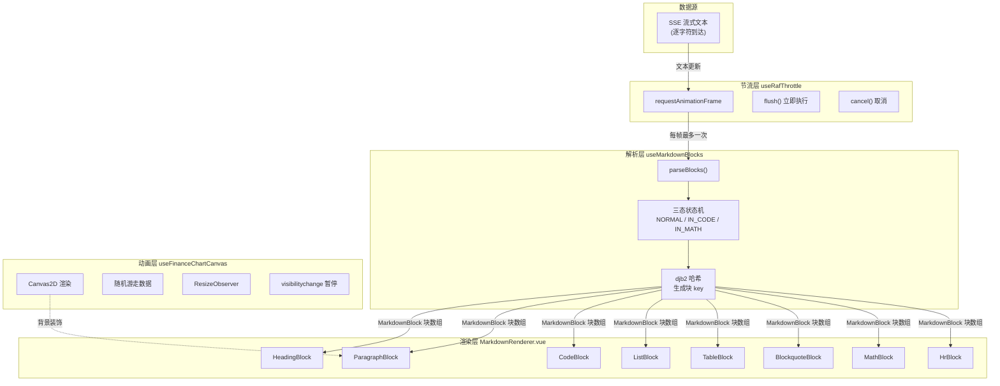
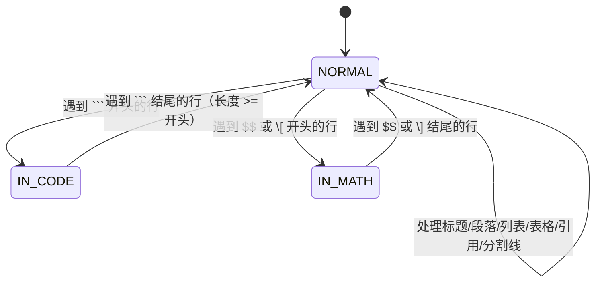
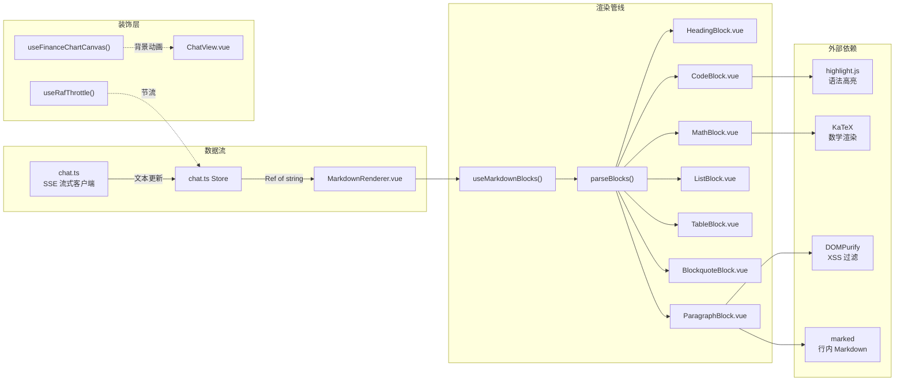

# 流式 Markdown 渲染器 -- 自研状态机与块级稳定渲染

> 本文档是小墨项目技术亮点系列的第 11 篇，面向初次接触项目的开发者，从问题出发，逐步拆解流式 Markdown 渲染器的设计思路与实现细节。

---

## 目录

- [一、核心内容](#一核心内容)
- [二、为什么需要这个设计](#二为什么需要这个设计)
- [三、整体架构](#三整体架构)
- [四、代码走读](#四代码走读)
- [五、配置与调参](#五配置与调参)
- [六、实战案例](#六实战案例)
- [七、与其他模块的关系](#七与其他模块的关系)
- [八、常见问题排查](#八常见问题排查)
- [九、源码索引](#九源码索引)
- [十、延伸阅读](#十延伸阅读)

---

## 一、核心内容

- 理解为什么流式场景下不能直接用 `marked` / `markdown-it` 等通用解析器
- 掌握自研三态状态机（NORMAL / IN_CODE / IN_MATH）的逐行解析原理
- 理解 djb2 哈希如何实现块级 key 的确定性生成，从而让 Vue 虚拟 DOM 只 diff 变化的块
- 了解 `useRafThrottle` 如何用 `requestAnimationFrame` 实现高频文本更新的节流
- 了解 `useFinanceChartCanvas` 如何用 Canvas2D 实现带随机游走的金融风格动画背景

---

## 二、为什么需要这个设计

### 2.1 问题场景一：通用解析器在流式输入下的崩溃

`marked`、`markdown-it` 等库的设计假设是"输入是一段完整的 Markdown 文本"。但在 SSE 流式场景下，文本是逐字符到达的：

```
第 1 秒: "## 分"
第 2 秒: "## 分析\n\n根据"
第 3 秒: "## 分析\n\n根据最新数据，"
...
第 30 秒: "## 分析\n\n根据最新数据，该股票..."（完整）
```

通用解析器在第 1 秒收到 `## 分` 时，可能把它当成普通段落；到第 2 秒 `\n` 出现时才识别为标题。这会导致：每次新 token 到达，整个已解析的 AST 被重新生成，之前渲染的 DOM 节点被全部销毁再重建。用户会看到内容不断"闪烁"，代码块的语法高亮反复失效。

### 2.2 问题场景二：未闭合结构的处理

流式输入的中间状态天然存在大量"未闭合"结构：

- 代码块只收到了开头的 ` ```python `，还没收到结尾的 ` ``` `
- 表格只收到了表头，还没收到分隔行 `|---|`
- 数学公式只收到了 `$$`，还没收到结尾的 `$$`

通用解析器遇到这些中间态会直接丢弃或报错，用户看到的是内容突然消失又出现。

### 2.3 问题场景三：XML 工具调用行的干扰

小墨的 AI Agent 在回复中会插入工具调用标记，格式如下：

```
function=astock_quote / operation=tencentQuote / code=600519
```

这些标记行不应该被用户看到，但如果交给通用 Markdown 解析器，它们会被当成普通文本渲染出来。

### 2.4 设计目标

1. **块级稳定**：新 token 到达时，只有内容真正变化的块才重新渲染，已稳定的块保持不动
2. **优雅降级**：未闭合的代码块、表格、数学公式在中间态仍能正确显示
3. **增量解析**：每次只处理新增的文本，不重复解析已经稳定的块
4. **工具调用过滤**：自动跳过 XML 格式的工具调用行
5. **高性能**：60fps 的流式更新不会造成页面卡顿

---

## 三、整体架构

### 3.1 一句话描述

`parseBlocks()` 将 Markdown 文本逐行拆分为带 `key` 的块数组，Vue 通过 `:key` 实现虚拟 DOM 的最小 diff；`useRafThrottle` 将高频文本更新节流到每一帧最多触发一次重解析。

### 3.2 架构图



### 3.3 核心模块表

| 模块 | 文件 | 职责 |
|------|------|------|
| `parseBlocks()` | `useMarkdownBlocks.ts` | 三态状态机，逐行解析 Markdown 文本为 `MarkdownBlock[]` |
| `useMarkdownBlocks()` | `useMarkdownBlocks.ts` | Vue Composable，将 `Ref<string>` 包装为响应式 `computed<MarkdownBlock[]>` |
| `useRafThrottle()` | `useMarkdownBlocks.ts` | RAF 节流器，提供 `schedule` / `flush` / `cancel` 三个方法 |
| `useFinanceChartCanvas()` | `useFinanceChartCanvas.ts` | Canvas2D 金融风格动画背景，随机游走 + 渐变填充 |
| `MarkdownRenderer.vue` | `MarkdownRenderer.vue` | 根渲染组件，根据 `block.type` 分发到对应的子组件 |
| `CodeBlock.vue` | `CodeBlock.vue` | 代码块渲染，支持语法高亮 |
| `TableBlock.vue` | `TableBlock.vue` | 表格渲染，支持对齐方式 |
| `MathBlock.vue` | `MathBlock.vue` | 数学公式渲染（KaTeX） |

### 3.4 类型定义一览

```typescript
// blocks.ts -- 所有块类型的联合类型
export type MarkdownBlock =
  | HeadingBlock      // # 标题
  | ParagraphBlock    // 普通段落
  | CodeBlock         // ```代码块```
  | ListBlock         // 列表（有序/无序，支持嵌套）
  | TableBlock        // | 表格 |
  | BlockquoteBlock   // > 引用
  | HrBlock           // --- 分割线
  | MathBlock         // $$数学公式$$

// 所有块都继承 BaseBlock
export interface BaseBlock {
  type: BlockType
  key: string     // djb2 哈希生成的稳定 key
  closed: boolean // 是否已闭合（流式场景的关键字段）
}
```

---

## 四、代码走读

### 4.1 三态状态机：parseBlocks() 的核心逻辑

`parseBlocks()` 是整个渲染器的心脏。它用一个 `state` 变量跟踪当前解析状态，在三个状态之间切换：

```typescript
let state: 'NORMAL' | 'IN_CODE' | 'IN_MATH' = 'NORMAL'
```

**状态转换图：**



**为什么是三态而不是更多？**

Markdown 的嵌套结构中，只有代码块和数学公式是"跨行且不能嵌套其他结构"的。列表可以嵌套列表，引用可以嵌套其他块，但代码块和数学公式内部的所有内容都是原始文本。因此只需要两个"逃逸"状态来处理它们。

**逐行处理的核心循环：**

```typescript
for (let i = 0; i < lines.length; i++) {
  const line = lines[i]

  // 优先处理 IN_CODE 和 IN_MATH 状态
  if (state === 'IN_CODE') {
    // 检测 ``` 关闭行，否则追加到 codeBlock.code
    continue
  }
  if (state === 'IN_MATH') {
    // 检测 $$ 或 \] 关闭行，否则追加到 mathLines
    continue
  }

  // NORMAL 状态：按优先级匹配各种块类型
  // 1. 跳过 XML 工具调用行
  // 2. 空行 -> flush 所有累积块
  // 3. 分割线
  // 4. 标题
  // 5. 数学公式（单行/多行开头）
  // 6. 代码围栏（进入 IN_CODE）
  // 7. 表格行
  // 8. 列表项
  // 9. 引用行
  // 10. 默认 -> 段落行
}
```

### 4.2 djb2 哈希：块级稳定的秘密

Vue 的虚拟 DOM diff 算法依赖 `key` 来判断两个节点是否"同一个"。如果 key 不稳定（比如用数组 index），Vue 会错误地复用或销毁节点。

```typescript
function hash(s: string): string {
  let h = 5381
  for (let i = 0; i < s.length; i++) {
    h = ((h << 5) + h + s.charCodeAt(i)) & 0xffffffff
  }
  return (h >>> 0).toString(16).padStart(8, '0')
}

function blockKey(type: string, sig: string): string {
  return `${type}-${hash(sig.slice(0, 40))}`
}
```

**设计要点：**

1. **只取前 40 个字符作为签名**：流式场景下，一个块的内容在不断增长，但前 40 个字符（通常是标题、代码语言名、列表项文本的开头）在块创建后很快就稳定了。这意味着同一个块在流式过程中 key 不会改变。

2. **djb2 而不是 SHA-256**：djb2 是一个极轻量的哈希函数（一次循环，无依赖），对于"生成 8 位十六进制 key"这个需求足够了。它不是密码学安全的，但碰撞概率在我们的场景下可以忽略。

3. **key 格式 `type-hash`**：类型前缀确保不同类型但内容相似的块不会冲突（比如一个标题 `## 分析` 和一个段落 `分析`）。

**实际效果：**

```
流式输入第 1 秒:
  heading-h3-616e616c  -> "## 分析报告"     <- key 稳定
  p-6e6f7274          -> "根据最新数据..."  <- key 稳定

流式输入第 5 秒:（段落内容增长了，但 key 不变）
  heading-h3-616e616c  -> "## 分析报告"     <- key 相同，Vue 复用 DOM
  p-6e6f7274          -> "根据最新数据，该股票..."  <- key 相同，Vue 只更新文本
```

### 4.3 优雅降级：未闭合结构的处理

流式输入的中间态天然存在未闭合结构。`parseBlocks()` 通过 `closed` 字段和循环结束后的后处理来解决：

**代码块未闭合：**

```typescript
// 循环结束后
if (state === 'IN_CODE' && codeBlock) {
  codeBlock.closed = false  // 标记为未闭合
  codeBlock.key = blockKey(
    'code', codeBlock.language + codeBlock.code
  )
  blocks.push(codeBlock)
}
```

子组件可以根据 `closed` 字段决定是否显示"输入中"的光标或提示。

**表格没有分隔行：**

```typescript
function flushTable(closed: boolean) {
  if (tableHeader.length > 0 && tableHasSeparator) {
    // 正常表格
    blocks.push({ type: 'table', ... })
  } else if (tableHeader.length > 0) {
    // 没有分隔行 -> 降级为段落
    const rawLines = [tableHeader.join(' | ')]
    for (const row of tableRows) {
      rawLines.push(row.join(' | '))
    }
    blocks.push({
      type: 'paragraph', lines: rawLines, ...
    })
  }
}
```

这是一个很实用的设计：当 AI 正在生成表格但还没输出 `|---|` 分隔行时，用户看到的是普通的文本行，而不是一个格式错乱的表格。

### 4.4 XML 工具调用行过滤

```typescript
// Skip XML-style tool call lines
if (/^\s*<\/?function/.test(line)
  || /^\s*<parameter=/.test(line)) {
  continue
}
```

这行代码在 `NORMAL` 状态的最前面，确保以下格式的行被静默跳过，不会出现在用户的聊天界面中：

- `function=astock_quote` （工具调用开始）
- `/function` （工具调用结束）
- `parameter=operation` （参数行）

### 4.5 嵌套列表的递归插入

列表的嵌套通过 `indent` 字段和递归函数 `addItemToList()` 实现：

```typescript
function addItemToList(
  items: ListItem[],
  item: ListItem,
  depth: number
): void {
  if (depth === 0) {
    items.push(item)
    return
  }
  const last = items[items.length - 1]
  if (!last) {
    items.push(item)
    return
  }
  if (!last.children) last.children = []
  addItemToList(last.children, item, depth - 1)
}
```

**工作原理：**

1. 每个列表项的缩进量（空格数）除以 2 得到 `depth`
2. `depth = 0` 表示顶层，直接 push
3. `depth > 0` 表示嵌套，递归到最后一个兄弟节点的 `children` 中

**示例：**

```
输入：
- 一级项 A
  - 二级项 A.1
    - 三级项 A.1.1
  - 二级项 A.2
- 一级项 B

解析结果：
[
  { text: "一级项 A", indent: 0, children: [
    { text: "二级项 A.1", indent: 1, children: [
      { text: "三级项 A.1.1", indent: 2, children: [] }
    ]},
    { text: "二级项 A.2", indent: 1, children: [] }
  ]},
  { text: "一级项 B", indent: 0, children: [] }
]
```

### 4.6 useRafThrottle：高频更新的节流

SSE 流式场景下，文本可能每 10-50ms 更新一次。如果每次都触发 `parseBlocks()` + Vue diff，会造成不必要的性能开销。`useRafThrottle` 将更新频率限制为每帧最多一次：

```typescript
export function useRafThrottle() {
  let rafId: number | null = null
  let pendingCallback: (() => void) | null = null

  function schedule(callback: () => void) {
    pendingCallback = callback       // 始终保留最新的回调
    if (rafId !== null) return        // 已经有帧在等待，跳过
    rafId = requestAnimationFrame(() => {
      rafId = null
      if (pendingCallback) {
        pendingCallback()             // 执行最新的回调
        pendingCallback = null
      }
    })
  }

  function flush() {
    if (rafId !== null) {
      cancelAnimationFrame(rafId)
      rafId = null
    }
    if (pendingCallback) {
      pendingCallback()
      pendingCallback = null
    }
  }

  function cancel() {
    if (rafId !== null) {
      cancelAnimationFrame(rafId)
      rafId = null
    }
    pendingCallback = null
  }

  onUnmounted(cancel)  // 组件卸载时自动清理

  return { schedule, flush, cancel }
}
```

**三个方法的使用场景：**

| 方法 | 场景 | 说明 |
|------|------|------|
| `schedule()` | SSE 收到新 token | 用最新的文本覆盖之前的回调，等下一帧统一执行 |
| `flush()` | SSE 流结束 | 立即执行最后一次解析，不等下一帧 |
| `cancel()` | 组件卸载或取消请求 | 清理残留的 rAF，防止内存泄漏 |

**为什么用 rAF 而不是 setTimeout？**

`requestAnimationFrame` 的回调在浏览器重绘前执行，天然与渲染周期同步。`setTimeout(fn, 0)` 可能会在同一帧内执行多次，造成重复渲染。

### 4.7 useFinanceChartCanvas：Canvas2D 金融风格动画

这是一个纯粹的视觉装饰组件，用 Canvas2D 绘制类似股票行情软件的动态折线图背景。

**核心设计点：**

**1. 随机游走数据生成**

```typescript
function generateDataPoint(
  prev: number, volatility: number
): number {
  const change = (Math.random() - 0.48) * volatility
  return Math.max(0.05, Math.min(0.95, prev + change))
}
```

注意 `Math.random() - 0.48` 而不是 `0.5`：这给数据一个微弱的"上涨倾向"，让视觉效果更像真实的牛市行情。

**2. DPR 适配**

```typescript
function resizeCanvas() {
  const dpr = Math.min(window.devicePixelRatio || 1, 2)
  canvas.width = width * dpr
  canvas.height = height * dpr
  canvas.style.width = width + 'px'
  canvas.style.height = height + 'px'
  ctx.setTransform(dpr, 0, 0, dpr, 0, 0)
}
```

在高 DPI 屏幕上，Canvas 默认会模糊。通过将 Canvas 的物理像素设为 CSS 像素的 `dpr` 倍，再用 `setTransform` 缩放绘图上下文，可以实现清晰的渲染。`Math.min(dpr, 2)` 是一个性能保护——在 3x 屏幕上用 2x 就够了，肉眼几乎看不出区别。

**3. ResizeObserver 响应容器变化**

```typescript
resizeObserver = new ResizeObserver(() => resizeCanvas())
resizeObserver.observe(el)
```

容器大小变化时（比如窗口拖拽、侧边栏展开），Canvas 自动重新适配。

**4. visibilitychange 暂停**

```typescript
function handleVisibility() {
  if (document.hidden) {
    stop()   // 标签页不可见时停止动画
  } else {
    start()  // 标签页可见时恢复动画
  }
}
```

这是一个重要的性能优化：当用户切换到其他标签页时，Canvas 动画会完全停止，不消耗 GPU 资源。

**5. 渐变填充**

```typescript
const grad = ctx.createLinearGradient(0, 0, 0, height)
grad.addColorStop(0, `rgba(${r},${g},${b},0.12)`)
grad.addColorStop(1, `rgba(${r},${g},${b},0)`)
ctx.fillStyle = grad
ctx.fill()
```

每条折线下方填充一个从上到下透明度递减的渐变，模拟金融软件中常见的"面积图"效果。

---

## 五、配置与调参

### 5.1 parseBlocks 配置

| 参数 | 当前值 | 位置 | 说明 |
|------|--------|------|------|
| hash 签名截取长度 | 40 字符 | `blockKey()` 函数 | 越大 key 越精确，但流式场景下变化越频繁 |
| djb2 初始种子 | 5381 | `hash()` 函数 | djb2 的经典种子值，无需修改 |
| 表格检测 | `line.startsWith('\|')` | NORMAL 状态的表格分支 | 仅检测以 `\|` 开头的行 |
| 列表缩进单位 | 2 空格 | `Math.floor(indent / 2)` | 每 2 个空格算一层嵌套 |

### 5.2 useFinanceChartCanvas 配置

| 参数 | 默认值 | 说明 |
|------|--------|------|
| `lineCount` | 4 | 折线数量 |
| 数据点间距 | 3px | `drawLine()` 中的 `step` 常量 |
| 波动率范围 | [0.008, 0.02] | `volatility` 的随机范围 |
| DPR 上限 | 2 | `Math.min(window.devicePixelRatio, 2)` |
| 新数据推送频率 | 每 8 帧 | `frameCount % 8 === 0` |
| 数据缓冲区上限 | `width/3 + 40` | 超出时 `shift()` 丢弃旧数据 |

### 5.3 useRafThrottle 配置

`useRafThrottle` 没有暴露可配置参数。它完全依赖浏览器的 `requestAnimationFrame` 行为（通常 60fps，即约 16.7ms 一次）。

---

## 六、实战案例

### 6.1 正常场景：AI 生成一段包含多种块类型的回复

**输入文本（流式逐步到达）：**

```
## 贵州茅台分析

根据最新数据，贵州茅台（600519）近期表现如下：

| 指标 | 数值 | 说明 |
|------|------|------|
| 股价 | 1688.00 | 今日收盘 |
| 涨幅 | +2.35% | 较昨日 |

核心代码：
```python
price = 1688.00
pe_ratio = price / eps
```

> 注意：以上分析仅供参考，不构成投资建议。
```

**解析结果（7 个块）：**

| 序号 | 类型 | key | closed |
|------|------|-----|--------|
| 1 | heading | `h2-6775697a` | true |
| 2 | paragraph | `p-67656e6a` | true |
| 3 | table | `table-696e6469` | true |
| 4 | paragraph | `p-e6a0b8e5` | true |
| 5 | code | `code-python7072` | true |
| 6 | blockquote | `bq-e6b3a8e6` | true |

### 6.2 边界场景：未闭合的代码块

**输入文本（流式中间态）：**

```
分析代码如下：

```python
import pandas as pd

df = pd.read_csv('data.csv')
# 还在生成中...
```

此时 `parseBlocks()` 输出：

```javascript
[
  {
    type: 'paragraph',
    lines: ['分析代码如下：'],
    closed: true,
    key: 'p-...'
  },
  {
    type: 'code',
    language: 'python',
    code: "import pandas as pd\n\ndf = pd.read_csv('data.csv')\n# 还在生成中...",
    closed: false,   // <-- 未闭合
    key: 'code-python...'
  }
]
```

注意 `closed: false`：子组件可以根据这个字段显示一个闪烁的光标，提示用户"AI 还在写"。

### 6.3 边界场景：表格缺少分隔行

**输入文本（流式中间态）：**

```
| 姓名 | 年龄 |
| 张三 | 25 |
| 李四 | 30 |
```

由于没有 `|---|` 分隔行，`parseBlocks()` 将其降级为段落：

```javascript
{
  type: 'paragraph',
  lines: ['姓名 | 年龄', '张三 | 25', '李四 | 30'],
  closed: true,
  key: 'p-...'
}
```

当 AI 随后输出 `|---|---|` 时，整组行会变成一个真正的表格块，key 也会改变，Vue 会销毁段落节点、创建表格节点。

### 6.4 边界场景：XML 工具调用行

**输入文本：**

```
贵州茅台今日收盘价为 1688.00 元。

function=astock_quote / operation=tencentQuote / code=600519

较昨日上涨 2.35%。
```

`parseBlocks()` 跳过包含 `function=` 和 `parameter=` 的行，输出：

```javascript
[
  {
    type: 'paragraph',
    lines: ['贵州茅台今日收盘价为 1688.00 元。'],
    closed: true, key: 'p-...'
  },
  {
    type: 'paragraph',
    lines: ['较昨日上涨 2.35%。'],
    closed: true, key: 'p-...'
  }
]
```

### 6.5 边界场景：嵌套列表

**输入文本：**

```
投资策略：
- 价值投资
  - 低估值买入
  - 长期持有
- 趋势跟踪
  - 均线突破
    - 金叉买入
    - 死叉卖出
```

解析结果：

```javascript
{
  type: 'list',
  ordered: false,
  items: [
    { text: '价值投资', indent: 0, children: [
      { text: '低估值买入', indent: 1, children: [] },
      { text: '长期持有', indent: 1, children: [] }
    ]},
    { text: '趋势跟踪', indent: 0, children: [
      { text: '均线突破', indent: 1, children: [
        { text: '金叉买入', indent: 2, children: [] },
        { text: '死叉卖出', indent: 2, children: [] }
      ]}
    ]}
  ]
}
```

### 6.6 边界场景：单行数学公式

**输入文本：**

```
以下是 CAPM 模型：

$$E(R_i) = R_f + \beta_i (E(R_m) - R_f)$$

其中 R_f 为无风险利率。
```

单行 `$$...$$` 格式会被直接识别为 math 块，不需要进入 `IN_MATH` 状态：

```javascript
[
  { type: 'paragraph', lines: ['以下是 CAPM 模型：'], closed: true },
  { type: 'math', tex: 'E(R_i) = R_f + \\beta_i (E(R_m) - R_f)', display: true, closed: true },
  { type: 'paragraph', lines: ['其中 R_f 为无风险利率。'], closed: true }
]
```

---

## 七、与其他模块的关系

### 7.1 依赖关系图



### 7.2 与 SSE 流式模块的关系

SSE 模块（详见 [06-SSEStreamingAndNotification](./06-SSEStreamingAndNotification.md)）负责从后端接收文本流，每收到一个 chunk 就更新 `Ref<string>`。`useMarkdownBlocks` 通过 `computed()` 自动响应这个变化，触发 `parseBlocks()` 重新解析。

`useRafThrottle` 在两者之间插入一个节流层：SSE 的更新频率可能是每秒 20-50 次，但 `parseBlocks()` + Vue diff 最多每帧执行一次（60fps）。

### 7.3 与工具系统的关系

工具系统（详见 [04-AStockDataAndRouterTool](./04-AStockDataAndRouterTool.md)）的调用结果通过 XML 标签嵌入 AI 回复中。`parseBlocks()` 的 XML 过滤逻辑确保这些内部标记不会暴露给用户。

### 7.4 与意图分类系统的关系

意图分类系统（详见 [03-IntentClassificationAndToolFiltering](./03-IntentClassificationAndToolFiltering.md)）决定 AI 使用哪些工具。不同的工具组合会产生不同类型的 Markdown 内容（表格、代码块、数学公式等），`parseBlocks()` 需要处理所有这些情况。

### 7.5 与记忆系统的关系

记忆系统（详见 [05-MemorySystem](./05-MemorySystem.md)）会影响 AI 回复的风格和内容长度。记忆丰富的用户可能收到更长的回复，包含更多类型的块，这对 `parseBlocks()` 的解析能力提出了更高要求。

---

## 八、常见问题排查

| 问题 | 可能原因 | 排查方法 |
|------|----------|----------|
| 代码块语法高亮不生效 | `highlight.js` 未加载对应语言 | 检查 `CodeBlock.vue` 中的 `hljs.getLanguage(language)` 返回值 |
| 表格显示为普通文本 | 流式中间态缺少 `\|---\|` 分隔行 | 正常行为，等 AI 输出分隔行后会自动变成表格 |
| 数学公式不渲染 | KaTeX 未加载或公式语法错误 | 检查浏览器控制台是否有 KaTeX 报错 |
| 列表缩进错乱 | AI 输出的缩进不是 2 的倍数 | `depth = Math.floor(indent / 2)` 会向下取整，不足 2 空格视为同级 |
| 流式更新卡顿 | `useRafThrottle` 未正确使用 | 确认 SSE 回调中调用的是 `schedule()` 而不是直接赋值 |
| 块的 key 频繁变化 | hash 签名截取长度过短 | 可以增大 `blockKey()` 中的 `sig.slice(0, 40)` 长度 |
| XML 工具调用行仍然显示 | 正则匹配不完整 | 检查 `parseBlocks()` 中的 XML 过滤正则是否覆盖了所有格式 |
| Canvas 动画在后台标签页仍然运行 | `visibilitychange` 事件未绑定 | 检查 `useFinanceChartCanvas` 的 `onMounted` 是否正确绑定了事件 |
| 高 DPI 屏幕上 Canvas 模糊 | DPR 计算或 `setTransform` 问题 | 检查 `resizeCanvas()` 中的 `dpr` 值和 `ctx.setTransform` 调用 |
| 段落内容闪烁 | `blockKey()` 的签名在流式过程中变化 | 检查段落第一行是否在流式过程中被修改 |

---

## 九、源码索引

| 文件路径 | 说明 |
|----------|------|
| `frontend/src/composables/useMarkdownBlocks.ts` | 核心解析器：`parseBlocks()` + `useMarkdownBlocks()` + `useRafThrottle()` |
| `frontend/src/composables/useFinanceChartCanvas.ts` | Canvas2D 金融风格动画背景 |
| `frontend/src/types/blocks.ts` | 所有块类型的 TypeScript 类型定义 |
| `frontend/src/components/blocks/MarkdownRenderer.vue` | 根渲染组件，根据 block.type 分发 |
| `frontend/src/components/blocks/HeadingBlock.vue` | 标题块渲染 |
| `frontend/src/components/blocks/ParagraphBlock.vue` | 段落块渲染（行内 Markdown + DOMPurify） |
| `frontend/src/components/blocks/CodeBlock.vue` | 代码块渲染（highlight.js 语法高亮） |
| `frontend/src/components/blocks/ListBlock.vue` | 列表块渲染（递归嵌套） |
| `frontend/src/components/blocks/TableBlock.vue` | 表格块渲染 |
| `frontend/src/components/blocks/BlockquoteBlock.vue` | 引用块渲染 |
| `frontend/src/components/blocks/MathBlock.vue` | 数学公式渲染（KaTeX） |
| `frontend/src/components/blocks/HrBlock.vue` | 分割线渲染 |
| `frontend/src/components/common/StreamingCursor.vue` | 流式光标动画 |

---

## 十、延伸阅读

- [06-SSEStreamingAndNotification](./06-SSEStreamingAndNotification.md) -- SSE 流式架构，本文的上游数据源
- [04-AStockDataAndRouterTool](./04-AStockDataAndRouterTool.md) -- A 股数据工具集，产生表格和代码块内容
- [03-IntentClassificationAndToolFiltering](./03-IntentClassificationAndToolFiltering.md) -- 意图分类系统，决定 AI 使用哪些工具
- [05-MemorySystem](./05-MemorySystem.md) -- 记忆系统，影响 AI 回复的风格和长度
- [08-AutonomousTaskPlanning](./08-AutonomousTaskPlanning.md) -- 任务规划系统，产生结构化的执行计划内容

---

> 本文档由小墨项目技术团队维护。如有疑问或建议，请在项目仓库中提交 Issue。
