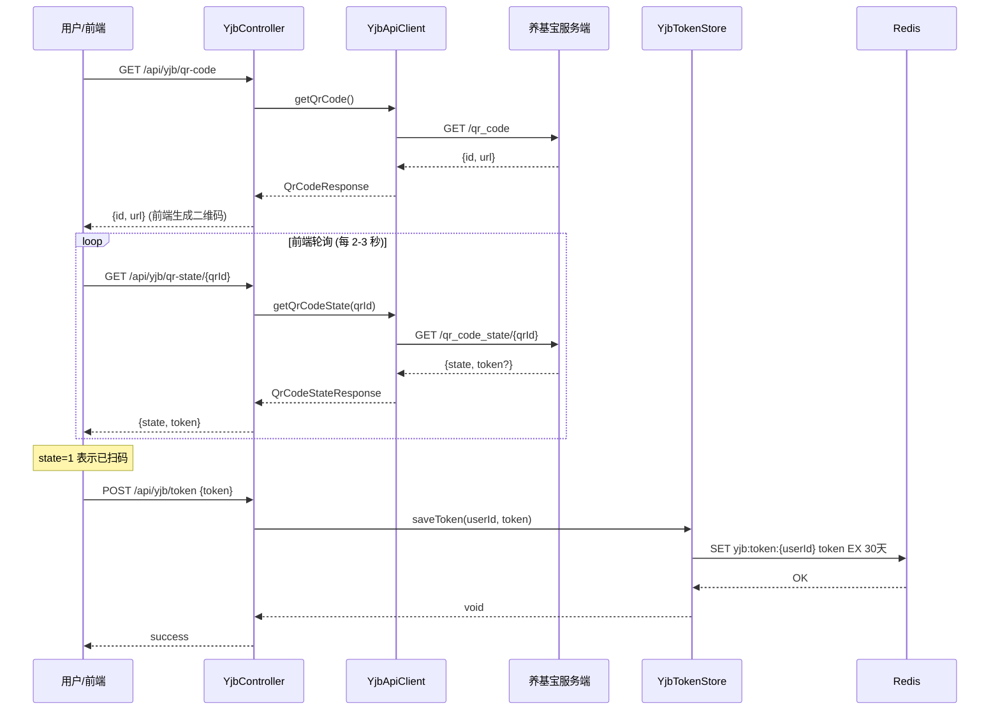
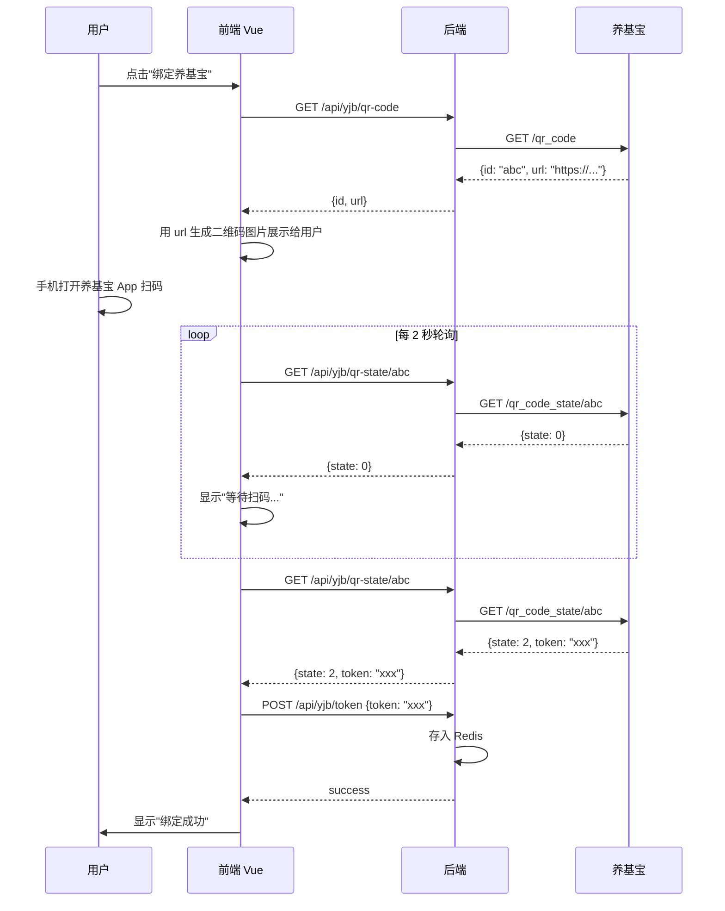
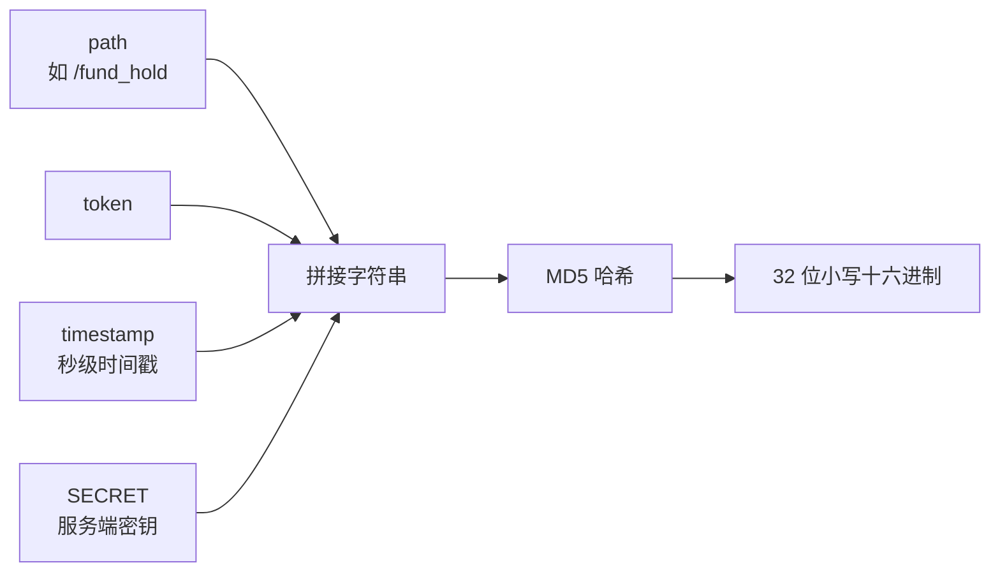
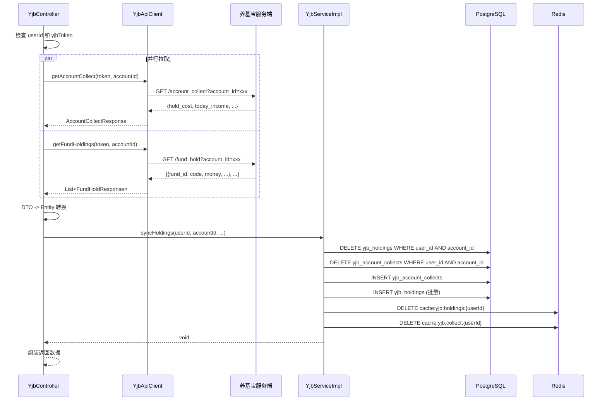
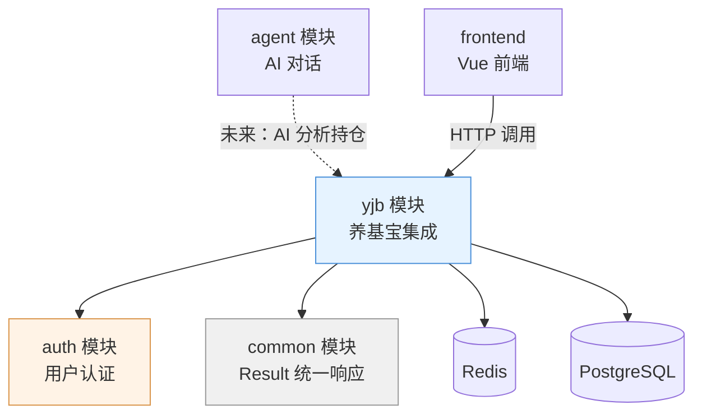

# 养基宝基金集成 -- QR 码登录与并行数据同步

> 本文档是小墨项目技术亮点系列的第 12 篇，面向初次接触项目的开发者，从"用户想在小墨里看自己的基金持仓"这个需求出发，拆解养基宝（YangJiBao）集成模块的完整设计：QR 码扫码登录、MD5 请求签名、双 API 域名策略、CompletableFuture 并行同步、以及"删后重插"事务写入。

---

## 目录

- [一、核心内容](#一核心内容)
- [二、为什么需要这个设计](#二为什么需要这个设计)
- [三、整体架构](#三整体架构)
- [四、代码走读](#四代码走读)
- [五、配置与调参](#五配置与调参)
- [六、实战案例](#六实战案例)
- [七、与其他模块的关系](#七与其他模块的关系)
- [八、常见问题排查](#八常见问题排查)
- [九、数据库表结构](#九数据库表结构)
- [十、源码索引](#十源码索引)
- [十一、延伸阅读](#十一延伸阅读)

---

## 一、核心内容

- 理解第三方 App 的 QR 码登录如何通过后端代理实现：获取二维码 -> 轮询状态 -> 持久化 Token
- 掌握 MD5 请求签名的构造方式：`sign = MD5(path + token + timestamp + SECRET)`
- 了解为什么同一个第三方需要两个不同的 API 基地址（认证接口 vs 公开行情接口）
- 学会用 `CompletableFuture.allOf` 并行拉取两个独立接口，将同步耗时从串行的 ~600ms 降到 ~300ms
- 理解"先删后插"事务同步策略的优势与适用场景

---

## 二、为什么需要这个设计

### 2.1 问题场景

小墨是一个金融投资导学 AI 助手。用户在日常使用中有一个高频需求：**"我今天基金赚了多少钱？"**

要回答这个问题，小墨需要获取用户在养基宝 App 中的真实持仓数据。但养基宝是一个独立的第三方应用，它的数据 API 有以下特点：

1. **需要用户登录授权** -- 养基宝的持仓数据是私有的，必须先登录才能访问
2. **登录方式是 QR 码扫描** -- 养基宝没有用户名/密码登录接口，只有扫码登录
3. **请求必须签名** -- 每个 API 请求都需要携带 MD5 签名，防篡改
4. **有两个 API 域名** -- 用户数据走 `browser-plug-api`（需认证），基金估值走 `app-api`（公开）

如果小墨不做集成，用户只能在手机上打开养基宝 App 手动查看，无法让 AI 助手直接分析自己的持仓收益、给出投资建议。

### 2.2 不这样做的后果

| 场景 | 不集成 | 集成后 |
|------|--------|--------|
| 查今日收益 | 手动打开 App 查看 | AI 助手直接回答 |
| 持仓分析 | 手动导出数据再分析 | AI 自动分析持仓结构 |
| 估值查询 | 离开小墨去别处查 | 在对话中直接获取实时估值 |
| 登录维护 | -- | QR 扫码一次，30 天免登录 |

### 2.3 设计目标

1. **扫码即用** -- 用户扫一次 QR 码，Token 在服务端保存 30 天，期间无需重复登录
2. **数据同步快** -- 账户汇总和持仓明细并行拉取，尽量减少用户等待时间
3. **签名安全** -- MD5 签名覆盖 path + token + timestamp + SECRET，防止请求被篡改或重放
4. **容错清晰** -- Token 过期时自动清除 Redis 缓存，提示用户重新扫码
5. **读写分离** -- 写入时全量替换，读取时走 Redis 缓存，避免脏读

---

## 三、整体架构

### 3.1 一句话描述

用户通过 QR 码扫码授权，后端代理养基宝 API 请求（MD5 签名），用 CompletableFuture 并行拉取账户汇总和持仓明细，写入 PostgreSQL（先删后插事务），读取时走 Redis 缓存。

### 3.2 架构图

```mermaid
flowchart TD
    FE[前端 Vue] -->|QR 码 / 同步 / 查询| Ctrl[YjbController]

    subgraph YJB 模块
        Ctrl --> TS[YjbTokenStore]
        Ctrl --> API[YjbApiClient]
        Ctrl --> SVC[YjbServiceImpl]

        TS -->|存取 Token| Redis[(Redis<br/>yjb:token:{userId})]

        API -->|认证接口| BPA[browser-plug-api<br/>yangjibao.com]
        API -->|公开估值| APA[app-api<br/>yangjibao.com]

        SVC -->|持仓 + 汇总| PG[(PostgreSQL)]
        SVC -->|缓存| Redis2[(Redis<br/>cache:yjb:*)]
    end

    BPA -->|QR 码 / 账户 / 持仓| YJBSrv[养基宝服务端]
    APA -->|基金估值| YJBSrv
```

### 3.3 核心组件一览

| 组件 | 职责 | 关键技术点 |
|------|------|-----------|
| `YjbController` | REST 入口，编排登录、同步、查询流程 | 从 `HttpServletRequest` 取 userId |
| `YjbApiClient` | 封装养基宝 HTTP 调用，处理签名和响应解析 | OkHttp + MD5 签名 + 双域名 |
| `YjbTokenStore` | Redis Token 持久化，30 天 TTL | `StringRedisTemplate` |
| `YjbServiceImpl` | 持仓数据的事务写入 + Redis 缓存读取 | `@Transactional` + 先删后插 |
| `YjbHolding` | 持仓明细实体，映射 `yjb_holdings` 表 | JPA + BigDecimal 精度 |
| `YjbAccountCollect` | 账户汇总实体，映射 `yjb_account_collects` 表 | JPA + BigDecimal 精度 |

### 3.4 双 API 域名说明

养基宝对外暴露了两个 API 入口，用途完全不同：

| 域名 | 用途 | 认证方式 | 小墨使用场景 |
|------|------|---------|------------|
| `browser-plug-api.yangjibao.com` | 用户数据（登录、账户、持仓） | Token + MD5 签名 | QR 登录、账户列表、持仓同步 |
| `app-api.yangjibao.com` | 公开行情数据 | 无需认证（模拟 App User-Agent） | 基金实时估值查询 |

---

## 四、代码走读

### 4.1 QR 码登录全流程

QR 码登录是整个模块的入口。用户需要先扫码授权，后端才能拿到 Token 去拉取持仓数据。



**关键点解读：**

1. **获取二维码** -- `GET /qr_code` 不需要任何认证参数，返回一个 `id`（用于后续轮询）和 `url`（二维码内容，通常是养基宝 App 的扫码链接）
2. **轮询状态** -- 前端拿到 `qrId` 后每 2-3 秒调用 `GET /qr_code_state/{qrId}`，`state` 值含义：`0` = 未扫码，`1` = 已扫码待确认，`2` = 已确认（此时 `token` 字段有值）
3. **存储 Token** -- 前端确认扫码成功后，将 `token` 发送到后端 `POST /api/yjb/token`，后端将其存入 Redis，key 为 `yjb:token:{userId}`，TTL 为 30 天

Token 存储的代码非常简洁：

```java
// YjbTokenStore.java
private static final String KEY_PREFIX = "yjb:token:";
private static final long TTL_DAYS = 30;

public void saveToken(Long userId, String yjbToken) {
    stringRedisTemplate.opsForValue().set(
            KEY_PREFIX + userId, yjbToken, TTL_DAYS, TimeUnit.DAYS);
}
```

**设计考量：** 为什么用 Redis 而不是数据库存 Token？因为 Token 是纯缓存数据，30 天过期后自动消失，不需要持久化。Redis 的 TTL 机制天然适合这个场景。

#### QR 码状态码详解

| state 值 | 含义 | 前端行为 |
|----------|------|---------|
| 0 | 未扫码 | 继续轮询，显示等待动画 |
| 1 | 已扫码，待确认 | 提示用户"请在手机上确认" |
| 2 | 已确认 | 停止轮询，提取 token 并提交到后端 |

> **注意：** 养基宝的 QR 码有时效限制。如果用户长时间不扫码，QR 码会过期，此时 `getQrCodeState` 会返回错误。前端应该在检测到错误时提示用户刷新二维码。

#### Token 存储的多用户隔离

Redis key `yjb:token:{userId}` 中的 `userId` 是小墨系统的用户 ID（来自 auth 模块），不是养基宝的用户 ID。这意味着：

- 同一个养基宝账号可以在不同小墨用户下分别绑定
- 每个小墨用户独立管理自己的养基宝 Token
- Token 的生命周期与小墨用户会话无关（30 天固定 TTL）

#### 前端交互时序



---

### 4.2 MD5 请求签名机制

养基宝的每个 API 请求都需要携带签名头，防止请求被篡改。签名构造方式如下：



签名构造的核心代码：

```java
// YjbApiClient.java
private Headers buildHeaders(String path, String token) {
    if (token == null) token = "";
    String timestamp = String.valueOf(System.currentTimeMillis() / 1000);
    String signPath = path.split("\\?")[0];  // 去掉 query 参数
    String sign = md5(signPath + token + timestamp + SECRET);
    return new Headers.Builder()
            .add("Authorization", token)
            .add("Request-Time", timestamp)
            .add("Request-Sign", sign)
            .add("Content-Type", "application/json")
            .build();
}
```

**逐行解读：**

| 行 | 作用 | 说明 |
|----|------|------|
| `path.split("\\?")[0]` | 取纯路径 | 签名只覆盖 path，不包含 query 参数 |
| `System.currentTimeMillis() / 1000` | 秒级时间戳 | 与养基宝服务端对时，防重放攻击 |
| `md5(signPath + token + timestamp + SECRET)` | 生成签名 | SECRET 硬编码在客户端，是养基宝分配的密钥 |

**请求头一览：**

| Header | 值 | 说明 |
|--------|---|------|
| `Authorization` | 用户 Token | 用于身份认证 |
| `Request-Time` | 秒级时间戳 | 防重放 |
| `Request-Sign` | MD5 签名 | 防篡改 |
| `Content-Type` | `application/json` | 固定值 |

**为什么 path 要去掉 query 参数？** 因为养基宝的签名算法约定只对路径签名，query 参数（如 `account_id=xxx`）不参与签名计算。这在对接第三方 API 时很常见 -- 你需要严格按照对方文档的签名规则来实现。

---

### 4.3 CompletableFuture 并行同步

扫码登录成功后，用户点击"同步持仓"按钮，后端需要同时拉取两个接口：

1. **账户汇总** (`/account_collect`) -- 返回总成本、今日收益、今日收益率
2. **持仓明细** (`/fund_hold`) -- 返回每只基金的持有份额、成本、收益等

这两个接口之间没有数据依赖，可以并行调用。`YjbController.syncHoldings()` 中的核心逻辑：

```java
// YjbController.java -- 并行拉取
CompletableFuture<YjbApiClient.AccountCollectResponse> collectFuture =
        CompletableFuture.supplyAsync(() -> {
            try { return yjbApiClient.getAccountCollect(yjbToken, finalAccountId); }
            catch (Exception e) { throw new RuntimeException(e); }
        });
CompletableFuture<List<YjbApiClient.FundHoldResponse>> holdFuture =
        CompletableFuture.supplyAsync(() -> {
            try { return yjbApiClient.getFundHoldings(yjbToken, finalAccountId); }
            catch (Exception e) { throw new RuntimeException(e); }
        });
CompletableFuture.allOf(collectFuture, holdFuture).join();

YjbApiClient.AccountCollectResponse collect = collectFuture.join();
List<YjbApiClient.FundHoldResponse> fundHolds = holdFuture.join();
```



**为什么用 `supplyAsync` 而不是手动创建线程？** `CompletableFuture.supplyAsync()` 默认使用 `ForkJoinPool.commonPool()`，避免了手动管理线程生命周期的麻烦。对于这种 IO 密集型的 HTTP 调用，commonPool 的线程数足够用。

**为什么 `allOf` 之后还要再 `join` 一次？** `allOf` 只是等待所有 Future 完成，不返回结果。要获取每个 Future 的返回值，需要再分别调用 `join()`。此时 `join()` 不会阻塞，因为任务已经完成了。

---

### 4.4 "先删后插"事务同步策略

数据写入数据库时，`YjbServiceImpl.syncHoldings()` 采用了"先删后插"的策略：

```java
// YjbServiceImpl.java
@Override
@Transactional
public void syncHoldings(Long userId, String accountId, BigDecimal holdCost,
                         BigDecimal todayIncome, BigDecimal todayIncomeRate,
                         List<YjbHolding> holdings) {
    LocalDateTime now = LocalDateTime.now();

    // 1. 删除旧数据
    holdingRepository.deleteByUserIdAndAccountId(userId, accountId);
    accountCollectRepository.deleteByUserIdAndAccountId(userId, accountId);

    // 2. 插入账户汇总
    YjbAccountCollect collect = new YjbAccountCollect();
    collect.setUserId(userId);
    collect.setAccountId(accountId);
    collect.setHoldCost(holdCost);
    collect.setTodayIncome(todayIncome);
    collect.setTodayIncomeRate(todayIncomeRate);
    collect.setSyncedAt(now);
    accountCollectRepository.save(collect);

    // 3. 插入持仓明细
    for (YjbHolding holding : holdings) {
        holding.setUserId(userId);
        holding.setAccountId(accountId);
        holding.setSyncedAt(now);
    }
    holdingRepository.saveAll(holdings);

    // 4. 清除缓存
    evictCache(userId);
}
```

**为什么不用 UPSERT（INSERT ON CONFLICT UPDATE）？**

| 策略 | 优点 | 缺点 |
|------|------|------|
| 先删后插 | 逻辑简单，保证数据完全一致 | 删除瞬间数据不可读（但在事务内，外部看不到） |
| UPSERT | 不删除，无闪烁 | 需要处理"用户卖掉了某只基金"的删除场景，逻辑复杂 |

在这个场景下，先删后插更合适，因为：

1. 每次同步都是**全量数据**（养基宝返回的是当前全部持仓，不是增量）
2. 有 `@Transactional` 保证原子性 -- 外部事务隔离级别下，删除和插入是一个原子操作
3. 用户卖掉了某只基金，旧记录会被自然删除，不需要额外处理

**`@Transactional` 的关键作用：** 如果在 `saveAll` 时抛异常（比如数据库连接断开），前面的 `delete` 操作也会回滚，用户不会丢失历史数据。

---

### 4.5 DTO 到 Entity 的转换细节

从养基宝 API 返回的 JSON 数据需要转换为 JPA 实体。这里有一个值得注意的细节 -- `costMoney` 的兜底计算：

```java
// YjbController.java -- DTO -> Entity 转换
BigDecimal costMoney = item.costMoney != null ? item.costMoney : BigDecimal.ZERO;
if (costMoney.compareTo(BigDecimal.ZERO) <= 0) {
    BigDecimal unitCost = item.holdCost != null ? item.holdCost : BigDecimal.ZERO;
    BigDecimal shares = item.holdShare != null ? item.holdShare : BigDecimal.ZERO;
    if (unitCost.compareTo(BigDecimal.ZERO) > 0 && shares.compareTo(BigDecimal.ZERO) > 0) {
        costMoney = unitCost.multiply(shares);
    }
}
h.setCostMoney(costMoney);
```

**为什么要兜底？** 养基宝 API 有时不返回 `cost_money`（投入成本），但会返回 `hold_cost`（单位成本）和 `hold_share`（持有份额）。此时可以用 `单位成本 x 持有份额` 来估算投入成本。这种"数据不完整但可推算"的情况在对接第三方 API 时很常见。

---

### 4.6 基金估值查询（公开 API）

估值查询走的是另一个域名 `app-api.yangjibao.com`，不需要用户登录，但需要模拟 App 的 User-Agent：

```java
// YjbApiClient.java
Request request = new Request.Builder()
        .url(PUBLIC_BASE_URL + "/market/v1/fund/batch")
        .headers(new Headers.Builder()
                .add("Content-Type", "application/json")
                .add("User-Agent", "YJB/2.0.4")  // 模拟养基宝 App
                .build())
        .post(okhttp3.RequestBody.create(
                body.toString(),
                okhttp3.MediaType.parse("application/json")))
        .build();
```

估值请求的 body 格式：

```json
{
  "funds": [
    {"fund_id": 123456, "data_source": "1"},
    {"fund_id": 789012, "data_source": "1"}
  ]
}
```

返回的估值数据包括：`dwjz`（单位净值）、`rzzl`（日增长率）、`vgszzl`（估算增长率）、`jzrq`（净值日期）。

---

### 4.7 Token 过期自动清理

当养基宝 API 返回错误（通常是 Token 过期），后端会自动清除 Redis 中的 Token，提示用户重新扫码：

```java
// YjbController.java -- catch 块
catch (Exception e) {
    Throwable cause = e.getCause() != null ? e.getCause() : e;
    if (cause.getMessage() != null && cause.getMessage().contains("code=")) {
        yjbTokenStore.removeToken(userId);  // 清除过期 Token
        return Result.error("养基宝登录已过期，请重新扫码");
    }
    return Result.error("同步失败: " + cause.getMessage());
}
```

**判断逻辑：** 如果异常消息包含 `code=`，说明是养基宝 API 返回了业务错误码（非 200），此时认为 Token 失效。这个判断虽然简单，但在实际运行中足够可靠 -- 养基宝的错误响应格式固定为 `code=xxx, message=yyy`。

---

## 五、配置与调参

### 5.1 HTTP 客户端配置

| 参数 | 当前值 | 位置 | 说明 |
|------|--------|------|------|
| `connectTimeout` | 10 秒 | `YjbApiClient` 构造函数 | 连接超时，超过则抛 `SocketTimeoutException` |
| `readTimeout` | 15 秒 | `YjbApiClient` 构造函数 | 读取超时，养基宝 API 响应通常在 1-3 秒内 |

### 5.2 Redis 缓存配置

| 参数 | 当前值 | Key 格式 | 说明 |
|------|--------|---------|------|
| Token TTL | 30 天 | `yjb:token:{userId}` | 用户扫码后 30 天内免重复登录 |
| 持仓缓存 TTL | 30 分钟 | `cache:yjb:holdings:{userId}` | 同步后 30 分钟内读缓存 |
| 汇总缓存 TTL | 30 分钟 | `cache:yjb:collect:{userId}` | 同步后 30 分钟内读缓存 |

### 5.3 签名密钥

| 参数 | 说明 |
|------|------|
| `SECRET` | 养基宝分配的服务端密钥，硬编码在 `YjbApiClient` 中 |

> **安全提示：** 生产环境建议将 SECRET 移到环境变量或配置中心，避免硬编码在代码中。

### 5.4 如何调整缓存 TTL

如果用户反馈"同步后持仓数据不更新"，可以缩短缓存 TTL：

```java
// YjbServiceImpl.java
private static final long CACHE_TTL_MINUTES = 30;  // 改为更小的值，如 5
```

如果 Token 频繁过期（养基宝服务端策略变化），可以调整 Token TTL：

```java
// YjbTokenStore.java
private static final long TTL_DAYS = 30;  // 改为 7 等更短的周期
```

---

## 六、实战案例

### 6.1 正常流程：用户首次同步持仓

**场景描述：** 用户小明第一次使用小墨的基金功能。

| 步骤 | 用户操作 | 后端行为 | 耗时 |
|------|---------|---------|------|
| 1 | 点击"绑定养基宝" | 调用养基宝 API 生成 QR 码 | ~200ms |
| 2 | 手机扫码确认 | 前端轮询状态，发现 state=1 | 2-5 秒（用户操作） |
| 3 | 前端自动提交 Token | Token 存入 Redis，30 天有效 | ~10ms |
| 4 | 点击"同步持仓" | 并行拉取账户汇总 + 持仓明细 | ~300ms |
| 5 | 查看持仓 | 从 Redis 缓存读取，毫秒级返回 | ~5ms |

**返回数据示例：**

```json
{
  "code": 1,
  "data": {
    "accounts": [{"id": "abc123", "title": "我的基金", "count": 8}],
    "accountCollect": {
      "hold_cost": 50000.00,
      "today_income": 123.45,
      "today_income_rate": 0.25
    },
    "holdings": [
      {
        "fund_id": "000001",
        "code": "000001",
        "short_name": "华夏成长混合",
        "money": 15000.00,
        "hold_earn": 1234.56,
        "hold_share": 5000.0000,
        "hold_cost": 3.00,
        "cost_money": 15000.00
      }
    ],
    "selectedAccountId": "abc123"
  }
}
```

### 6.2 边界情况：Token 过期

**场景描述：** 用户 20 天前扫码登录，今天同步时 Token 已被养基宝服务端废弃。

| 步骤 | 后端行为 | 用户看到的 |
|------|---------|-----------|
| 1 | 调用 `getAccountCollect` | -- |
| 2 | 养基宝返回 `code=401` | -- |
| 3 | `YjbApiClient.doGet()` 抛出 `IOException("YJB API 返回错误: code=401")` | -- |
| 4 | `YjbController.syncHoldings()` catch 块捕获异常 | -- |
| 5 | 检测到 `code=` 关键词，调用 `removeToken()` | -- |
| 6 | 返回错误响应 | 看到"养基宝登录已过期，请重新扫码" |

### 6.3 边界情况：养基宝无账户数据

**场景描述：** 用户在养基宝中没有创建任何基金账户。

```java
// YjbController.java
List<YjbApiClient.UserAccountResponse> accounts = yjbApiClient.getUserAccounts(yjbToken);
if (accounts.isEmpty()) {
    return Result.error("养基宝无账户数据");
}
```

此时用户看到提示"养基宝无账户数据"，需要先在养基宝 App 中创建账户并购买基金。

### 6.4 边界情况：部分字段为 null

养基宝 API 的某些字段可能返回 null（例如新买入的基金还没有收益数据）。代码中对所有数值字段都做了 null 检查：

```java
h.setMoney(item.money != null ? item.money : BigDecimal.ZERO);
h.setHoldEarn(item.holdEarn != null ? item.holdEarn : BigDecimal.ZERO);
h.setHoldShare(item.holdShare != null ? item.holdShare : BigDecimal.ZERO);
```

**为什么不直接用 `@JsonSetter(nulls = Nulls.AS_EMPTY)` 之类的全局配置？** 因为养基宝 API 的响应结构不稳定，有时候返回 `null`，有时候字段直接不存在，有时候返回空字符串。逐字段处理更可控。

### 6.5 多账户场景

养基宝支持一个用户创建多个基金账户（例如"日常定投"和"一次性买入"）。同步时默认选择第一个账户，但前端可以通过 `accountId` 参数指定同步哪个：

```java
// YjbController.java
String finalAccountId = (accountId != null && !accountId.isBlank())
        ? accountId : accounts.get(0).id;
```

**前端如何获取账户列表？** 在调用 `/api/yjb/sync` 之前，前端会先调用 `/api/yjb/status` 检查登录状态。同步接口返回的 `accounts` 字段包含了所有账户列表，前端可以用它来渲染账户选择器。

### 6.6 并行同步的性能对比

| 方式 | 账户汇总耗时 | 持仓明细耗时 | 总耗时 |
|------|------------|------------|--------|
| 串行调用 | ~250ms | ~350ms | ~600ms |
| CompletableFuture 并行 | ~250ms | ~350ms | ~350ms |

并行调用的总耗时等于两个请求中较慢的那个，而不是两者之和。对于网络延迟敏感的移动端用户，这个优化效果显著。

### 6.7 缓存穿透防护

当前的缓存策略是"缓存有就读缓存，没有就查数据库"。如果一个用户从未同步过持仓，`getHoldings()` 会查数据库返回空列表，但不会缓存空列表：

```java
// YjbServiceImpl.java
List<YjbHolding> holdings = holdingRepository.findByUserIdOrderByMoneyDesc(userId);
redisTemplate.opsForValue().set(key, holdings, CACHE_TTL_MINUTES, TimeUnit.MINUTES);
```

这里有一个潜在问题：如果 `holdings` 是空列表，它也会被缓存 30 分钟。在这 30 分钟内，即使用户同步了新数据并清除了缓存，空列表缓存已经被设置了。不过由于 `syncHoldings()` 在写入后会调用 `evictCache()`，所以这个问题实际上不会发生。

---

## 七、与其他模块的关系

### 7.1 模块依赖图



### 7.2 与 auth 模块的关系

`YjbController` 的每个接口（除了 QR 码生成）都需要从 `HttpServletRequest` 中获取 `userId`：

```java
Long userId = (Long) request.getAttribute("userId");
if (userId == null) {
    return Result.error("未登录");
}
```

这个 `userId` 是由 auth 模块的拦截器在请求进入 Controller 之前设置的。养基宝模块不自己做用户认证，完全依赖 auth 模块。

### 7.3 与 Redis 的关系

养基宝模块使用了两个 Redis key 命名空间：

| Key 模式 | 用途 | TTL | 操作方 |
|---------|------|-----|--------|
| `yjb:token:{userId}` | 存储养基宝登录 Token | 30 天 | `YjbTokenStore` |
| `cache:yjb:holdings:{userId}` | 持仓明细缓存 | 30 分钟 | `YjbServiceImpl` |
| `cache:yjb:collect:{userId}` | 账户汇总缓存 | 30 分钟 | `YjbServiceImpl` |

### 7.4 与 AI 对话模块的潜在集成

目前养基宝模块是独立的数据同步模块，未来可以与 AI 对话模块集成，让小墨直接在对话中分析用户的基金持仓：

- "帮我分析一下我的基金持仓结构"
- "我今天赚了多少钱？"
- "哪只基金收益最高？要不要止盈？"

这需要将养基宝持仓数据作为工具（Tool）暴露给 LLM Agent，属于后续迭代的内容。

---

## 八、常见问题排查

| 问题 | 可能原因 | 排查方法 | 解决方案 |
|------|---------|---------|---------|
| 扫码后提示"未登录" | 前端没有把 Token 发送到后端 | 检查 `POST /api/yjb/token` 请求是否发出 | 确认前端在扫码成功后调用了保存 Token 接口 |
| 同步失败"养基宝未登录" | Redis 中没有 Token | `redis-cli GET yjb:token:{userId}` | 重新扫码 |
| 同步失败"养基宝登录已过期" | Token 被养基宝服务端废弃 | 检查异常日志中的 `code=` 值 | 重新扫码 |
| 同步失败"HTTP 403" | 养基宝 API 封禁了你的 IP | 检查服务器出口 IP | 联系养基宝解除封禁，或加代理 |
| 持仓数据不更新 | Redis 缓存未过期 | 检查 `cache:yjb:holdings:{userId}` 是否存在 | 等待 30 分钟缓存过期，或手动删除缓存 key |
| 估值查询失败 | 养基宝 App API 接口变更 | 检查返回的 HTTP 状态码和错误消息 | 更新 `YjbApiClient.getFundValuations()` 的请求格式 |
| `costMoney` 为 0 | 养基宝 API 未返回 `cost_money` 且 `hold_cost` 或 `hold_share` 为 0 | 检查养基宝 App 中该基金的数据 | 正常情况，新买入或已清仓的基金可能没有成本数据 |
| 同步超时 | 养基宝 API 响应慢 | 检查日志中的请求耗时 | 调大 `readTimeout`（当前 15 秒） |

### 如何手动清除用户的养基宝 Token

```bash
redis-cli DEL yjb:token:{userId}
```

### 如何手动清除用户的持仓缓存

```bash
redis-cli DEL cache:yjb:holdings:{userId}
redis-cli DEL cache:yjb:collect:{userId}
```

### 如何查看用户的养基宝 Token 是否存在

```bash
redis-cli EXISTS yjb:token:{userId}
# 返回 1 表示存在，0 表示不存在
```

### 如何查看 Token 的剩余 TTL

```bash
redis-cli TTL yjb:token:{userId}
# 返回剩余秒数，-1 表示永不过期，-2 表示 key 不存在
```

### 日志关键字速查

| 日志关键字 | 含义 | 关注点 |
|-----------|------|--------|
| `[YJB] 获取二维码失败` | 调用养基宝 QR 码接口失败 | 检查网络连通性和养基宝服务状态 |
| `[YJB] 保存 token` | Token 成功存入 Redis | 确认 userId 正确 |
| `[YJB] 同步持仓数据` | 同步成功，日志包含基金数量 | 确认基金数与养基宝 App 一致 |
| `[YJB] 同步持仓失败` | 同步过程异常 | 查看异常栈，判断是网络问题还是 Token 过期 |
| `[YJB] 持仓缓存命中` | 读取走了 Redis 缓存 | 正常行为，说明缓存在工作 |
| `[YJB] 缓存已清除` | 同步后缓存被清除 | 正常行为，下次读取会查数据库 |

---

## 九、数据库表结构

### 9.1 yjb_holdings 持仓明细表

| 列名 | 类型 | 说明 |
|------|------|------|
| `id` | BIGINT (PK, 自增) | 主键 |
| `user_id` | BIGINT (NOT NULL) | 小墨用户 ID |
| `account_id` | VARCHAR(50) (NOT NULL) | 养基宝账户 ID |
| `fund_id` | VARCHAR(50) | 养基宝内部基金 ID |
| `code` | VARCHAR(20) | 基金代码（如 "000001"） |
| `short_name` | VARCHAR(100) | 基金简称 |
| `money` | DECIMAL(15,2) | 持有市值（元） |
| `hold_earn` | DECIMAL(15,2) | 持有收益（元） |
| `hold_share` | DECIMAL(15,4) | 持有份额 |
| `hold_cost` | DECIMAL(15,2) | 单位成本 |
| `cost_money` | DECIMAL(15,2) | 投入成本（元） |
| `hold_day` | VARCHAR(20) | 持有天数 |
| `category` | VARCHAR(50) | 基金类型（如 "混合型"） |
| `market_type` | VARCHAR(20) | 市场类型 |
| `synced_at` | TIMESTAMP | 同步时间 |

### 9.2 yjb_account_collects 账户汇总表

| 列名 | 类型 | 说明 |
|------|------|------|
| `id` | BIGINT (PK, 自增) | 主键 |
| `user_id` | BIGINT (NOT NULL) | 小墨用户 ID |
| `account_id` | VARCHAR(50) (NOT NULL) | 养基宝账户 ID |
| `hold_cost` | DECIMAL(15,2) | 总持有成本（元） |
| `today_income` | DECIMAL(15,2) | 今日收益（元） |
| `today_income_rate` | DECIMAL(8,4) | 今日收益率（%） |
| `synced_at` | TIMESTAMP | 同步时间 |

### 9.3 表设计要点

- **无唯一约束**：`yjb_holdings` 表没有在 `(user_id, account_id, fund_id)` 上建唯一约束，因为采用的是"先删后插"策略，不需要 UPSERT
- **BigDecimal 精度**：金额字段统一使用 `DECIMAL(15,2)`（整数部分最多 13 位，小数 2 位），份额字段使用 `DECIMAL(15,4)`（4 位小数），避免浮点精度丢失
- **synced_at 字段**：通过 `@PrePersist` 自动填充，记录每次同步的时间，便于排查数据新鲜度问题

---

## 十、源码索引

| 文件 | 职责 | 行数 |
|------|------|------|
| `src/main/java/com/xiaomo/agent/yjb/controller/YjbController.java` | REST 控制器，编排 QR 登录、同步、查询、估值 | ~242 |
| `src/main/java/com/xiaomo/agent/yjb/service/YjbApiClient.java` | 养基宝 HTTP 客户端，MD5 签名，双域名，响应解析 | ~286 |
| `src/main/java/com/xiaomo/agent/yjb/service/YjbTokenStore.java` | Redis Token 存储（存/取/删/查） | ~35 |
| `src/main/java/com/xiaomo/agent/yjb/service/YjbService.java` | Service 接口定义 | ~18 |
| `src/main/java/com/xiaomo/agent/yjb/service/impl/YjbServiceImpl.java` | 事务同步 + Redis 缓存读取 | ~104 |
| `src/main/java/com/xiaomo/agent/yjb/entity/YjbHolding.java` | 持仓明细实体（`yjb_holdings` 表） | ~73 |
| `src/main/java/com/xiaomo/agent/yjb/entity/YjbAccountCollect.java` | 账户汇总实体（`yjb_account_collects` 表） | ~44 |
| `src/main/java/com/xiaomo/agent/yjb/repository/YjbHoldingRepository.java` | 持仓 Repository，按金额降序查询 | ~15 |
| `src/main/java/com/xiaomo/agent/yjb/repository/YjbAccountCollectRepository.java` | 汇总 Repository，按同步时间降序查询 | ~13 |

---

## 十一、延伸阅读

- [05-MemorySystem](./05-MemorySystem.md) -- 养基宝的 Token 存储复用了项目的 Redis 基础设施，与记忆系统的 Redis 使用模式类似
- [06-SSEStreamingAndNotification](./06-SSEStreamingAndNotification.md) -- 未来如果养基宝持仓变动需要实时通知用户，可以复用 SSE 通知机制
- [04-AStockDataAndRouterTool](./04-AStockDataAndRouterTool.md) -- 养基宝的估值查询与 A 股数据工具集都涉及金融数据获取，设计思路有相似之处
- [07-UserConfigSystem](./07-UserConfigSystem.md) -- 养基宝的 Token 管理可以看作一种特殊的用户配置，未来可能纳入统一的配置管理体系
